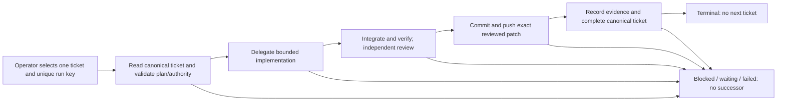

# T-895 — Single-ticket software delivery event profile

Kanban T-895 owns plan/status/evidence. This document specifies the configuration and operating boundary, not a second backlog.

## Decision and scope

Current Principal decision: keep the five-minute CoAS progress schedule as the live GM driver; finish this event-loop exercise as an unactivated, tested prototype. Do not install or activate it unless it demonstrates added value and receives separate approval. The profile models one manually selected ticket per bounded run (T-886 was the original pilot candidate); future Kaggle evaluation is deferred and outside this repo's delivery scope. Fix any actual runtime defects discovered using failing regressions and bounded Luna implementation/review, without unrelated refactors or new dependencies. No event-loop timers, automatic backlog selection, model changes, restarts, or live ticket execution in this exercise.

The current GM handles commands using its existing authorized tools and delegates substantive implementation. The extension neither imports Kanban/Panopticon nor discovers/spawns workers. Kanban remains authoritative; session events record the GM's observations and do not themselves verify a commit, test, review, or ticket completion.

## Shape

Each success outcome closes its current stage and opens the next. Each stage also accepts blocked/waiting/failed outcomes that close its row and open no executable successor. No automatic repair cycle. Operator decides a bounded retry/restart after remediation; stable run correlation prevents cross-run accidental closure. Require ticketId, runId and a compound correlation (`"<ticketId>:<runId>"`) in payloads and use correlation as the view correlation key; payload validation is presence and key match only. Ticket ownership, artifact identity, approval checks, and same-ticket semantics must be revalidated by command instructions; do not claim JSON required-field validation enforces their meaning — including that correlation equals the two id fields.

Planning is not implicit scope approval. If the existing ticket/Principal authorization is insufficient, emit blocked with the exact decision needed; no implementation successor. Check for an active /goal driver or another GM working this ticket; step aside rather than race or silently stop other work. Replayed commands reconcile board status, worker/artifact state, commit and remote state before mutating; do not blindly spawn/commit/push again.

Subagent work may outlive the command turn. Bound wait time; if unfinished, record awaiting-worker in Kanban and emit a terminal waiting outcome. Do not fabricate success to keep the loop running. The initial profile intentionally has no automatic worker-completion subscription. A blocked/waiting event halts domain progression but need not set the runtime paused bit; distinguish this from runtime missing-outcome/limit pauses.

Verification must cover acceptance criteria, focused tests, npm run check, npm test, independent review where required, docs/C4 and secret-safe diff review. Commit only the selected ticket's reviewed changes, preserving unrelated work. A push failure must not permit completion. The final stage checks actual pushed commit and evidence, then calls kanban_complete subject to existing gates; emit completion only after tool success. Treat already-complete canonical tickets as reconciliation, never reimplement them.

## Deliverables

- Tracked standalone JSON profile/config fixture under `examples/event-loop/` (or a comparably small repo-local location), with five bounded stages, operator-only seed, no allowWithoutCommand agent starts, no timers.
- Suggested limits: one pending command, eight automated turns, chain depth twelve; validate against actual runtime schema. No auto-next-ticket loop.
- Focused tests under `tests/` loading the tracked config through production validation, projections and automator. Cover success chain, failure/wait/block terminal paths, duplicate seed/idempotence, cross-run correlation and no initial work/timer. No real board/provider/git mutations.
- Operator runbook with exact explicit start, status, pause, resume/retry behavior, enablement/reload, waiting-worker recovery and rollback. Do not promise restart exactly-once domain execution.
- Value/limitations assessment versus the simpler CoAS schedule. Leave `.pi/event-loop.json` absent and project/global extension enablement unchanged; keep installation instructions only as explicitly gated future steps.

## Validation and review

Council approved the plan's feasibility; ADR-058 records evaluation-only disposition, not live adoption. Independent Luna review, focused production-runtime tests and full repository gates are required. A reproduced runtime defect within the existing SPEC may be fixed test-first; new public API, persistence schema or authority changes require separate council/ADR review.

A pristine session with this configuration and no seed yields no commands or turns in tests. Existing session history can replay pending work, so this is not a general no-dispatch guarantee on reload. The exercise leaves live configuration absent. Do not restart, enable the extension, or seed T-886. Record actual tested limits and manual intervention requirements, not inferred usability benefits.
