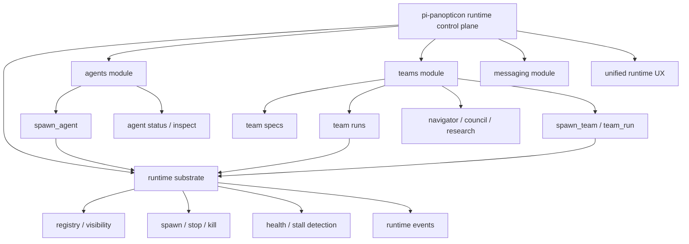

# Goal — Option A: Panopticon Runtime Consolidation

## Objective

Make `pi-panopticon` the intentional runtime control plane for both agents and teams, while keeping team orchestration code cleanly modular. Avoid the current middle ground where `pi-teams` appears independent but relies on Panopticon-like runtime concepts.

Preferred end state: **teams become a first-class Panopticon runtime module**, not a fully merged code blob and not an independent duplicate runtime.

## Target architecture

## Architectural decision

Adopt **Option A: Runtime consolidation**.

- `pi-panopticon` owns runtime substrate:
  - process spawning
  - registry and visibility
  - lifecycle, stop, kill, cancellation
  - health and stall detection
  - runtime event stream
  - messaging/routing substrate
  - unified runtime UI

- Teams remain modular but move under the Panopticon runtime umbrella:
  - team specs
  - team protocols
  - team run state machine
  - model role binding
  - research/debate/navigator semantics
  - approval/worktree policy gates

- Preserve compatibility aliases initially:
  - `team_run`
  - `team_stop`
  - `team_list`
  - `team_form`
  - `team_models`

## Non-goals

- Do not big-bang merge all team files into Panopticon internals.
- Do not remove public `team_*` tools until compatibility and migration are explicitly approved.
- Do not duplicate Panopticon runtime substrate inside `pi-teams`.
- Do not promote quarantined approval/worktree behavior as part of this consolidation.

## Required outcomes

1. **Unified UX model**
   - Agents and teams are visible as runtime entities from one surface.
   - Stop/status/inspect semantics are consistent.
   - `/agents` and `/teams` may remain, but should cross-link or converge toward a runtime view.

2. **Clean module boundary**
   - Team protocol logic remains separate from low-level runtime lifecycle.
   - Panopticon exposes approved runtime APIs/adapters used by team runs.
   - Architecture tests prevent teams from bypassing the runtime substrate with raw process management unless explicitly allowed.

3. **Runtime entity model**
   - Distinguish:
     - agent process
     - team spec
     - team run
   - Avoid pretending a team is just an agent.
   - Model team runs as orchestration instances that can own child agents/model calls.

4. **Compatibility-first migration**
   - Existing `team_*` tools continue to work.
   - New unified names may be introduced as aliases, e.g. `spawn_team`, `runtime_status`, `runtime_stop`.
   - Documentation explains the new mental model.

## Implementation phases

### Phase 1 — Boundary ADR and inventory

- Write an ADR defining Panopticon as the runtime control plane.
- Inventory direct runtime/process dependencies in `pi-teams`.
- Identify which team APIs need Panopticon runtime adapters.

Acceptance:
- ADR merged.
- Inventory lists files, dependencies, and proposed adapter boundaries.

### Phase 2 — Runtime adapter surface

- Add narrow Panopticon runtime APIs for:
  - spawn child agent/process
  - stop runtime entity
  - inspect runtime entity
  - emit runtime event
  - link child entity to parent team run

Acceptance:
- APIs are documented and tested.
- No team protocol logic is moved into runtime substrate.

### Phase 3 — Route team execution through Panopticon runtime

- Refactor `pi-teams` run execution to use Panopticon runtime APIs where it currently owns equivalent lifecycle behavior.
- Add parent/child run metadata for spawned agents.

Acceptance:
- Team runs can be traced to child agents/processes.
- Existing `team_run` tests still pass.
- Architecture test prevents new raw spawn/lifecycle bypasses.

### Phase 4 — Unified status/stop/inspect UX

- Add unified runtime list/status view for agents and team runs.
- Define exact stop semantics for:
  - stop team orchestration only
  - stop child agents
  - cancel pending calls
  - preserve logs/artifacts

Acceptance:
- Users can see agents and teams from one runtime surface.
- `team_stop` and agent stop behavior are consistent and documented.

### Phase 5 — Compatibility and cleanup

- Keep existing tools as compatibility aliases.
- Update docs, skills, and prompt guidance to describe Panopticon as runtime control plane.
- Consider moving files physically only after behavior is stable.

Acceptance:
- `npm run check` and `npm test` pass.
- Docs and architecture diagrams reflect the new model.
- No public command/tool removal occurs without explicit approval.

## Completion criteria

- Panopticon is documented and tested as the shared runtime substrate.
- Teams no longer maintain duplicate runtime/process lifecycle concepts where Panopticon can own them.
- Agents and team runs are inspectable through a unified runtime UX.
- Existing `team_*` public APIs remain compatible or have approved aliases/migration notes.
- Security-sensitive capabilities remain explicit and review-gated.
