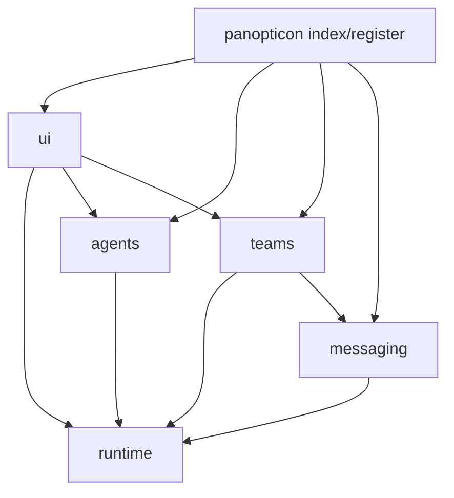

# Panopticon + Teams Module Map

Date: 2026-05-30
Status: Phase 1 migration artifact
Source: `docs/reports/panopticon-teams-single-extension-migration-plan.md`

## Decision

Move toward one effective extension: `pi-panopticon`. Team code should become a strongly modular `teams/` area inside Panopticon, with runtime behavior depending on Panopticon runtime modules rather than parallel team-owned runtime concepts.

No backward-compatibility shims are planned by default. Legacy surfaces should be removed during cutover once the replacement surface is documented and tested.

## Target directory map

```text
extensions/pi-panopticon/
  index.ts
  agents/
  messaging/
  runtime/
  teams/
    config/
    protocols/
    authoring/
    ui/
    state/
    policy/
  ui/
```

## Current `pi-teams` file disposition

| Current file | Target module | Disposition |
|---|---|---|
| `extensions/pi-teams/index.ts` | `pi-panopticon/teams/register.ts` | Fold registration into Panopticon extension entrypoint. Remove standalone extension entrypoint. |
| `package.json` | remove | `pi-teams` should stop being independently installable after cutover. |
| `README.md` | `pi-panopticon/teams/README.md` or Panopticon README section | Rewrite as module docs, not standalone extension docs. |
| `config/config.json` | `pi-panopticon/teams/config/config.json` | Move with team defaults. |
| `team-runtime.ts` | `pi-panopticon/teams/runtime.ts` | Keep team orchestration semantics; depend on `runtime/` substrate. |
| `state.ts` | `pi-panopticon/teams/state.ts` | Keep team-run protocol/session state separate from runtime entity registry. |
| `runner.ts` | `pi-panopticon/runtime/child-process.ts` + `teams/runner.ts` | Runtime child process primitive belongs in runtime; team model-call shaping stays in teams. |
| `live-agent.ts` | `pi-panopticon/teams/live-agent.ts` | Keep team-node behavior; use runtime messaging module. |
| `team-node-runner.ts` | `pi-panopticon/teams/node-runner.ts` | Keep protocol node orchestration; no raw process ownership. |
| `team-handler-*.ts`, `team-handlers.ts` | `pi-panopticon/teams/protocols/` | Keep protocol handlers isolated. |
| `protocol-prompts.ts`, `prompt-*.ts`, `context-loader.ts`, `members.ts`, `provider-payload.ts` | `pi-panopticon/teams/protocols/` or `teams/prompts/` | Team protocol support; no runtime ownership. |
| `team-types.ts`, `types.ts`, `team-manifest.ts`, `team-bindings.ts` | `pi-panopticon/teams/types.ts` / `teams/manifest.ts` | Preserve typed domain model. |
| `team-registry.ts`, `team-paths.ts`, `settings.ts`, `front-matter.ts` | `pi-panopticon/teams/registry/` | Team-spec discovery/parse only; not runtime registry. |
| `team-form*.ts`, `team-models.ts` | `pi-panopticon/teams/authoring/` | Team-spec authoring and model assignment. |
| `team-tools.ts` | `pi-panopticon/teams/spec-tools.ts` | Keep only team-spec tools that remain useful after API cutover. |
| `team-commands.ts`, `team-overlay.ts`, `team-picker.ts`, `status-symbols.ts` | `pi-panopticon/teams/ui/` or unified `ui/runtime-browser.ts` | Split spec-management UI from runtime-control UI. |
| `approval-gates.ts` | `pi-panopticon/teams/policy/approval-gates.ts` | Keep quarantined; no default runtime promotion. |
| `worktree-isolation.ts` | `pi-panopticon/teams/policy/worktree-isolation.ts` | Keep quarantined/experimental; direct git process use remains explicitly gated. |
| `observability.ts` | `pi-panopticon/teams/state/observability.ts` | Internal/provisional only per ADR 024; do not promote to public runtime event contract. |
| `handoff.ts` | `pi-panopticon/teams/protocols/handoff.ts` | Protocol routing helper; not runtime registry. |
| `provider-overrides-extension.ts` | `pi-panopticon/teams/provider-overrides.ts` | Keep as team model-call support or move to shared provider module if reused. |

## Shared `lib/runtime-*` disposition

| Current file | Target | Rationale |
|---|---|---|
| `lib/runtime-control-plane.ts` | `extensions/pi-panopticon/runtime/control-plane.ts` | Panopticon runtime substrate, not generic repo library long-term. |
| `lib/runtime-child-process.ts` | `extensions/pi-panopticon/runtime/child-process.ts` | Central process lifecycle primitive. |
| `lib/runtime-agent-messaging.ts` | `extensions/pi-panopticon/runtime/agent-messaging.ts` or `messaging/runtime-adapter.ts` | Bridges runtime events and message transports. |

Keep these in `lib/` only temporarily while `pi-teams` is still a separate extension directory. Move them under Panopticon when physical consolidation starts.

## Existing Panopticon module map

| Current file(s) | Future module |
|---|---|
| `spawner*.ts`, `agent-stop.ts` | `runtime/spawn/` or `agents/` depending on entity scope. |
| `registry.ts`, `peers.ts`, `visibility.ts`, `health.ts`, `reconciler.ts`, `state.ts` | `runtime/registry/` and `agents/`. |
| `messaging*.ts`, `agent-message-overlay.ts` | `messaging/`. |
| `agent-overlay.ts`, `agents-command.ts`, `list-mode*.ts`, `status-widget.ts`, `ui*.ts` | `ui/agents/`, later unified into `ui/runtime-browser.ts`. |
| `peek.ts` | `runtime/inspect/` or `agents/inspect.ts`. |
| `memory-renderer.ts` | keep separate advisory memory module; do not couple to teams migration. |

## Dependency direction rules

Target import direction:



Rules:

- `runtime/` must not import `teams/` protocol modules.
- `runtime/` may expose typed hooks/callbacks used by teams.
- `teams/` may import `runtime/` adapter interfaces, not private registry/spawner internals.
- `teams/protocols/` must not import TUI modules.
- `teams/policy/worktree-isolation.ts` remains the only direct git/process exception unless separately approved.

## Architecture tests to add or update

1. `teams/*` cannot import `node:child_process` except `teams/policy/worktree-isolation.ts`.
2. `runtime/*` cannot import from `teams/*`.
3. `teams/protocols/*` cannot import TUI components.
4. `extensions/pi-teams` package directory should be absent after physical cutover.
5. Removed legacy tools should not be registered after API cutover.

## Cutover notes

The physical move should happen only after the unified runtime API and UI are usable. Do not create a long-lived `pi-teams` compatibility package; it risks the same stale-control problem seen with `.pi-goal` path compatibility.
