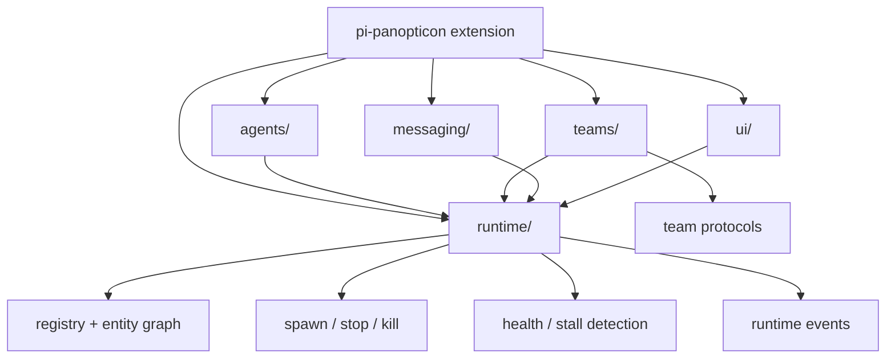

# Panopticon + Teams Single-Extension Migration Plan

Date: 2026-05-30
Status: active migration plan; Phase 1 module map added

## Goal

Converge `pi-panopticon` and `pi-teams` into a single runtime extension with strong internal modularity and a common user experience for agents, teams, and runtime entities.

Target product model:

```text
Panopticon = runtime control plane
  agents   = live process/peer module
  teams    = orchestration module
  runtime  = shared lifecycle/status/stop/event substrate
  messages = shared routing/messaging module
  ui       = unified inspect/control UX
```

This is not a big-bang code merge. The migration should preserve working behavior at each step and keep team protocol logic modular.

## Target shape



## Migration principles

1. **One extension surface, many modules.** Physical package consolidation must not produce a monolith.
2. **Runtime concepts live once.** Spawn, stop, status, health, events, and parent/child lineage belong to the Panopticon runtime module.
3. **Teams keep protocol ownership.** Team specs, handlers, model-role binding, and research/debate/navigator semantics stay isolated.
4. **No backward-compatibility shims by default.** Avoid legacy aliases, migrations, and duplicate state paths unless explicitly approved; stale compatibility paths caused the `.pi-goal` loop failure.
5. **Cut over deliberately.** Prefer one clear runtime UX/API over parallel old and new surfaces.
6. **No promotion by accident.** Approval gates, worktree isolation, and observability JSONL remain governed by existing ADRs.

## Current baseline

Already landed:

- ADR 025: Panopticon runtime control plane.
- Runtime adapter libraries:
  - `lib/runtime-child-process.ts`
  - `lib/runtime-control-plane.ts`
  - `lib/runtime-agent-messaging.ts`
- `pi-teams` routes one-shot model calls through runtime child-process adapter.
- Live-agent team nodes use runtime messaging adapter.
- Team runs are exposed through `runtime_status` and `runtime_stop`.
- Architecture guard prevents new raw `node:child_process` usage in `pi-teams` except approved worktree POC.

## Phase 1 — Package-boundary decision and module map

Phase 1 artifact: `docs/reports/panopticon-teams-module-map.md`.

### Work

- Decide the final directory/package layout.
- Preferred layout:

```text
extensions/pi-panopticon/
  index.ts
  runtime/
  agents/
  teams/
  messaging/
  ui/
```

- Map current `extensions/pi-panopticon/teams/*` files into future modules.
- Identify files that should remain shared `lib/*` versus move under `pi-panopticon/runtime/*`.

### Acceptance

- Add a short architecture report with the file/module map. ✅ `docs/reports/panopticon-teams-module-map.md`
- No runtime behavior changes.
- `npm run check` and `npm test` pass before implementation phases that change code.

## Phase 2 — Runtime substrate hardening

### Work

- Move or formalize runtime adapter APIs as the stable internal substrate.
- Add capabilities and limits model for runtime operations:
  - child process spawn
  - live-agent messaging
  - stop propagation
  - parent/child linkage
  - max loops/fanout/timeouts
- Fix known runtime risks while touching this area:
  - fail closed on missing trusted `pi` binary
  - reject `channel=agent` in `message_send`
  - registry dir/file permissions
  - bounded child-process close after SIGKILL

### Acceptance

- Runtime substrate tests cover spawn, stop, inspect, link, event emission, and failure cases.
- Preferred runtime tools work; redundant old team runtime tools may be removed in the same phase if tests/docs are updated.
- Security tests or targeted unit tests cover hardened behavior.

## Phase 3 — Unified runtime entity model

### Work

Define first-class internal entities:

```ts
type RuntimeEntityKind = "agent" | "team_run" | "child_process";
```

Each entity should support:

- id
- kind
- label
- status
- parent
- children
- created/updated timestamps
- stop delegate
- recent events

Team specs stay separate from runtime entities.

### Acceptance

- `runtime_status` lists active/recent agents and team runs from one model.
- `runtime_stop` handles both agent and team-run entities where supported.
- Tests prove teams are not modeled as agents; team runs own child entities.

## Phase 4 — Unified UX

### Work

Add a common runtime UX surface.

Options:

```text
/runtime
/agents      # becomes filtered runtime view for agents
/teams       # becomes filtered runtime view for teams/specs
```

or:

```text
/agents      # renamed conceptually to runtime browser, with tabs: Agents / Teams / Runs
```

Recommended: add `/runtime` first to avoid surprising current `/agents` users.

UX should support:

- list agents
- list team runs
- inspect entity
- stop entity
- show parent/child lineage
- show recent events
- jump from team run to child agents/processes

### Acceptance

- Users can manage agents and team runs from one overlay/tool surface.
- `/runtime` becomes the preferred common surface; `/teams` should be removed or narrowed to team-spec authoring once the common view lands.
- TUI tests or render tests cover the common view.

## Phase 5 — Move teams under Panopticon package

### Work

- Move `extensions/pi-panopticon/teams/*` into `extensions/pi-panopticon/teams/*` or equivalent.
- Keep imports clean: no circular dependencies between runtime and teams modules.
- Register the final team/spec/runtime tools from the single Panopticon extension.
- Remove the standalone standalone pi-teams package; team modules now live under `extensions/pi-panopticon/teams`.

### Acceptance

- Only one extension owns runtime registration.
- No compatibility package keeps old runtime registration alive.
- Extension registration tests prove the new single extension registers the intended tools/commands.
- Architecture tests prevent `teams/*` from importing runtime internals except approved adapter modules.

## Phase 6 — API cutover and legacy removal

### Work

Inventory public surfaces and assign each a final disposition:

- `team_list`, `team_describe`, `team_form`, `team_models`, `team_delete` — keep only if they remain the clearest team-spec authoring API inside Panopticon.
- `team_run`, `team_runs`, `team_stop` — remove or replace with unified runtime names once `spawn_team`/`runtime_status`/`runtime_stop` exist.
- `runtime_status`, `runtime_stop`, future `spawn_team` — preferred runtime-control API.
- `/teams` — keep only for team-spec management if useful; remove as a duplicate runtime-control surface.
- `/agents` and future `/runtime` — converge on one common runtime browser.

Do not add deprecation shims unless specifically approved. Removal is acceptable when the new single surface is documented and tested.

### Acceptance

- Legacy runtime-control surfaces are removed, not aliased indefinitely.
- Prompt/skill guidance points only to the preferred common UX/API.
- Tests assert removed tools/commands are not registered when cutover is complete.

## Phase 7 — Documentation and architecture cleanup

### Work

- Update C4/Mermaid architecture docs.
- Update README extension table to describe the single runtime extension.
- Update skills:
  - `pi-agent-orchestration`
  - `pi-team-consultation`
- Archive or rewrite stale `pi-teams` standalone docs.

### Acceptance

- Docs describe one runtime extension with modular teams support.
- No docs imply `pi-teams` owns an independent runtime substrate.
- `npm run check`, `npm test`, and docs sanity checks pass.

## Risks and mitigations

| Risk | Mitigation |
|---|---|
| Big-bang merge creates spaghetti | Move by module, preserve tests after each phase. |
| Team protocol logic leaks into runtime substrate | Architecture tests and import boundaries. |
| Users lose familiar `team_*` tools | Document the new single surface clearly; avoid aliases that keep stale behavior alive. |
| Runtime trust boundary expands too fast | Capability model and no accidental approval/worktree promotion. |
| Circular imports between agents/teams/runtime | Define narrow runtime interfaces and dependency direction tests. |
| Existing sessions/registers break | Treat runtime state as session-local unless explicitly migrated. |

## Completion criteria

- There is a single effective runtime extension package.
- Agents and team runs share one runtime status/stop/inspect substrate.
- Team protocol code remains modular and testable.
- Users have a common UX for agents, teams, and runtime entities.
- Legacy compatibility surfaces are removed unless there is a specific, approved reason to keep one.
- Full validation passes: `npm run check`, `npm test`, gitleaks on staged changes.
