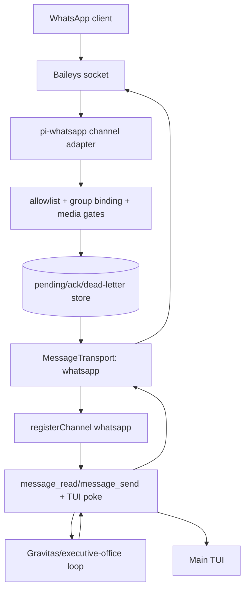

# T-520 WhatsApp Channel Integration Plan

Date: 2026-05-23

## Recommendation

Proceed with a bounded design-only adapter POC, but defer runtime integration and pairing until an explicit approval gate. Do not couple Gravitas or the executive-office loop directly to `whatsapp-pi`; build a thin `MessageTransport` channel adapter that reuses the existing Matrix/TUI notification path.

Rationale: `whatsapp-pi@1.0.62` already proves Baileys connectivity, allowlists, group handling, recents, media handling, same-thread replies, and TUI menus, but its current extension drives `pi.sendUserMessage()` and `message_end` directly. That is useful as reference code, not the boundary we want for safe executive-office communications.

## Evidence inspected

- Repo-local messaging boundary: `lib/message-transport.ts`.
- Unified message tools and TUI notification flow: `extensions/pi-panopticon/messaging.ts`.
- Matrix channel implementation: `extensions/pi-matrix/index.ts`, `extensions/pi-matrix/client.ts`, `extensions/pi-matrix/transport.ts`, `extensions/pi-matrix/config.ts`.
- `whatsapp-pi` npm metadata via `npm view whatsapp-pi --json`.
- Published tarball `whatsapp-pi-1.0.62.tgz` inspected in `/tmp`; no install, no pairing, no credentials touched.

## Current `whatsapp-pi` capability summary

`whatsapp-pi@1.0.62` is an MIT-licensed pi extension with these relevant capabilities:

- Uses `baileys` for WhatsApp Web multi-device connectivity.
- Manual QR pairing through `/whatsapp`; optional startup auto-connect through `--whatsapp-pi-online`.
- Persistent local state under `~/.pi/whatsapp-pi/`, including auth, config, logs, and recents.
- Contact allowlist and group allowlist, including group-only binding via `--whatsapp-group <jid>`.
- Group reaction modes: active replies to all allowed group messages; passive replies only on mention.
- Incoming text extraction for direct, extended, media, reaction, contact, location, protocol, and unsupported message shapes.
- Media handling: image forwarding to pi as image content, audio transcription if Whisper is available, document download to `./.pi-data/whatsapp/documents/`, PDF preview via `@llamaindex/liteparse`.
- Outbound send tool `send_wa_message`, reaction tool `send_reaction`, retrying send path, typing indicators, read receipts, and same-thread replies.
- Recents/history browser and manual reply UI.
- Loop guard: outbound messages append `π`; inbound messages ending with `π` are ignored.
- WhatsApp-side commands `/compact` and `/abort` call pi session actions.

## Security posture

Positive controls already present:

- No messages are processed until a contact or group is allowed.
- Group binding can constrain a session to one WhatsApp group.
- Auto-connect does not pair when credentials are absent unless the operator explicitly connects.
- Session shutdown stops the WhatsApp service.
- Message sending has bounded retries and connection checks.
- Matrix-like attachment posture can be approximated because media metadata and saved paths are available.

Concerns for this repo's human-channel loop:

- Direct prompt injection: current `whatsapp-pi` calls `pi.sendUserMessage(..., {deliverAs: "followUp"})` for inbound WhatsApp. That bypasses `message_read`, channel-level ACKs, and a single auditable human-message envelope.
- Direct outbound coupling: current `message_end` auto-sends assistant responses back to the last WhatsApp JID. Gravitas should send through an explicit channel send operation, not implicit hook coupling.
- Credentials and logs live in user home. Integration must not write auth/session files except during a separately approved pilot.
- Phone numbers/JIDs and group IDs are sensitive identifiers. Reports, logs, fixtures, and tests must use synthetic values only.
- Media handling currently downloads documents and parses PDFs automatically. For executive-office safety, match Matrix policy: download only after MIME/size gates, surface metadata, and never execute or parse attachments automatically unless explicitly approved.
- Package imports `@mariozechner/pi-coding-agent` while this repo uses `@earendil-works/pi-coding-agent`; compatibility must be audited before installation.
- Package has a fast release cadence and external dependencies (`baileys`, `pino`, `qrcode-terminal`, `@llamaindex/liteparse`); pinning and source audit are required before runtime use.

## Mapping to existing Matrix/TUI/Lumen abstractions

### Existing boundary

`lib/message-transport.ts` defines the useful abstraction:

- `MessageTransport.send(peer, from, message): Promise<DeliveryResult>`
- `receive(agentId): InboundMessage[]`
- `ack(agentId, messageId): void`
- `pendingCount(agentId): number`
- channel registration through `registerChannel(name, transport)`
- notification through `notifyChannel()`

`pi-panopticon` already turns any registered channel into:

- sparse TUI/user notification: `N new messages. Use message_read...`
- unified `message_read` output with `[channel:from]` attribution
- `message_send({channel, message})` outbound routing
- ACK/prune after read

### Proposed inbound envelope

Use channel name `whatsapp` and adapt each allowed WhatsApp event to `InboundMessage`:

```ts
interface WhatsAppEnvelope {
  id: string;              // WhatsApp message key id, or chatJid/messageId fallback
  from: string;            // whatsapp:<alias-or-redacted-jid>, group participant if needed
  text: string;            // normalized text or safe media notice
  ts: number;              // message timestamp in ms
  attachments?: InboundAttachment[];
}
```

Recommended `from` forms:

- Direct: `whatsapp:contact:<alias>` when alias exists, otherwise `whatsapp:contact:<redacted-last4>`.
- Group: `whatsapp:group:<alias>/<participant-alias-or-redacted-last4>`.
- Preserve raw JID only in adapter-private correlation storage, never in default `message_read` text.

Add `origin` metadata in adapter internals even if the current shared interface cannot carry it yet:

```json
{
  "origin": {"channel": "whatsapp", "chatJid": "...", "messageId": "..."},
  "correlationKey": "whatsapp:<chatJid>:<messageId>"
}
```

If the interface is extended later, keep it optional and transport-agnostic.

### Correlation and idempotency

- Primary idempotency key: `${remoteJid}:${message.key.id}`.
- Include participant JID for groups when available: `${remoteJid}:${participant}:${message.key.id}`.
- Maintain a small persistent seen-message store under an opt-in project or user path, separate from credentials.
- `receive()` should not erase messages until `ack()`; this is stronger than current Matrix's ephemeral buffer and safer for executive-office communications.
- On process restart, do not replay already ACKed messages.

### ACK/receipt semantics

Separate three concepts:

1. WhatsApp read receipt: optional, after the adapter safely buffers the message.
2. Pi transport ACK: after `message_read` drains and panopticon calls `ack()`.
3. Human reply receipt: outbound `DeliveryResult.reference` from WhatsApp send.

Do not mark WhatsApp messages read before buffering succeeds. If read receipts are enabled, use them after enqueue, not after model processing.

### Same-channel outbound

- `message_send({channel: "whatsapp", message})` should reply to the most recent inbound WhatsApp chat only when that correlation exists.
- For proactive sends, require an explicit approved alias/JID mapping, not free-form phone numbers from the model.
- Return `DeliveryResult.reference = messageId` on success.
- Do not append model text to WhatsApp via `message_end`; outbound must be explicit and auditable.

### Dual TUI display

Keep two distinct UI layers:

- Transport status: `pi-whatsapp: off|pairing|on|err msg:N`, like `pi-matrix`.
- Message notification: reuse panopticon's `N new messages. Use message_read...`; do not display bodies in the TUI notification.

A `/whatsapp` menu may remain for pairing and allowlist management, but the agent-facing path should be `message_read`/`message_send`.

### Dead-letter/error handling

Add a local dead-letter queue for events that cannot be safely converted:

- unknown sender not in allowlist;
- missing message id;
- media too large;
- unsupported MIME;
- failed download;
- outbound send failure after retries;
- duplicate conflict or stale correlation.

Surface only counts and safe summaries in status/notifications. Provide a diagnostic command or report that redacts identifiers by default.

## Recommended architecture

Use a thin channel adapter, not direct orchestrator coupling.



Adapter responsibilities:

- own WhatsApp lifecycle, allowlist, group binding, and credentials;
- normalize inbound events into `InboundMessage`;
- manage ACK/idempotency/dead-letter storage;
- send outbound replies to correlated chats;
- expose status and safe diagnostics.

Orchestrator responsibilities:

- consume all human channels through `message_read`;
- choose whether/how to respond;
- send through `message_send` with `channel = whatsapp`;
- never know Baileys internals or raw credentials.

## Phased plan

### Phase 0 — audit/package install decision

- Pin the exact package version or vendor/audit the minimal source needed.
- Confirm pi package API compatibility (`@mariozechner` vs `@earendil-works`).
- Review dependency tree and license posture.
- Decide whether to depend on `whatsapp-pi`, extract a small adapter from it, or implement a fresh adapter using Baileys.
- Approval gate: security/runtime owner signs off before any install or pairing.

### Phase 1 — adapter shim and contract tests

- Add a `pi-whatsapp` extension skeleton behind disabled-by-default settings.
- Implement a fake WhatsApp client interface for tests.
- Implement `WhatsAppTransport` against `MessageTransport` with durable pending/ack/dead-letter stores.
- Contract tests: inbound enqueue, duplicate suppression, receive/ack/restart behavior, same-channel outbound, send failure, redaction.
- No network, no Baileys socket, no credentials.

### Phase 2 — local dry-run fixture

- Add static synthetic fixtures for direct text, group mention, image metadata, oversized media, unsupported media, and send result.
- Verify `message_read` output includes `[whatsapp:...]` attribution and safe attachment metadata.
- Verify TUI status is count-only.
- Run `npm run check`, targeted tests, and secret-marker scans.

### Phase 3 — opt-in pilot

- Add settings but keep default off:
  - `enabled: false`
  - `autoConnect: false`
  - `allowPairing: false` except during manual pairing command
  - `trustedContacts`/`trustedGroups`
  - `redactIdentifiers: true`
  - media MIME/size limits
  - read receipt mode
- Pair only in an approved sandbox pi profile.
- Pilot with one synthetic/test group or non-production number.
- Monitor dead-letter counts and duplicate suppression.

### Phase 4 — executive-office integration gate

- Require ADR before Gravitas/executive-office use.
- Require rollback rehearsal: disable settings, unregister channel, stop client, preserve but do not delete auth unless explicitly requested.
- Require human approval for proactive outbound and any media parsing beyond metadata.

## Required settings/package changes

No current repo changes should be made for runtime behavior during T-520.

Likely future settings block:

```json
{
  "pi-whatsapp": {
    "enabled": false,
    "channelLabel": "whatsapp",
    "autoConnect": false,
    "allowPairing": false,
    "trustedContacts": [],
    "trustedGroups": [],
    "groupBinding": "",
    "redactIdentifiers": true,
    "storagePath": "~/.pi/agent/whatsapp-channel",
    "credentialPath": "~/.pi/whatsapp-pi/auth",
    "maxAttachmentBytes": 26214400,
    "allowedMimePrefixes": ["image/", "application/pdf", "text/", "audio/"],
    "readReceipts": "after_enqueue"
  }
}
```

Likely package decision options:

1. Add `whatsapp-pi` as an optional/reference dependency only after audit.
2. Add `baileys`, `pino`, and `qrcode-terminal` directly to a new adapter package if a smaller audited surface is preferred.
3. Defer all package additions and keep dry-run tests on a fake client until pilot approval.

Preferred near-term option: 3.

## Rollback plan

- Set `pi-whatsapp.enabled = false`.
- On session shutdown or disable, call client stop and `unregisterChannel("whatsapp")`.
- Leave credentials untouched by default; provide a separate explicit logoff/delete-session command.
- Keep pending/dead-letter stores for audit unless the operator explicitly purges them.
- Remove optional dependency/package setting if runtime pilot is cancelled.
- Confirm `message_read` reports no `whatsapp` channel and TUI status returns `pi-whatsapp: off`.

## ADR and approval triggers

Create an ADR before any of these:

- installing `whatsapp-pi` or Baileys into this repo/package set;
- pairing a real WhatsApp account or writing credentials;
- enabling auto-connect or background lifecycle hooks;
- routing WhatsApp-origin messages to Gravitas in production;
- allowing proactive outbound sends;
- storing raw phone numbers/JIDs in project files;
- enabling automatic media parsing beyond metadata;
- changing `MessageTransport` to carry structured origin metadata.

Approval should include security posture, dependency audit, data retention, human consent for read receipts, and rollback rehearsal.

## Final decision

Proceed with a fake-client adapter POC and contract tests only. Defer package installation, WhatsApp pairing, credentials, background hooks, and executive-office runtime integration until explicit ADR/approval gates are met.
