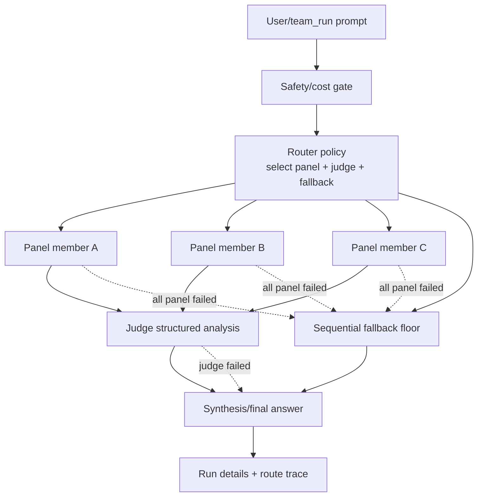

# T-704 OpenRouter-style internal team topology

Status: active

## Recommendation

Build a small internal `router-fusion` team protocol only if we need this behavior repeatedly; otherwise keep using `llm-council` and `deep-research`.

Do **not** add an external OpenRouter dependency. Mimic only the useful topology:

1. policy-gated model selection,
2. bounded parallel panel calls,
3. judge analysis of consensus/contradictions/blind spots,
4. final synthesis by the caller or synthesis node,
5. sequential fallback on classified failures.

Keep this separate from existing `llm-council`: routing/fusion optimizes answer quality and resilience for one prompt; council optimizes explicit disagreement and governance review.

## Public-source claim checks

- OpenRouter routing separates **model selection** from **provider selection**; its router handles model selection, provider selection, load balancing, and failover behind one endpoint. Source: OpenRouter blog, “How OpenRouter Model Routing Works,” 2026-06-12, https://openrouter.ai/blog/insights/model-routing/
- Default provider routing prioritizes providers without significant outages in the last 30 seconds, then chooses among low-cost stable providers weighted by inverse square of price, keeping remaining providers as fallbacks. Source: OpenRouter Provider Routing docs, https://openrouter.ai/docs/guides/routing/provider-selection.mdx
- Model fallback uses a priority `models` array and triggers on errors including context-length validation, moderation flags, rate limiting, and downtime; pricing follows the model that ultimately answered. Source: OpenRouter Model Fallbacks docs, https://openrouter.ai/docs/guides/routing/model-fallbacks
- Provider control includes `order`, `allow_fallbacks`, `only`, `ignore`, `quantizations`, `data_collection`, `zdr`, `sort`, `preferred_min_throughput`, `preferred_max_latency`, and `max_price`. Source: OpenRouter Provider Routing docs.
- Fusion is a panel-plus-judge pipeline: panel models answer in parallel, judge returns structured analysis with consensus, contradictions, partial coverage, unique insights, and blind spots; the outer model writes final answer. Source: OpenRouter Fusion docs, https://openrouter.ai/docs/guides/features/plugins/fusion
- Fusion is intended for research/expert critique/expensive-to-be-wrong tasks and is overkill for routine prompts. Source: OpenRouter Fusion docs.
- Fusion permits 1–8 analysis models and bounded tool calls; panel/judge use web search/fetch in OpenRouter’s server implementation. Source: OpenRouter Fusion docs.
- OpenRouter’s announcement claims DRACO deep-research benchmark gains from panels and synthesis, including budget panels approaching frontier performance; those are vendor-run benchmark claims, not independent proof. Source: OpenRouter blog, “Surpassing Frontier Performance with Fusion,” 2026-06-12, https://openrouter.ai/blog/announcements/fusion-beats-frontier/
- OpenRouter’s server tool reports partial success when some panel models fail, can degrade if judge fails by returning raw panel responses, and hard-fails only when no useful output exists. Source: OpenRouter Fusion Server Tool docs, https://openrouter.ai/docs/guides/features/server-tools/fusion

## Difference from debate/council

| Pattern | Primary goal | Execution | Output | Best use |
|---|---|---|---|---|
| Router/fallback | Reliability/cost/latency policy | Sequential attempts until success | One model answer plus route trace | Routine calls with resilience |
| Fusion/aggregation | Higher-quality answer for one prompt | Parallel panel, judge, synthesis | Consensus/contradictions/blind spots + final | Research, critiques, trade-offs |
| Debate/council | Deliberate disagreement and governance | Role-shaped arguments and synthesis | Decision record/recommendation | Architecture, public API, security, contested strategy |
| Deep research | Evidence gathering and verification | Explorer/verifier loops | Cited report with gap closure | Research needing source audits |

`pi-fusion@0.7.4` already implements a local pi extension with similar panel/judge semantics, but T-701/T-702/T-703 found it should be optional and needs at least a packaging fix before trust. An internal topology avoids third-party extension execution and can reuse pi’s existing team observability and model controls.

## Smallest internal topology

Name: `router-fusion` or `fusion-consult`.

Roles:

- `router`: deterministic policy function, not an LLM. Selects candidate models from config/runtime overrides, cost/safety gates, and visible pi models.
- `panel_member[]`: 1–4 model-backed calls, parallel by default. Each gets the same sanitized prompt and optional readonly evidence bundle.
- `judge`: one model-backed call that compares panel outputs into structured JSON: `consensus`, `contradictions`, `partialCoverage`, `uniqueInsights`, `blindSpots`, `confidence`, `missingEvidence`.
- `synthesis`: either existing outer/caller model or a configured synthesis node. Produces final user-facing answer using judge analysis and bounded raw panel excerpts.
- `fallback_floor`: optional sequential fallback model used only when all panel members or judge fail.

Execution flow:



## Router policy sketch

Inputs:

```ts
interface RouterFusionConfig {
  panel: string[];
  judge?: string;
  fallbackModels?: string[];
  maxPanelModels?: number;
  mode?: "quality" | "budget" | "latency";
  maxEstimatedCalls?: number;
  maxPanelOutputTokens?: number;
  maxJudgeTokens?: number;
  tools?: "none" | "readonly";
  allowProviders?: string[];
  denyProviders?: string[];
  requireDistinctProviders?: boolean;
  requireApprovalAboveCalls?: number;
}
```

Selection rules:

1. Resolve runtime overrides over project/user defaults, matching existing `team_run` model override precedence.
2. Filter to pi-visible/authed text models where possible; unknown configured models are warnings, not silent substitutions.
3. Apply provider allow/deny and data-safety policy before cost/quality scoring.
4. Cap panel size at 3 by default, hard cap 4 initially. OpenRouter supports up to 8, but pi should start smaller.
5. Score candidates by configured mode:
   - `quality`: configured order, prefer diverse providers.
   - `budget`: cheaper/local models first when price metadata exists; otherwise explicit configured order only.
   - `latency`: prefer fast/local models if historical duration exists.
6. Use sequential fallback only on classified operational failures: provider error, timeout, context-length, rate-limit, empty output. Do not fallback for a merely low-quality 200 response unless judge validation fails.

## Failure handling

- Panel partial success: continue when at least one panel response is usable; record failed nodes in `details[]`.
- All panel failed: try `fallbackModels` sequentially; if one succeeds, synthesize from fallback and mark degraded.
- Judge failed/invalid JSON: return raw panel excerpts to synthesis with `analysisStatus: "missing"`; do not discard useful panel work.
- Synthesis failed: return judge JSON and panel summaries as diagnostic artifact, status failed/degraded depending on caller contract.
- Timeouts: per-node timeout plus overall run budget; no unbounded retries.
- Recursion: do not allow `router-fusion` to invoke itself or `llm-council` recursively in panel prompts.

## Config surface

Start as a declarative team/protocol config, not a generic DAG engine:

```json
{
  "id": "router-fusion",
  "protocol": "fusion",
  "models": {
    "panel": [
      "openai-codex/gpt-5.5",
      "google/gemini-3.1-pro-preview",
      "google/gemini-2.5-pro"
    ],
    "judge": "openai-codex/gpt-5.5",
    "fallback": ["google/gemini-2.5-flash"]
  },
  "limits": {
    "maxPanelModels": 3,
    "timeoutMs": 120000,
    "maxPanelOutputTokens": 1200,
    "maxJudgeTokens": 2000,
    "requireApprovalAboveCalls": 4
  },
  "policy": {
    "tools": "none",
    "requireDistinctProviders": true,
    "denyProviders": []
  }
}
```

Avoid exposing provider-specific OpenRouter fields directly. Pi has provider/model IDs, not OpenRouter endpoint slugs. If later needed, add pi-native policy names (`budget`, `quality`, `latency`, `local-first`, `no-third-party-data`) and map them internally.

## Observability

Reuse existing `pi-teams` session run details rather than adding storage:

- `trace`: chosen panel/judge/fallback, mode, caps, approval decision.
- `fallback`: failed model, reason, next attempted model.
- `artifact`: optional path/hash for full judge JSON when too large for run state.
- `error`: classified provider/runtime failures.
- `node`: model, role, ok, duration, bounded output, token/cost usage if available.

Expose in `team_runs`/`runtime_status` as a normal team run. Do not change public contracts until implementation pressure proves a new field is needed.

## Safety and cost gates

Default gates:

- Disabled unless explicitly invoked; no automatic every-prompt routing.
- `maxPanelModels: 3`, max one judge, max one synthesis.
- `tools: "none"` by default; `readonly` only with explicit project/data approval; no mutating panel tools in v1.
- Prompt/context minimization: pass only current prompt and explicit evidence, not full session history.
- Provider/data policy gate before model selection.
- Approval required when estimated calls exceed 4 or when non-default providers/tools are requested.
- Hard timeout and cancellation propagation to child model calls.
- Budget mode should prefer local/cheaper models only when model metadata is known; otherwise require explicit ordered config.

## Implementation sketch

Smallest code path:

1. Add a `fusion` direct handler alongside existing `consult`, `debate`, and `research` handlers.
2. Add strict v2 manifest validation for `protocol: "fusion"` only after a design approval; do not reintroduce generic graph execution.
3. Implement `selectFusionPlan(config, visibleModels, limits)` as a pure tested function.
4. Execute panel with bounded concurrency, then judge, then synthesis; reuse `team-node-runner.ts` for model-backed calls.
5. Add tests for:
   - selection order and caps,
   - unknown/unauthed model warnings,
   - partial panel success,
   - all-panel failure fallback,
   - judge invalid JSON degradation,
   - cost/approval gate behavior,
   - no recursive fusion.
6. Add one built-in team only after tests: `router-fusion` with conservative defaults and `tools: none`.

## Risks

- Quality claims from OpenRouter Fusion are vendor-run and benchmark-specific; do not assume universal improvement.
- Multi-model fanout multiplies cost and data exposure.
- Adding too much provider-routing vocabulary could turn pi-teams into a generic LLM gateway, which conflicts with current direct-handler architecture.
- Poor model diversity can add noise; require explicit model choices and cap panel size.

## Decision

Proceed with design-only approval discussion. If implemented, choose a minimal direct `fusion` protocol handler, not a new external dependency and not a replacement for `llm-council`.
