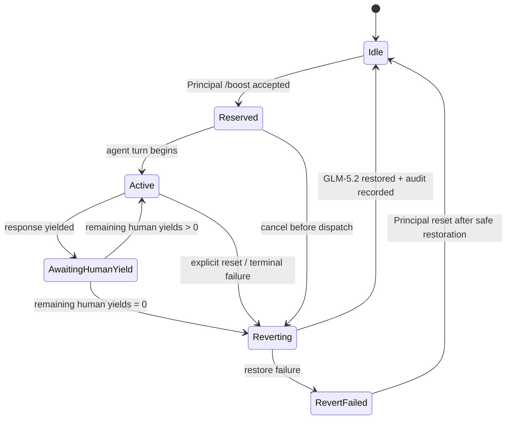

# T-839 Proposal: Approved `/boost` Frontier-Model Lease

**Status:** proposal for council review; no implementation or model/config call is authorized.

## Decision requested

Approve a non-sticky, Principal-authorized lease that temporarily runs one agent turn on Sol Ultra, then reliably restores the pre-lease GLM-5.2 selection. If accepted, this design occupies **ADR-045**; no ADR is adopted by this proposal.

## Goals and boundaries

- Give a Principal an explicit, bounded way to request a high-capability review turn.
- Apply the lease across a multi-step turn (including tool use and follow-up reasoning), not per model call.
- Decrement its turn budget only after a human-visible yield.
- Preserve the conversation after fallback while keeping boost framing and isolated contexts ephemeral.
- Never change global defaults, persisted model selection, residency, schedule cadence, or agent authorization.

Excluded: automatic upgrades, non-Principal invocation, model probing, background/scheduled use, retries on a paid model, prompt retention, and implementation before council approval.



## Command grammar

```ebnf
boost-command = "/boost", ws, (status | reset | request) ;
status        = "status" ;
reset         = "reset" ;
request       = { option, ws }, [ "--", ws ], prompt ;
option        = turns | clean | fresh ;
turns         = "-n", ws, positive-integer ;
clean         = "--clean" ;
fresh         = "--fresh" ;
prompt        = non-empty-text ;
```

- `status` reports lease state, remaining human yields, expiry, and audit identifier; it never reveals prompt text or credentials.
- `reset` is Principal-only, stops a pending lease, restores the saved GLM-5.2 selection, and records a reset audit event.
- `-n` requests a count of human yields. Policy sets a hard maximum and rejects values outside it; omission means one yield.
- `--clean` and `--fresh` are mutually exclusive. An option after `--` is prompt text, not syntax.
- A request with no prompt, repeated option, unknown option, non-positive integer, or non-Principal issuer is rejected before any lease reservation.

## Lease state and lifecycle

A session-local lease record contains only: opaque lease id, subject agent/session identity, Principal issuer identity, saved model selector (`GLM-5.2`), leased selector (`Sol Ultra`), state, remaining human yields, expiry, isolation mode, and audit event ids. It contains neither the user prompt nor model output.

1. **Reserve.** Authorization and budget are checked atomically; capture the current model selector. The only eligible saved selector is the approved GLM-5.2 baseline. If it cannot be captured, reject.
2. **Activate.** Sol Ultra is selected only for the target agent turn. The ephemeral rut-breaker instruction is appended in memory for that turn only.
3. **Use.** Tool calls, internal reasoning, retries within the same turn, and streaming chunks do not decrement `-n`.
4. **Human yield.** Decrement exactly once when the harness emits the terminal response handed to a human. A cancelled, hidden, failed, or tool-only turn does not decrement.
5. **Continue or revert.** If yields remain, the next eligible human turn may reactivate the same lease after an authorization/budget recheck. At zero, immediately begin reversion before accepting another model action.
6. **Expiry.** A lease cannot span daemon restart, session transfer, or expiry. These events force reversion; no lease is reconstructed from durable session content.

## Reversion, failure, and reset

- Reversion restores the captured GLM-5.2 selector before the next model dispatch. It must be idempotent.
- A Sol failure, cancellation, transport timeout, policy violation, or isolation setup failure enters `Reverting`; it never silently falls through to another frontier provider.
- If restoration succeeds, record `reverted` with the failure category and retain normal conversation context.
- If restoration fails, enter `RevertFailed`, block further model dispatch for that subject, raise a bounded local warning, and require an explicit Principal `reset`. A reset retries restoration only; it does not reuse Sol or replay the prompt.
- Rollback is therefore: discard the lease record and ephemeral boost framing after a successful GLM restoration. No durable model/config mutation exists to undo.

## Authorization, budget, and audit

- Only the Principal authorization boundary may reserve, inspect sensitive lease detail, or reset a lease. Agents, schedules, tools, and Matrix-originated text cannot self-authorize.
- A budget authority supplies an allow/deny decision and a lease ceiling before Sol dispatch. Denial is fail-closed and consumes nothing.
- At most one active lease is permitted per subject agent and one globally until a later ADR explicitly changes the budget topology.
- Audit records are append-only and bounded: opaque lease id, issuer/subject ids, state transition, timestamp, requested/consumed human yields, isolation mode, selected-model labels, and failure category. They exclude prompts, model responses, paths outside the selected workspace, tokens, credentials, and raw provider errors.
- Audit write failure is fail-closed before activation; a post-dispatch audit failure triggers reversion and local warning.

## Ephemeral prompt and context boundaries

The temporary framing is exactly: challenge assumptions, inspect the underlying diff where available, and avoid repeating recent failed edits. It is injected after immutable system policy and before the current user request; it cannot override authorization, tool policy, or repository instructions.

It is held only in the active dispatch payload. It is not written to system prompts, `AGENTS.md`, workspace context, schedule state, model defaults, agent profile, audit log, completion transcript, or future GLM turn. Conversation content remains available after fallback unless an isolation flag changes that dispatch context.

## `--clean` and `--fresh`

| Flag | Dispatch context | Session effect | Failure handling |
|---|---|---|---|
| none | Existing turn context plus ephemeral boost framing | Existing session continues after reversion | Revert; retain original context |
| `--clean` | Minimal transient context: immutable policy, repository instructions, explicit boost prompt, selected workspace identity; excludes prior conversation and hidden session state | Does not create or replace a session | Destroy transient context, then revert |
| `--fresh` | New empty transient session with immutable policy, repository instructions, explicit boost prompt, and selected workspace identity | Original session remains untouched; no automatic merge | Discard fresh session, then revert |

Neither flag copies secrets, private session files, or raw audit records into the leased dispatch. `--clean` and `--fresh` must not be treated as a bypass of tool or workspace confinement.

## Test plan and acceptance gates

1. Parser: accepted request/status/reset forms; `--` delimiter; malformed, duplicate, unknown, and out-of-range options; mutual exclusion.
2. State machine: reserve/activate/yield/continue/revert; decrement once per human yield; no decrement for tools, stream chunks, cancellation, or failure.
3. Reversion: success, idempotence, Sol failure, GLM restoration failure, blocked dispatch in `RevertFailed`, Principal reset, restart/expiry rollback.
4. Authorization/budget/audit: Principal-only reservation/reset; budget denial and ceiling; single-lease exclusion; audit redaction and audit-write fail-closed behavior.
5. Prompt/context: framing exists only in leased payload; does not persist after fallback; clean/fresh omit prior conversation and do not bypass policy.
6. Regression: global model/default/config and scheduler behaviour are byte-for-byte unaffected; existing tool authorization tests pass.

Before any implementation: council must PASS this proposal, confirm the ADR-045 disposition, and approve the concrete authorization/budget authority integration. Any REVISE/BLOCK outcome keeps `/boost` unavailable.
