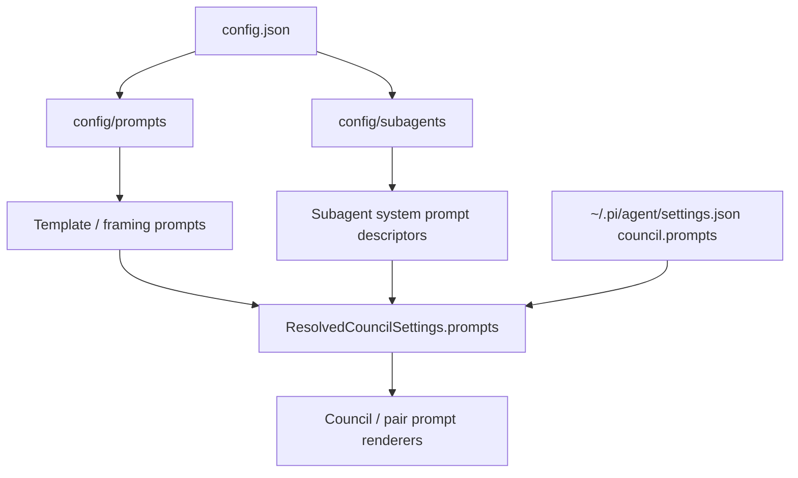

# Subagent System Prompts Migration Plan

Date: 2026-05-02
Status: implementation plan

## Goal

Move pi-llm-council default system prompts from generic prompt files into subagent descriptor files, while preserving existing prompt IDs and user settings overrides.

## Scope

In scope:

- Add `extensions/pi-llm-council/config/subagents/` Markdown descriptors for council and pair system prompts.
- Teach the settings loader to read a configured `subagentDirectory` in addition to the existing `promptDirectory`.
- Keep template/framing prompts in `config/prompts/` for now.
- Preserve existing public settings keys such as `councilGenerationSystem` and `pairNavigatorConsultSystem`.

Out of scope:

- New `team_run` APIs.
- Full team spec execution.
- Capability enforcement for subagent tools.
- Deleting compatibility support for old prompt files or user prompt overrides.

## Design



Subagent descriptor files use YAML frontmatter plus a Markdown body. The frontmatter includes a `promptId` that maps the descriptor body to the existing prompt setting key.

```md
---
name: "pair_navigator_consult"
version: "1.0.0"
description: "Navigator consulted by the main Pilot for focused pair review."
promptId: "pairNavigatorConsultSystem"
tools: []
parameters:
  temperature: 0.1
---

# IDENTITY
...
```

Loader precedence:

1. prompt Markdown files from `promptDirectory`;
2. subagent descriptors from `subagentDirectory`, overriding matching default prompt IDs;
3. extension config JSON inline prompt defaults;
4. user settings overrides.

This makes subagents the default source for system prompts, while old prompt files and user settings remain compatible.

## Acceptance criteria

- Existing council/pair tests pass.
- Default system prompt IDs resolve from subagent descriptor files.
- User `council.prompts.*` overrides still win.
- Template prompt files continue to load from `config/prompts/`.
