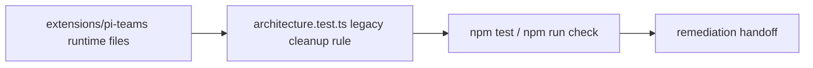
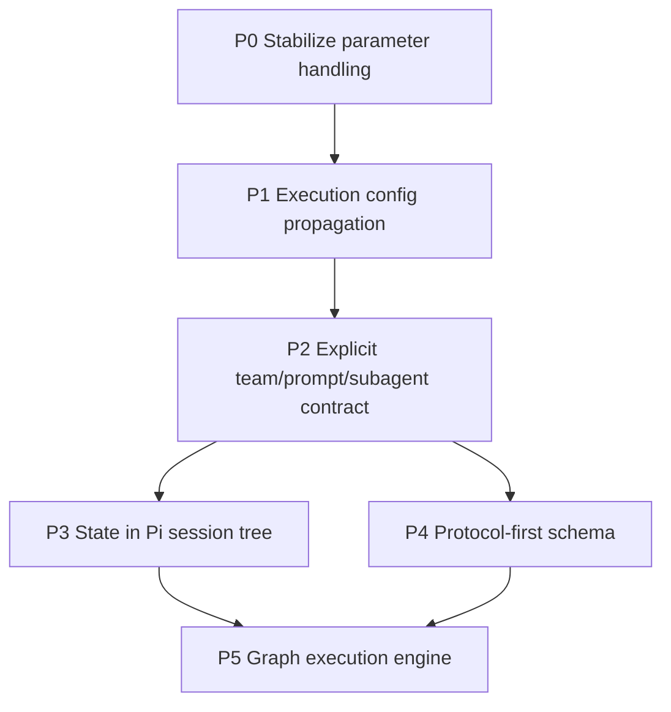

# Teams Future Improvements TODO

This is the remediation plan for moving `extensions/pi-teams` from a working extension into a robust, inspectable teams platform.

Keep moving forward and don't  ask for my feedback until you have completed all of these features as noted. Write your ADRs that you agree with the council as  You progress and you are the project manager and architect so I'll make sure you make for you solve Jules or local agents to do the work and the council and your navigator to review your work and decisions.

you have specs for P1 -> P5 in @docs/teams-p1...

Dont use kanban in this repo.

Do mark of in this document ADRs and progress

KISS, YAGNI: do not implement backward compatibility; only implement new features. Make sure you have removed all instances of the old team from the Code Base; e.g., council pair is a smell, and the types or modules that deal specifically with these needs need to be generalised to handle team apology slots and the prompts they produce. We need their teams to be driven by the configuration settings. Jason and the supporting teams' files provide no context for the code.

For each feature, please commit and push your changes when you have them, then refactor. We look brutally for simplicity and clean code in this extension. Make sure that you pass all the tests. Make sure you have tested all the changes you've made, and keep the code as concise and clean as possible. Make sure that you follow the clean code principles.

you can find out how to delegate and follow up  with jules in ~/git/coas/skills/jules-delegation/

IMPORTANT update your progress in this document as you progress!

IMPORTANT Complete the outstanding tasks -- then follow /Users/jim/git/pi-tools-and-skills/prompts/refactor.md

## Executive decisions

1. **Do not ship `temperature` in bundled agent defaults.** Pi exposes `temperature` as a generic stream option, and several provider implementations map it correctly, but support is not universal at the model/API level. Defaults should be portable and boring.
2. **Keep generation parameters provider-aware.** User-specified `parameters` can remain supported, but they must be mapped or filtered per provider/model before reaching the payload.
3. **Make team behavior inspectable from the team file.** A user should be able to see which subagents, templates, tools, model bindings, and generation parameters a team run will use.
4. **Keep authored team manifests v2-only.** Runtime legacy state import/fallback is isolated from team manifest loading; copied v1 team files are not a compatibility target.

## Architecture decision records

### ADR-001 — Keep execution config and runtime data packaging separate

**Decision:** `tools` and provider `parameters` are execution config resolved before a child call; upstream graph/council/pair outputs are runtime data rendered into protocol templates. They are separate paths and must not share a generic "parameters" abstraction.

### ADR-002 — Prompt resolution is protocol-slot based

**Decision:** P2 uses open string prompt slots declared by protocol data, not TypeScript unions of built-in or test workflow names. Resolution precedence is deterministic: protocol default < subagent prompt < team prompt override < binding prompt override < binding literal. Team markdown bodies remain human notes unless explicitly referenced by a future opt-in slot.

### ADR-003 — Team run state is session-first with explicit visibility

**Decision:** P3 persists `pi-teams:run` delta events in the Pi session tree. Run state is not model-visible by default; protocols may opt in to a bounded model-visible summary event when a later phase needs prior run context.

### ADR-004 — Schema is protocol-first

**Decision:** P4 makes `protocol` the dispatch source. Authored team manifests are strict `schemaVersion: 2`; `engine` aliases, `topology`, and legacy top-level model fields are not accepted or emitted by new `team_form` output.

### ADR-005 — Execution topology belongs in team configuration

**Decision:** P5 starts with deterministic DAG execution, but the target architecture is broader: no built-in team topology should be baked into TypeScript. Team files, agent bindings, prompt slots, limits, and explicit execution-policy fields should describe the workflow. TypeScript should provide generic execution primitives and validation, not hardcoded council/pair/telephone control flow.

### ADR-006 — Authored teams are v2 protocol files

**Decision:** New bundled and generated team files use `schemaVersion: 2`, `protocol`, object role bindings, and explicit prompt-slot maps. `topology` is not parsed, retained, emitted, or used for execution.

### ADR-007 — Session state writes event deltas, not model-visible messages

**Decision:** `TeamStateManager` appends bounded `pi-teams:run` custom events (`run_started`, `phase_started`, `node_completed`, terminal/tombstone events) and rehydrates from the current session branch. Legacy JSON snapshots remain a local file fallback, but session events are the inspection surface.

### ADR-008 — Graph nodes are existing role bindings

**Decision:** P5 does not introduce a separate graph DSL. A graph node is a team role binding; edges, outputs, reducer, dependency policy, timeout, and concurrency are the minimal execution policy required for deterministic DAG runs.

### ADR-009 — Remove baked-in team topology from TypeScript

**Decision:** Council/debate, pair-coding, consult, and telephone are bundled team configurations, not TypeScript architecture boundaries. Their role names may exist in team, agent, and prompt files, but orchestration code must be factored into generic prompt packaging, node execution, sequencing, joins, retries, and bounded-iteration primitives. Obsolete wrapper modules such as `prompts.ts` and `pair-prompts.ts` are removed instead of preserved for compatibility.

### ADR-010 — Lower simple protocols before inventing new primitives

**Decision:** Consult and telephone lower onto the existing graph executor first. Live-agent consult refs are rejected until a generic live graph-node runner exists. Debate fanout/critique/synthesis and pair-coding's bounded fix loop remain separate until they can be expressed with small, explicit execution primitives rather than protocol-named orchestration modules.

### ADR-011 — Session rehydrate must not list global legacy runs

**Decision:** Once a Pi session branch has been rehydrated, `TeamStateManager.list()` is branch-scoped even when the branch has zero team events. Legacy JSON remains readable by explicit id fallback, but new/resumed/forked sessions do not automatically inherit unrelated global run files.

### ADR-012 — Debate lowering deletes bespoke orchestration before broad renames

**Decision:** Debate now lowers into ordinary graph nodes for generation, critique, and synthesis. The old live-agent deliberation runner, mailbox request path, and preflight helper surface are removed instead of wrapped.

### ADR-013 — Bounded pair loops are unrolled DAGs

**Decision:** Pair-coding now lowers to a finite graph (`navigator_brief -> driver_implementation -> review/fix...`) using `maxFixPasses` for static unrolling. No cyclic graph edges, expression language, or pair-specific runner module is introduced.

### ADR-014 — Remove compatibility aliases instead of carrying legacy type names

**Decision:** P6 removes `CouncilDefinition`, `CouncilMember`, `TeamRunDefinition`, `LEGACY_TEAM_RUN_CUSTOM_TYPE`, and compatibility conversion helpers rather than preserving aliases. Tests now target protocol-neutral team registry, graph, prompt, runner, and state surfaces directly.

### ADR-015 — Remove topology from runtime types and tool output

**Decision:** `topology` is no longer derived, stored on `TeamSpec`, accepted by `requireBuiltinTeam`, or returned by `team_list`. Protocol and explicit graph policy are the only execution selectors.

### ADR-016 — Session state records are protocol-neutral

**Decision:** `TeamStateManager` no longer writes or rehydrates debate-shaped snapshots with generation/critique/synthesis fields, legacy file fallback, or `chairman` participants. The session branch contains only bounded protocol-neutral run, phase, node, completion, failure, and tombstone events; inspection reduces those events into generic phase/node records.

### ADR-017 — Synthesis replaces chairman as the debate output slot

**Decision:** Debate output is named `synthesis` in team bindings, model overrides, settings, prompt contracts, and tests. `chair`/`chairman` compatibility is removed; users should update authored team files to the v2 `synthesis` role and `models.synthesis` binding.

### ADR-018 — Protocol lowering is separate from handler dispatch

**Decision:** Refactor follow-up keeps runtime behavior unchanged but moves bundled protocol graph lowering into `team-lowering.ts`. `team-handlers.ts` now owns handler selection, progress/state recording, and result shaping only; lowering code owns protocol-to-graph planning and prompt packaging. This preserves the graph execution core while reducing the largest handler module below architecture limits.

### ADR-019 — No manifest compatibility aliases

**Decision:** Authored v2 team manifests use `protocol` and role binding `model` fields only. `engine`, `memberModels`, `synthesisModel`, `driverModel`, and `navigatorModel` parsing is removed from `team-registry.ts` instead of retained as compatibility surface. The obsolete `teams.ts` compatibility barrel is deleted; tests import concrete modules directly.

### ADR-020 — Role matching is a shared execution primitive

**Decision:** Protocol lowering and handler model-slot inspection use one shared role-binding matcher. This keeps fuzzy role matching (`role` and `role_*`) protocol-neutral and removes ad hoc fake-team wrappers from graph planning code.

### ADR-021 — Generated forms only create runnable built-in protocols

**Decision:** `team_form` does not offer `graph` until it can author explicit edges and output policy. Graph remains a supported runtime protocol for manually authored v2 team files; generated team files should be runnable without hidden follow-up edits.

### ADR-022 — Refactor closure is evidence-gated

**Decision:** After P3-P6 completion, do not keep rewriting working graph/state/registry code without a concrete smell, failing fitness function, or user-visible simplification. The refactor follow-up closes on objective evidence: green full validation, zero knip findings, architecture fitness green, no legacy runtime-symbol matches in `extensions/pi-teams`, and council/navigator review finding no blockers.

### ADR-023 — Team file rewrites preserve inspectable execution config

**Decision:** File-mutating helpers such as `team_models` must preserve prompt refs, binding prompt/template overrides, tools, parameters, graph policy, outputs, reducers, and limits when rewriting a team manifest. Generated built-in protocol teams must also be runnable without optional model inputs; debate generation therefore emits at least one member binding even when `models.members` is omitted.

### ADR-024 — Graph retries stay bounded and declarative

**Decision:** P5 retry support is a small graph execution policy, not a protocol-specific loop. `maxRetries` may be set globally in team limits, overridden on a role binding, or supplied at run time; retries apply only to child-call failures and do not retry parent cancellation or node timeouts.

### ADR-025 — Prompt asset IDs stay path-shaped

**Decision:** Built-in prompt asset IDs use protocol path names such as `graph/node/template`, not camelCase compatibility IDs. Prompt slot keys remain protocol-local map keys, but the referenced assets should be inspectable and grouped by protocol without TypeScript-only naming conventions.

### ADR-026 — Legacy cleanup is architecture-gated

**Decision:** The P6 cleanup is now guarded by an architecture fitness function, not only an ad hoc grep. Runtime `extensions/pi-teams` source/config files must not reintroduce removed compatibility symbols such as `council`, `chairman`, `topology`, legacy run custom types, or old compatibility type/function names. Intentional protocol labels such as `debate`, `consult`, `telephone`, and `pair-coding` remain allowed as team configuration vocabulary.



## Temperature support finding

`temperature` is supported by **some interfaces**, but not safely enough to use as a universal default.

Observed from Pi provider code:

- `openai-completions`: supports root-level `temperature`.
- `openai-responses` / `azure-openai-responses`: supports root-level `temperature`.
- `openai-codex-responses`: the interface includes `temperature`, but current Codex GPT-5.x models may reject it in practice.
- `anthropic`: supports `temperature` only when thinking is disabled.
- `google-generative-ai` / Vertex: supports `temperature` under `config` / generation config.
- `google-gemini-cli` / Cloud Code Assist: supports `temperature` under `request.generationConfig`, not at the root.
- `mistral` and `bedrock`: have provider-specific mappings.

Conclusion: `temperature` should be treated as a **provider/model capability**, not a portable manifest default.

## Remediation roadmap



## P0 — Stabilize provider/model parameter handling

**Status:** ✅ **COMPLETE**

**Goal:** Stop parameter defaults from breaking team runs across models while preserving advanced user control.

**Current state:**
- ✅ `temperature` removed from all `config/agents/*.md` files
- ✅ `team-form.ts` does not generate `temperature` defaults
- ✅ `provider-payload.ts` implements provider-aware merging:
  - `mergeCloudCodeAssistParameters()` → `request.generationConfig`
  - `mergeGoogleGenerateContentParameters()` → `config`
  - `mergeOpenAiCompatibleParameters()` → root-level with filtering
- ✅ `filterRootParameters()` filters `temperature` for GPT-5.x models

**Verified:**
```bash
$ grep -r "temperature" extensions/pi-teams/config/agents/  # No results
$ grep "temperature" extensions/pi-teams/team-form.ts  # No results
```

**Remaining work:** None — P0 is complete.

## P1 — Fully honor subagent and binding execution config

**Status:** ✅ **IMPLEMENTED; validation green**

**Goal:** Make `tools` and `parameters` in subagent manifests and team bindings mean exactly what they say for one-shot child model calls.

**Current state:**
- ✅ `GenerationConfig` type defined and used in handlers
- ✅ `team-handlers.ts` applies effective execution config through graph node bindings
- ✅ Pair-coding execution config is applied through graph-lowered driver/navigator bindings
- ✅ `team-graph.ts` applies binding config to graph nodes
- ✅ `provider-payload.ts` merges `parameters` per-provider

**Remaining work:** None for P1 scope. Any residual protocol-specific code path cleanup is tracked under P5.

## P2 — Make prompts explicitly linked to teams and subagents

**Status:** ✅ **COMPLETE**

**Goal:** Resolve the current ambiguity around why prompts are separate from team notes or subagent system prompts.

**Current state:**
- ✅ `protocol-contracts.ts` — defines prompt contract interfaces
- ✅ `prompt-resolver.ts` — resolves prompts with precedence chain
- ✅ `protocol-prompts.ts` — formats protocol context
- ✅ `prompt-renderer.ts` — template rendering
- ✅ Built-in teams use `promptId` metadata in subagent files

**Architecture implemented:**
- Subagent prompt = **who the role is** (identity/framing)
- Team spec = **which roles participate and how they are wired**
- Protocol template = **how dynamic upstream outputs are packaged**

**Remaining work:** None for P2 scope. Obsolete prompt wrapper modules have been removed; graph-core migration remains under P5.

## P3 — Move team run state into Pi's session tree

**Status:** ✅ **COMPLETE**

**Goal:** Team runs should branch, fork, resume, and compact with normal Pi sessions.

**Current state:**
- ✅ `state.ts` defines full event schema:
  - `TeamRunStartedEvent`, `TeamRunPhaseStartedEvent`, `TeamRunNodeCompletedEvent`
  - `TeamRunCompletedEvent`, `TeamRunFailedEvent`, `TeamRunTombstonedEvent`
- ✅ `TEAM_RUN_CUSTOM_TYPE = "pi-teams:run"`
- ✅ Session hooks registered in `index.ts`
- ✅ Bounds output persistence with `MAX_PERSISTED_OUTPUT_CHARS = 64_000`
- ✅ SHA-256 integrity metadata on outputs
- ✅ Rehydration from session branch only; legacy JSON fallback removed
- ✅ Protocol-abstract state writer and reducer for consult, pair-coding, telephone, graph, and debate

**Remaining work:** None for P3 scope.

**Verified:**
- [x] Test reload/resume/fork branch replacement scenarios explicitly
- [x] Remove legacy council JSON fallback instead of carrying compatibility state
- [x] Measure session file bloat controls with 70k-character output truncation/hash tests

**Assignee plan:** Add focused session lifecycle tests.

## P4 — Deprecate `topology` as first-class schema

**Status:** ✅ **IMPLEMENTED; validation green**

**Goal:** Simplify team authoring by making `protocol` the execution selector.

**Current state:**
- ✅ Built-in team files (`config/teams/*.md`) do not include `topology`
- ✅ `team-form.ts` generates v2 manifests without `topology`
- ✅ Handlers dispatch by `protocol`, not `topology`
- ✅ `team-registry.ts` no longer derives or emits `topology`
- ✅ `team-registry.ts` no longer accepts `engine` aliases or legacy top-level model fields
- ✅ `team-types.ts` no longer defines `TeamTopology` or `TeamSpec.topology`

**Remaining work:** None for P4 scope. Derived display metadata is acceptable; authored v2 manifests are protocol-first.

## P5 — Promote graph execution to the core engine

**Status:** ✅ **COMPLETE — built-in protocols lower onto graph core**

**Goal:** Replace protocol-specific control flow with a DAG executor once config, prompts, and state are stable.

**Current state:**
- ✅ `team-graph.ts` implements full DAG execution:
  - Validates DAG shape (cycles, disconnected graphs, duplicate edges, unknown roles)
  - Deterministic topological level scheduling
  - Bounded concurrency
  - Direct-upstream prompt packaging
  - Per-node timeout and bounded retry policy
  - Deterministic output reduction
- ✅ Graph-defined teams are integrated in `team-handlers.ts`
- ✅ Focused tests for validation, fanout, reduction, skipped dependents
- ✅ Removed obsolete council/pair prompt wrapper modules (`prompts.ts`, `pair-prompts.ts`)

**Remaining work:**
- [x] Spec consult/telephone lowering slice in `docs/teams-p5-protocol-lowering-slice.md`
- [x] Lower consult to a one-node graph and reject `agent:` refs clearly
- [x] Lower telephone to a linear graph using protocol prompt slots
- [x] Lower debate/council fanout, critique, and synthesis onto graph execution and delete bespoke deliberation runner
- [x] Replace pair-coding orchestration with bounded static graph unrolling
- [x] Keep protocol-specific names only where they are intentional built-in labels or explicit graph-lowering helpers

**Assignee plan:** Complete. Consult, telephone, debate, and pair-coding all lower through graph execution. P6 now owns residual naming/config cleanup.

---

## P6 — Remove legacy protocol assumptions (council/pair/telephone)

**Status:** ✅ **COMPLETE — legacy compatibility surface removed; built-ins lower through graph helpers**

**Goal:** Eliminate hardcoded "council", "pair", "telephone" assumptions from types, modules, and prompts. Generalize to protocol-agnostic team slots driven entirely by configuration. This is the KISS/YAGNI cleanup pass to ensure the codebase does not bake in legacy protocol names.

**Original smells (closed or converted to graph-lowering helpers):**

1. **Module/function naming:**
   - `deliberation.ts` — council-specific name (should be `team-execution.ts` or similar)
   - `deliberate()` function — should be `runTeam()` or `executeTeam()`
   - `teamToDebateDefinition()` — should be `teamToRunDefinition()`

2. **Type naming:**
   - `CouncilDefinition` → should be `TeamRunDefinition`
   - `CouncilMember` → should be `TeamParticipant`

3. **Hardcoded protocol handlers:**
   - `team-handlers.ts` has separate `debateHandler`, `pairCodingHandler`, `pairConsultHandler`, `telephoneHandler`
   - These should either:
     - Be converted to graph specs (P5 completion), OR
     - Use a protocol contract registry where each protocol declares slots, phases, and templates

4. **Prompt keys:**
   - `debate/generation/system`, `debate/critique/system`, `debate/synthesis/system`
   - `pair-coding/navigator-brief/system`, `pair-coding/driver-implementation/system`, `pair-coding/navigator-review/system`
   - `telephone/relay/system`
   - Should normalize to: `{protocol}/{phase}/{slot}` format

5. **Settings structure:**
   - `resolveCouncilSettings()` — name implies council-only (should be `resolveTeamSettings()`)
   - `defaultCouncil`, `defaultPair` — should be `defaultTeams: Map<protocol, TeamDefaults>`

6. **State event naming:**
   - `LEGACY_TEAM_RUN_CUSTOM_TYPE = "pi-teams:deliberation"` — council-specific legacy marker
   - Phase names: "generating", "critiquing", "synthesizing" — council-specific
   - Should come from protocol contract, not hardcoded

7. **Agent file naming:**
   - `config/agents/council-*.md` — embed "council" in filenames
   - `config/agents/pair-*.md` — embed "pair" in filenames

**Work:**

1. **Rename core types:**
   - ✅ `CouncilDefinition`/`CouncilMember` removed; `TeamParticipant` remains for protocol-local labels
   - ✅ `TeamRunDefinition` compatibility type removed
   - ✅ `deliberate()` execution path removed; graph-backed `runTeam()` dispatch is the execution path

2. **Generalize settings:**
   - ✅ `resolveCouncilSettings()` is gone; `resolveTeamSettings()` is the only settings resolver
   - ✅ `defaultCouncil`/`defaultPair`/`councils` compatibility fields removed; defaults resolve from team files by protocol ids

3. **Refactor handlers:**
   - ✅ P5 completed: built-ins lower through graph execution, with obsolete `deliberation.ts`, `agent-runner.ts`, and `pair-coding.ts` execution modules removed

4. **Normalize prompt keys:**
   - ✅ Prompt IDs use `{protocol}/{phase}/{slot}` style, e.g. `debate/generation/system`, `pair-coding/navigator-brief/system`, `telephone/relay/system`

5. **Audit and rename agent files:**
   - ✅ `council-*.md` → `debate-*.md`
   - ✅ `pair-*.md` → `pair-coding-*.md` or `consult-*.md`

6. **Update state events:**
   - ✅ Phase names are protocol ids, not hardcoded debate statuses
   - ✅ `TeamRunRecord` is protocol-neutral (`phases[]`, `nodes[]`, `summary`) and no longer stores debate-shaped generation/critique/synthesis snapshots
   - ✅ Legacy file-backed state and live-agent request prompt leftovers removed

7. **Rename debate output role:**
   - ✅ `chairman` role/model/settings/tool wording replaced with `synthesis`
   - ✅ Built-in default debate team uses `role: "synthesis"` and `models.synthesis`

**Assignee plan:** Architect to write P6 mini-spec with concrete rename list; Jules to execute in small, tested batches.

**Acceptance criteria:**

- [x] Runtime `topology` types/output removed
- [x] Manifest compatibility aliases (`engine`, `memberModels`, `synthesisModel`, `driverModel`, `navigatorModel`) removed
- [x] `teams.ts` compatibility barrel removed
- [x] No runtime module names contain "council"
- [x] No runtime module names contain "pair"; `pair-coding.ts` was deleted
- [x] `resolveTeamSettings()` replaces `resolveCouncilSettings()`
- [x] `TeamRunDefinition` compatibility type removed with `CouncilDefinition`
- [x] `runTeam()` graph-backed dispatch replaces `deliberate()`
- [x] Prompt asset IDs use `{protocol}/{phase}/{slot}` convention; team prompt slot keys remain short protocol-local names such as `navigatorBrief.system`
- [x] New custom workflows can be added via graph protocol config without TypeScript execution changes
- [x] `npm run check` and `npm test` pass

**Risks:**

- Breaking change for user teams referencing old prompt keys or agent names
- Large refactoring surface; must be done in small, tested increments

**KISS/YAGNI constraints:**

- ❌ Do NOT add backward compatibility shims
- ❌ Do NOT support v1 team manifests
- ❌ Do NOT preserve "council" naming for nostalgia
- ✅ Rename aggressively; let users update their team files
- ✅ Remove, don't deprecate

## Delegation plan

- **Architect / PM:** own specs, sequencing, review, and acceptance criteria.
- **Jules/local agents:** implement remaining P5 graph-lowering slices after each slice has a narrow spec and tests.
- **Local spawned agents:** audit behavior, run focused regression scans, and verify migration compatibility.
- **Pair navigator:** review each spec/patch for user-facing clarity and over-engineering risk before merge.

## Immediate next tasks

1. ✅ Create Jules task for **P0 parameter stabilization**.
2. ✅ Create/replace P1 execution config propagation work and local audit notes.
3. ✅ Draft a short P2 mini-spec that shows a concrete default-debate team file with explicit prompt/template inheritance.
4. ✅ Pair/navigator review requested locally after implementation because the built-in `team_run consult` tool is blocked by stale user-level copied team files in the live extension runtime.
5. ✅ Add/update tests to cover current protocol-first schema, prompt chains, session event registration, and graph validation/execution surfaces.
6. ✅ Start P3-P5 only after P0-P2 local validation was green.
7. ✅ Remove obsolete council/pair prompt wrapper modules and move tests onto protocol-neutral prompt helpers.
8. ✅ P5 graph-core migration completed; remaining protocol-specific names are intentional built-in protocol labels or graph-lowering helpers.

## Latest validation

- 2026-05-03 architecture hardening refresh: added an architecture fitness function that fails if `extensions/pi-teams` runtime source/config files reintroduce removed legacy symbols (`council`, `chairman`, `topology`, old compatibility type/function names, or legacy run custom types). Navigator review and council review both found no true KISS/YAGNI blockers for closure. Validation green: `npm run check`, `npm test` (32 files, 360 tests), `npm test -- tests/architecture.test.ts` (16 tests), and `npm run knip` (zero findings). Fresh legacy runtime-symbol grep over `extensions/pi-teams` returned no output.
- 2026-05-03 refactor closure refresh: local audit found no P3-P6 blockers and one tiny duplication cleanup. Reused `graphNodeDetails()` in the graph handler and renamed the generic graph prompt asset from `teamGraphNodeTemplate` to `graph/node/template` to keep prompt IDs path-shaped. Validation green: `npm run check`, `npm test` (32 files, 359 tests), and `npm test -- tests/architecture.test.ts`. Fresh legacy runtime-symbol grep over `extensions/pi-teams` returned no output; council review found no blockers.
- 2026-05-03 final evidence refresh: local audit found a P5 documentation/code mismatch: graph retry policy was claimed but not implemented. Fixed with bounded `maxRetries` policy on team limits, role bindings, and runtime limits; `team_models` rewrites preserve it. Focused retry tests cover successful retry, runtime override precedence (`maxRetries: 0`), and timeout non-retry behavior. Validation green: `npm run check`, `npm test` (32 files, 359 tests), and `npm test -- tests/architecture.test.ts`. Fresh legacy runtime-symbol grep over `extensions/pi-teams` returned no output. Live navigator (`team_run consult`) and council (`team_run default-debate`) reviews found no true KISS/YAGNI blockers after the fix.
- 2026-05-03 evidence refresh: local audit found two `team-form.ts` blockers (`team_form` debate without members; lossy `team_models` rewrite). Both are fixed and reviewed by the audit agent, council (`team_run default-debate`), and navigator (`team_run consult`) with no remaining true KISS/YAGNI blockers. Validation green: `npm run check`, `npm test` (32 files, 356 tests), and `npm test -- tests/architecture.test.ts`. Legacy runtime-symbol grep still only reports unrelated `tests/task-brief.test.ts` topology fixtures outside `extensions/pi-teams`.
- Final handoff verification passed on 2026-05-03: `npm run check && npm test` green, `tests/architecture.test.ts` green, and `git status` clean on `main...origin/main` before this progress note.
- `npm run check` passed: typecheck, Biome lint, knip, and type coverage (99.05%).
- `npm test` passed: 32 files, 354 tests.
- Council review (`team_run default-debate`) found no true KISS/YAGNI blockers requiring code changes before handoff.
- Navigator review (`team_run consult`) found no true blockers requiring code changes before handoff.
- Local audit agent found P3-P6 claims consistent with code at a high level; legacy compatibility surface appears removed and built-ins lower through graph execution.
- Refactor prompt follow-up completed: baseline `npm run check && npm test` green, `npm run knip` zero findings, and `tests/architecture.test.ts` green.
- Refactor pass 2 completed: extracted protocol graph-lowering/prompt-packaging from `team-handlers.ts` to `team-lowering.ts`; `team-handlers.ts` is now 238 lines and focused on dispatch/state/result shaping. Validation green: `npm run check` and `npm test`.
- Compatibility cleanup completed: removed `engine` and legacy top-level model field parsing from `team-registry.ts`, deleted the obsolete `teams.ts` compatibility barrel, cleaned stale chair/council wording in config and generic tests, and verified no legacy-name matches remain in `extensions/pi-teams` or tests except unrelated task-brief topology fixtures. Validation green: `npm run check && npm test`.
- P6 config cleanup completed: bundled agent/prompt filenames and prompt ids no longer use legacy shorthand; ids use protocol slot paths.
- Refactor pass 3 completed: extracted shared role-binding lookup to `team-bindings.ts`, removed duplicate/fake-team role matching in `team-handlers.ts` and `team-lowering.ts`, and kept behavior unchanged. Validation green: `npm run check && npm test` (32 files, 354 tests, type coverage 99.05%, knip zero findings).
- Navigator review follow-up completed: corrected P3 event documentation, clarified prompt asset-id vs prompt-slot naming, stopped advertising unsupported `agent:` refs as navigator model input, and removed `graph` from generated `team_form` protocol choices because graph teams need explicit manual edge policy. Validation green: `npm run check && npm test` (32 files, 354 tests, type coverage 99.05%, knip zero findings).
- P6 topology-removal grep passed: no `topology` or `TeamTopology` matches remain in `extensions/pi-teams`; unrelated task-brief tests still cover orchestration topology outside pi-teams.
- P6 legacy-name grep passed for `extensions/pi-teams` and team tests: no `council`, `chairman`, `TeamRunDefinition`, `LEGACY_TEAM_RUN_CUSTOM_TYPE`, `pi-teams:deliberation`, or old conversion helpers remain.
- Refactor prompt follow-up removed dead compatibility files (`agent-ref.ts`, `preflight.ts`, unused live-agent request/framing prompts), renamed tests to team-oriented names, and simplified session state to protocol-neutral event reduction.
- P5 consult/telephone lowering slice complete: both protocols now run through `runTeamGraph`; focused tests cover one-node consult lowering, linear telephone prompts, and deterministic outputs.
- Council review recommended a narrow evidence pass rather than a broad rewrite; resulting follow-up added protocol-abstract state writer methods, non-debate run instrumentation, and focused graph/state tests.
- Live `team_run consult` review could not run in this harness because the active installed extension sees a stale user-level `consult` v1 override; local spawned audit/navigation was used instead.
