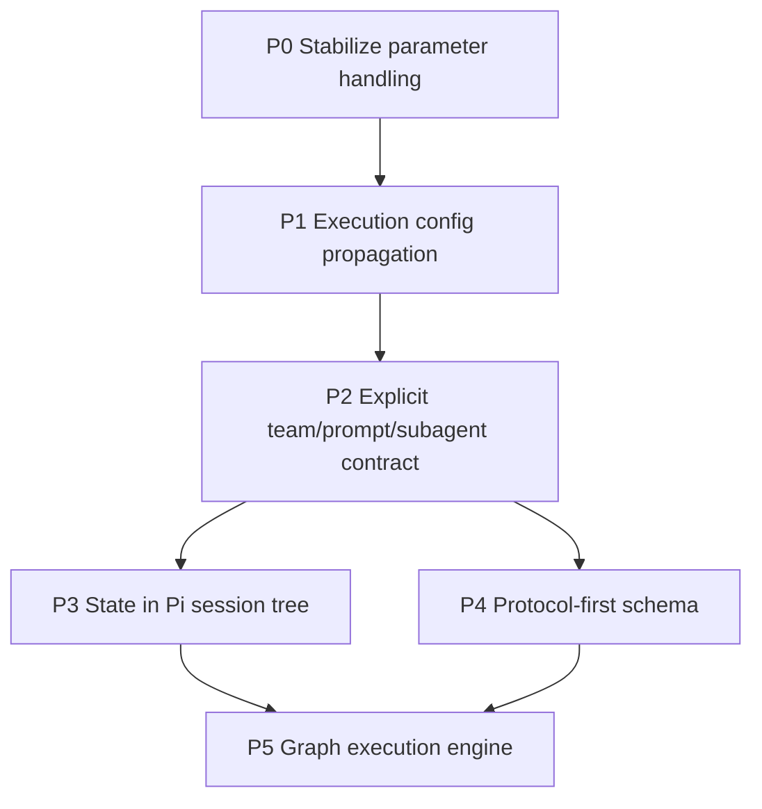

# Teams Future Improvements TODO

This is the remediation plan for moving `extensions/pi-teams` from a working extension into a robust, inspectable teams platform.

Keep moving forward and don't  ask for my feedback until you have completed all of these features as noted. Write your ADRs that you agree with the council as  You progress and you are the project manager and architect so I'll make sure you make for you solve Jules or local agents to do the work and the council and your navigator to review your work and decisions.

you have specs for P1 -> P5 in @docs/teams-p1...

Dont use kanban in this repo.

Do mark of in this document ADRs and progress

KISS, YAGNI: do not implement backward compatibility; only implement new features. Make sure you have removed all instances of the old team from the Code Base; e.g., council pair is a smell, and the types or modules that deal specifically with these needs need to be generalised to handle team apology slots and the prompts they produce. We need their teams to be driven by the configuration settings. Jason and the supporting teams' files provide no context for the code.

For each feature, please commit and push your changes when you have them, then refactor. We look brutally for simplicity and clean code in this extension. Make sure that you pass all the tests. Make sure you have tested all the changes you've made, and keep the code as concise and clean as possible. Make sure that you follow the clean code principles.

you can find out how to delegate and follow up  with jules in ~/git/coas/skills/jules-delegation/

IMPORTANT update your progress in this document before completion!

## Executive decisions

1. **Do not ship `temperature` in bundled agent defaults.** Pi exposes `temperature` as a generic stream option, and several provider implementations map it correctly, but support is not universal at the model/API level. Defaults should be portable and boring.
2. **Keep generation parameters provider-aware.** User-specified `parameters` can remain supported, but they must be mapped or filtered per provider/model before reaching the payload.
3. **Make team behavior inspectable from the team file.** A user should be able to see which subagents, templates, tools, model bindings, and generation parameters a team run will use.
4. **Use backward-compatible migrations.** Many users may have copied built-in team/subagent files into user/project roots.

## Architecture decision records

### ADR-001 — Keep execution config and runtime data packaging separate

**Decision:** `tools` and provider `parameters` are execution config resolved before a child call; upstream graph/council/pair outputs are runtime data rendered into protocol templates. They are separate paths and must not share a generic "parameters" abstraction.

### ADR-002 — Prompt resolution is protocol-slot based

**Decision:** P2 uses open string prompt slots declared by protocol data, not TypeScript unions of built-in or test workflow names. Resolution precedence is deterministic: protocol default < subagent prompt < team prompt override < binding prompt override < binding literal. Team markdown bodies remain human notes unless explicitly referenced by a future opt-in slot.

### ADR-003 — Team run state is session-first with explicit visibility

**Decision:** P3 persists `pi-teams:run` delta events in the Pi session tree. Run state is not model-visible by default; protocols may opt in to a bounded model-visible summary event when a later phase needs prior run context.

### ADR-004 — Schema is protocol-first

**Decision:** P4 makes `protocol`/`engine` the dispatch source. `topology` is v1 compatibility metadata only: accepted on old files, shown as deprecated, never used for handler selection, and not emitted by new `team_form` output.

### ADR-005 — Graph execution starts as bounded DAG orchestration

**Decision:** P5 implements DAG-only execution with deterministic topological scheduling, bounded concurrency, direct-upstream prompt packaging, per-node timeout, and bounded per-node retries for transient child-call failures. Loops, plugins, threshold joins, and protocol-to-graph lowering remain explicit non-goals for P5.

### ADR-006 — Authored teams are v2 protocol files

**Decision:** New bundled and generated team files use `schemaVersion: 2`, `protocol`, object role bindings, and explicit prompt-slot maps. `topology` is retained only as derived in-memory display metadata so old UI affordances do not select execution.

### ADR-007 — Session state writes event deltas, not model-visible messages

**Decision:** `TeamStateManager` appends bounded `pi-teams:run` custom events (`run_started`, `phase_started`, `node_completed`, terminal/tombstone events) and rehydrates from the current session branch. Legacy JSON snapshots remain a local file fallback, but session events are the inspection surface.

### ADR-008 — Graph nodes are existing role bindings

**Decision:** P5 does not introduce a separate graph DSL. A graph node is a team role binding; edges, outputs, reducer, dependency policy, timeout, and concurrency are the minimal execution policy required for deterministic DAG runs.

## Temperature support finding

`temperature` is supported by **some interfaces**, but not safely enough to use as a universal default.

Observed from Pi provider code:

- `openai-completions`: supports root-level `temperature`.
- `openai-responses` / `azure-openai-responses`: supports root-level `temperature`.
- `openai-codex-responses`: the interface includes `temperature`, but current Codex GPT-5.x models may reject it in practice.
- `anthropic`: supports `temperature` only when thinking is disabled.
- `google-generative-ai` / Vertex: supports `temperature` under `config` / generation config.
- `google-gemini-cli` / Cloud Code Assist: supports `temperature` under `request.generationConfig`, not at the root.
- `mistral` and `bedrock`: have provider-specific mappings.

Conclusion: `temperature` should be treated as a **provider/model capability**, not a portable manifest default.

## Remediation roadmap

## P0 — Stabilize provider/model parameter handling

**Status:** Implemented locally from Jules session `3129154319698551594`; provider-payload tests, typecheck, and lint pass. Full-suite validation is deferred until the pre-existing `tests/council-teams.test.ts` default-model fixture mismatch is reconciled.

**Goal:** Stop parameter defaults from breaking team runs across models while preserving advanced user control.

**Current issue:** `parameters.temperature` in `config/agents/*.md` caused failures on Gemini when injected at the wrong payload location, and can also fail on OpenAI Codex GPT-5.x models even though the Codex interface has a temperature field. Council resilience masks this by continuing with partial responses, but failed members reduce answer quality.

**Work:**

1. Remove `parameters.temperature` from all bundled `extensions/pi-teams/config/agents/*.md` files.
2. Remove generated default `temperature: 0.1` from `team-form.ts` subagent stubs.
3. Keep `provider-payload.ts` provider-aware mapping for user-specified parameters:
   - OpenAI-compatible root-level fallback.
   - Cloud Code Assist `request.generationConfig`.
   - Google GenerateContent `config`.
4. Add an explicit provider/model capability filter before merge:
   - Known-safe params are applied.
   - Known-unsafe params are omitted with a warning in the model run error/details.
   - Unknown payload shapes should not receive arbitrary root-level params by default.
5. Add tests for unsupported parameter filtering, especially Codex GPT-5.x and Gemini payload shapes.

**Assignee plan:** Jules for implementation; local architect review for capability policy and tests.

**Acceptance criteria:**

- Default council, pair, telephone, and graph teams run without `temperature` in bundled manifests.
- User-provided `parameters.temperature` still works where supported.
- Unsupported parameters are skipped instead of causing child model failure.
- Tests cover OpenAI-compatible, OpenAI Codex GPT-5.x rejection/filtering, Cloud Code Assist, and Google GenerateContent shapes.
- `npm run check` and `npm test` pass.

**Risks:**

- Users relying on bundled low-temperature defaults may see slightly more variation.
- Capability detection can drift as providers change.
- Warning surfaces must be visible without spamming successful runs.

## P1 — Fully honor subagent and binding execution config

**Status:** Implemented locally. Effective role config merges binding-over-manifest for tools/parameters, preserves omitted tools vs `tools: []`, propagates config through debate, pair, telephone, and graph paths, and surfaces tools/parameters in `team_describe`.

**Goal:** Make `tools` and `parameters` in subagent manifests and team bindings mean exactly what they say for one-shot child model calls.

**Work:**

1. Define precedence in code and docs:
   - Runtime tool/model override.
   - Team role binding.
   - Subagent manifest.
   - Runner default.
2. Add coverage for config propagation through:
   - council generation,
   - council critique,
   - chairman synthesis,
   - pair driver/navigator phases,
   - telephone relay,
   - graph nodes.
3. Preserve the semantic difference between:
   - omitted `tools` = runner/provider default,
   - `tools: []` = no tools.
4. Make live-agent refs explicit: parent teams cannot force a separate live agent's provider params/tools unless a future agent-control protocol is added.
5. Show effective tools/parameters in `team_describe` and Team Detail TUI.

**Assignee plan:** Jules session `16658974696077478963` produced an invalid patch that removed the provider override path and used a nonexistent CLI flag; replacement Jules session `12139230731594454287` is in progress. Spawned audit agent captured the regression matrix in `docs/teams-p1-execution-config-review.md`.

**Acceptance criteria:**

- Tests verify config precedence and propagation for every protocol handler.
- `team_describe` exposes effective per-role config.
- Live-agent limitations are documented and either warned or rejected when a team tries to set unenforceable params.
- `tools: []` never serializes to provider payloads that reject empty tools arrays.

**Risks:**

- Existing teams may have relied on implicit tool access.
- Live-agent and one-shot behavior may diverge.
- Over-displaying config in the TUI can reintroduce duplication/noise.

## P2 — Make prompts explicitly linked to teams and subagents

**Status:** Implemented locally. Built-in teams declare prompt-slot maps; `protocol-contracts.ts` and `prompt-resolver.ts` resolve open string slots with protocol default, subagent, team override, binding override, and literal precedence. `team_describe` prints the effective prompt chain.

**Goal:** Resolve the current ambiguity around why prompts are separate from team notes or subagent system prompts.

**Current issue:** Behavior is split across three surfaces:

1. **Subagents** define role identity/framing, tools, and parameters.
2. **Teams** define role bindings, protocol, model slots, and limits.
3. **Prompt templates/settings** define dynamic protocol packaging such as critique prompts, synthesis prompts, pair review handoff, and graph node input formatting.

This separation is valid, but currently under-specified and too hidden.

**Architecture decision:**

- Subagent prompt = **who the role is**.
- Team spec = **which roles participate and how they are wired**.
- Protocol template = **how dynamic upstream outputs are packaged for the next role**.

Do **not** fold all templates into subagent system prompts. A reviewer identity should be reusable across council critique, pair review, graph QA, and other workflows. The packaging differs by protocol and phase.

**Work:**

1. Add a `templates` / `prompts` section to team specs with phase-level template ids.
2. Allow built-in protocol defaults so small team files stay concise.
3. Use subagent `promptId` as an actual runtime resolution input, not just metadata.
4. Make `team_describe` and Team Detail show the effective prompt chain:
   - team protocol default,
   - team override,
   - binding override,
   - subagent prompt.
5. Migrate hardcoded prompt-key lookup in `prompts.ts`, `pair-prompts.ts`, and `team-handlers.ts` behind a resolver.
6. Keep existing prompt files and settings as aliases during migration.

**Assignee plan:** Architect wrote `docs/teams-prompt-contract-spec.md`; Jules implements resolver and schema; pair navigator reviews UX clarity.

**Acceptance criteria:**

- Built-in teams can declare or inherit all templates without hidden handler-specific prompt-key selection.
- `team_describe default-council` shows member, critic, and chairman prompt/template chain.
- A user can override only the synthesis template for one team without copying subagent files.
- Existing user/project teams still load.
- Tests cover default inheritance and explicit overrides.

**Risks:**

- Too much template flexibility can make team behavior hard to debug.
- Duplicate instructions between subagent files and templates can conflict.
- Migration must not break user-copied built-ins.

## P3 — Move team run state into Pi's session tree

**Status:** Implemented locally. The extension registers `session_start` and `session_tree` hooks, appends `pi-teams:run` custom event deltas, bounds node output persistence with SHA-256 integrity metadata, and rehydrates from session branch entries before falling back to legacy local JSON snapshots.

**Goal:** Team runs should branch, fork, resume, and compact with normal Pi sessions.

**Current issue:** `CouncilStateManager` writes legacy JSON records under `~/.pi/agent/councils` and also appends `pi-teams:deliberation` entries. It does not yet fully rehydrate from the current session tree, and pair/graph runs do not share a common state model.

**Work:**

1. Define a common `pi-teams:run` event schema for council, pair, telephone, and graph runs.
2. Rehydrate on `session_start` for startup, reload, resume, fork, and new session boundaries.
3. Read current-session entries first; treat `~/.pi/agent/councils` as legacy import/history.
4. Store incremental deltas instead of repeatedly snapshotting large outputs.
5. Add a migration path for old council JSON files.
6. Add optional user-facing summaries as explicit message entries only when useful.

**Assignee plan:** Mini-spec captured in `docs/teams-p3-session-state-spec.md`; Jules for implementation after P1/P2 schemas settle; local agent for session/fork tests.

**Acceptance criteria:**

- Team run state survives reload/resume.
- Forked sessions do not accidentally inherit unrelated global council state.
- Legacy council files remain readable or importable.
- Tests cover reload, resume, fork, and legacy fallback.
- Session file bloat is measured and bounded.

**Risks:**

- Large outputs can bloat session JSONL.
- Branch semantics can surprise users coming from global council files.
- Compaction must not erase state needed for result inspection.

## P4 — Deprecate `topology` as first-class schema

**Status:** Implemented locally. Built-in and generated team files are v2 protocol-first manifests without authored `topology`; handlers dispatch by `protocol`; TUI/tool summaries lead with protocol. Derived topology remains display-only for existing tests/UI.

**Goal:** Simplify team authoring by making protocol/engine the execution selector.

**Current issue:** Specs historically used both `topology` and `protocol`, but `protocol` already implies the topology. Some code now infers topology, while UI/types still display it as primary.

**Work:**

1. Introduce schema v2 where `protocol` or `engine` is primary.
2. Treat `topology` as derived display metadata.
3. Keep v1 loading with deprecation warnings.
4. Validate mismatched v1 `topology/protocol` combinations clearly.
5. Update built-ins and generated team files to omit `topology`.
6. Update handlers to match required protocol/roles rather than topology.

**Assignee plan:** Mini-spec captured in `docs/teams-p4-protocol-schema-spec.md`; Jules after P2; architect reviews migration semantics.

**Acceptance criteria:**

- v1 and v2 teams both load.
- Built-ins do not require `topology`.
- `team_form` does not expose topology unless compatibility requires it.
- Team Detail TUI does not over-emphasize derived topology.
- Tests cover v1 compatibility and v2 authoring.

**Risks:**

- User/project teams copied from old built-ins may retain `topology`.
- External docs/scripts may expect topology in `team_describe`.

## P5 — Promote graph execution to the core engine

**Status:** Implemented locally for graph-defined teams. `team-graph.ts` now validates DAG shape, unknown roles, duplicate edges, cycles, disconnected graphs, outputs, reducer support, and per-node model availability; execution uses deterministic topological levels, bounded concurrency, direct-upstream packaging, dependency policy, per-node timeout, and deterministic output reduction.

**Goal:** Replace protocol-specific control flow with a DAG executor once config, prompts, and state are stable.

**Current issue:** `team-graph.ts` exists, but `team-handlers.ts` still hardcodes debate, pair-coding, consult, and telephone flows.

**Work:**

1. Define graph node schema:
   - role/subagent binding,
   - model/tools/parameters,
   - prompt/template id,
   - timeout/cancellation policy,
   - reducer/join behavior.
2. Implement preflight validation:
   - unknown roles,
   - missing models,
   - cycles,
   - disconnected graphs,
   - unsupported joins.
3. Support parallel ready nodes and deterministic joins.
4. Represent built-in protocols as graph specs:
   - council: generation fanout → critique fanout → synthesis join,
   - pair coding: brief → implementation → review → bounded fix loop,
   - telephone: sequential relay,
   - consult: single navigator node.
5. Emit execution trace/state events through P3 state schema.

**Assignee plan:** Mini-spec captured in `docs/teams-p5-graph-engine-spec.md`; council review first; Jules implementation only after P0-P4 stabilize.

**Acceptance criteria:**

- Existing built-ins behave the same through graph execution.
- Custom `Review -> Fix -> QA -> Merge` workflows run from YAML without new TypeScript handlers.
- Failure behavior is explicit for partial failures, retries, and threshold-based continuation.
- Tests cover parallel fanout, joins, cancellation, and invalid graph preflight.

**Risks:**

- A general graph DSL can overcomplicate simple team authoring.
- Parallel execution changes cost/timing/failure behavior.
- Council anonymity and pair review semantics need careful reducer design.

## Delegation plan

- **Architect / PM:** own specs, sequencing, review, and acceptance criteria.
- **Jules:** implement P0/P1 first; implement P2 resolver after mini-spec approval; implement P3/P4 after schemas settle; implement P5 only after graph mini-spec and review.
- **Local spawned agents:** audit behavior, run focused regression scans, and verify migration compatibility.
- **Pair navigator:** review each spec/patch for user-facing clarity and over-engineering risk before merge.

## Immediate next tasks

1. ✅ Create Jules task for **P0 parameter stabilization**.
2. ✅ Create/replace P1 execution config propagation work and local audit notes.
3. ✅ Draft a short P2 mini-spec that shows a concrete default-council team file with explicit prompt/template inheritance.
4. ✅ Pair/navigator review requested locally after implementation because the built-in `team_run pair-consult` tool is blocked by stale user-level copied team files in the live extension runtime.
5. ✅ Add/update tests to cover current protocol-first schema, prompt chains, session event registration, and graph validation/execution surfaces.
6. ✅ Start P3-P5 only after P0-P2 local validation was green.

## Latest validation

- `npm run check` passed: typecheck, Biome lint, knip, and type coverage (99.12%).
- `npm test` passed: 33 files, 362 tests.
- Live `team_run pair-consult` review could not run in this harness because the active installed extension sees a stale user-level `pair-consult` v1 override; a local spawned navigator review was requested instead.
