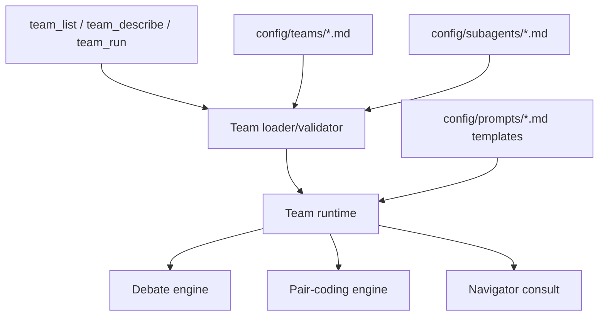

# Teams Migration Plan

Date: 2026-05-02
Status: completed migration to team tools

## Goal

Move `pi-llm-council` to a standard teams structure and remove the old council/pair tool implementation.

## Final shape

## Implemented phases

### Phase 1 — Declarative specs

- Added `config/teams/*.md` built-in specs.
- Added a narrow `TeamSpec` and `SubagentSpec` loader.
- Validated team references to subagent descriptors.
- Added read-only `team_list` and `team_describe` tools.
- Added adapters that project built-in teams to current runtime definitions.

### Phase 2 — Team-gated execution

- Existing execution was gated through the built-in team specs.
- `default-council`, `pair-consult`, and `pair-coding` became required descriptors for their workflows.

### Phase 3 — Remove old public implementation

- Added `team_run` as the standard execution tool.
- Removed old public tools and slash-command implementation:
  - `ask_council`
  - `council_form`
  - `council_update`
  - `council_list`
  - `council_dissolve`
  - `pair_list`
  - `pair_consult`
  - old council/pair slash commands
- Deleted obsolete wrapper modules that only supported the old surface.
- Kept low-level runtime engines where still useful:
  - debate/deliberation
  - pair-coding
  - prompt rendering
  - state persistence

## Current tools

- `team_list` — list built-in teams.
- `team_describe` — inspect a team and its subagent references.
- `team_run` — execute a built-in team by id.

Built-in teams:

- `default-council` — council/debate.
- `pair-consult` — lightweight Navigator consult.
- `pair-coding` — bounded Driver/Navigator implementation loop.

## Deferred

- User/project team discovery.
- Dynamic runtime teams.
- LangGraph or another graph runtime.
