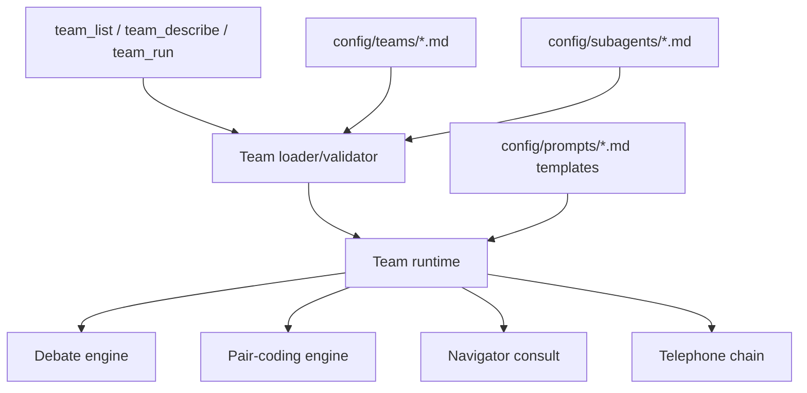

# Teams Migration Plan

Date: 2026-05-02
Status: completed migration to team tools

## Goal

Move `pi-llm-council` to a standard teams structure and remove the old council/pair tool implementation.

## Final shape



## Implemented phases

### Phase 1 — Declarative specs

- Added `config/teams/*.md` built-in specs.
- Added a narrow `TeamSpec` and `SubagentSpec` loader.
- Validated team references to subagent descriptors.
- Added read-only `team_list` and `team_describe` tools.
- Added adapters that project built-in teams to current runtime definitions.

### Phase 2 — Team-gated execution

- Existing execution was gated through the built-in team specs.
- `default-council`, `pair-consult`, and `pair-coding` became required descriptors for their workflows.

### Phase 3 — Remove old public implementation

- Added `team_run` as the standard execution tool.
- Removed old public tools and slash-command implementation:
  - `ask_council`
  - `council_form`
  - `council_update`
  - `council_list`
  - `council_dissolve`
  - `pair_list`
  - `pair_consult`
  - old council/pair slash commands
- Deleted obsolete wrapper modules that only supported the old surface.
- Kept low-level runtime engines where still useful:
  - debate/deliberation
  - pair-coding
  - prompt rendering
  - state persistence

## Current tools and commands

Tools:

- `team_list` — list teams.
- `team_describe` — inspect a team and its subagent references.
- `team_form` — create or replace a user/project team and missing subagent stubs.
- `team_models` — update model bindings for an existing team.
- `team_delete` — delete/dissolve a user/project team; built-in default ids are protected unless scoped.
- `team_run` — execute a team by id.

TUI commands:

- `/teams` — browse teams in an overlay; use ↑/↓ and enter to open details; press `d` to delete user/project teams.
- `/teams list` — browse teams in an overlay; use ↑/↓ and enter to open details; press `d` to delete user/project teams.
- `/teams describe [id]` — inspect a team in an overlay; selects when id is omitted.
- `/teams form [id]` — interactively create or replace a user-level team.
- `/teams models [id]` — interactively select/update model bindings for a team; selects when id is omitted.
- `/teams delete [id]` — delete/dissolve a team; selects when id is omitted.
- `/teams dissolve [id]` — alias for delete.
- `/teams run [id] [prompt]` — run a team; selects and/or prompts when omitted.
- `/teams <id> <prompt>` — shorthand for running a team.

## Team discovery

Built-in package team and subagent files are templates. At startup, missing defaults are instantiated into `~/.pi/agent/teams/` and `~/.pi/agent/subagents/` without overwriting edits. The active team set is therefore user teams plus project overrides.

Teams and subagents are loaded in this order, with later sources overriding earlier sources by id:

1. Built-in package defaults:
   - `extensions/pi-llm-council/config/teams/*.md`
   - `extensions/pi-llm-council/config/subagents/*.md`
2. User defaults:
   - `~/.pi/agent/teams/*.md`
   - `~/.pi/agent/subagents/*.md`
3. Project overrides:
   - `<project-root>/.pi/teams/*.md`
   - `<project-root>/.pi/subagents/*.md`

`<project-root>` is found by walking up from the current working directory until a `package.json` or `.git` directory is found.

Team file changes are discovered by subsequent team commands/tools. Built-in default ids are protected from unscoped deletion. To remove a user/project default/override whose id matches a package default, use scoped deletion (`scope: "user"` or `scope: "project"`). Extension code or tool schema changes still require a pi session reload before the live API reflects them.

Team files may bind default models directly in frontmatter:

```md
---
schemaVersion: 1
id: "my-review"
name: "My Review"
topology: "pair"
protocol: "consult"
agents:
  - "my_reviewer"
navigatorModel: "ollama/glm-5.1:cloud"
---
```

Supported model fields:

- `memberModels` — council/debate member model list or chain/telephone relay model list.
- `chairmanModel` — council/debate synthesis model.
- `driverModel` — pair-coding Driver model.
- `navigatorModel` — pair-consult or pair-coding Navigator model.

Built-in teams:

- `default-council` — council/debate.
- `pair-consult` — lightweight Navigator consult.
- `pair-coding` — bounded Driver/Navigator implementation loop.

Additional user/project runtime shape:

- `chain/telephone` — sequential relay where each member receives the current message, rewrites it, passes it to the next member, and returns the final relay output.

## Deferred

- Dynamic runtime teams.
- LangGraph or another graph runtime.
