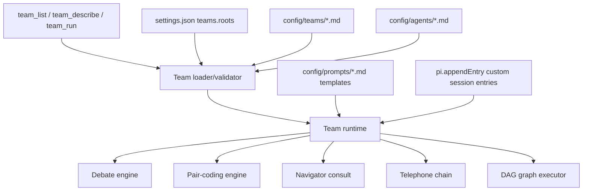
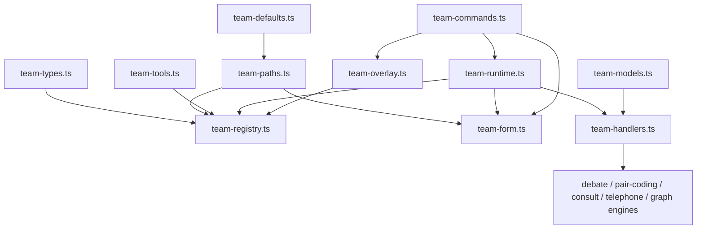

# Teams Migration Plan

Date: 2026-05-02
Status: completed migration to team tools; refactored team module boundaries

## Goal

Move `pi-teams` to a standard teams structure and remove the old council/pair tool implementation.

## Final shape


```mermaid
flowchart TD
  TeamTools[team_list / team_describe / team_run] --> Loader[Team loader/validator]
  Settings[settings.json teams.roots] --> Loader
  Teams[config/teams/*.md] --> Loader
  Agents[config/agents/*.md] --> Loader
  Loader --> Runtime[Team runtime]
  Runtime --> Debate[Debate engine]
  Runtime --> PairCoding[Pair-coding engine]
  Runtime --> PairConsult[Navigator consult]
  Runtime --> Telephone[Telephone chain]
  Runtime --> Graph[DAG graph executor]
  Prompts[config/prompts/*.md templates] --> Runtime
  State[pi.appendEntry custom session entries] --> Runtime
```

## Current module boundaries


```mermaid
flowchart TD
  Types[team-types.ts] --> Registry[team-registry.ts]
  Paths[team-paths.ts] --> Registry
  Paths --> Form[team-form.ts]
  Defaults[team-defaults.ts] --> Paths
  Tools[team-tools.ts] --> Registry
  Runtime[team-runtime.ts] --> Handlers[team-handlers.ts]
  Runtime --> Form
  Runtime --> Registry
  Commands[team-commands.ts] --> Runtime
  Commands --> Form
  Commands --> Overlay
  Models[team-models.ts] --> Handlers
  Overlay[team-overlay.ts] --> Registry
  Handlers --> Engines[debate / pair-coding / consult / telephone / graph engines]
```

- `team-types.ts` owns core team/agent/registry type definitions.
- `team-paths.ts` owns `teams.roots` plus package, user, and project path resolution.
- `team-registry.ts` owns descriptor loading, validation, and registry construction.
- `team-defaults.ts` seeds user defaults from built-in descriptors.
- `team-handlers.ts` dispatches supported protocols and exposes model slot metadata.
- `team-graph.ts` owns the generic DAG executor for graph-defined role workflows.
- `team-tools.ts` contains read-only `team_list` and `team_describe` registration.
- `team-runtime.ts` contains mutating team tools and run dispatch.
- `team-commands.ts` contains the `/teams` command flow.

## Implemented phases

### Phase 1 — Declarative specs

- Added `config/teams/*.md` built-in specs.
- Added a narrow `TeamSpec` and role-agent descriptor loader.
- Validated team references to agent descriptors.
- Added read-only `team_list` and `team_describe` tools.
- Added adapters that project built-in teams to current runtime definitions.

### Phase 2 — Team-gated execution

- Existing execution was gated through the built-in team specs.
- `default-council`, `pair-consult`, and `pair-coding` became required descriptors for their workflows.

### Phase 3 — Remove old public implementation

- Added `team_run` as the standard execution tool.
- Removed old public tools and slash-command implementation:
  - `ask_council`
  - `council_form`
  - `council_update`
  - `council_list`
  - `council_dissolve`
  - `pair_list`
  - `pair_consult`
  - old council/pair slash commands
- Deleted obsolete wrapper modules that only supported the old surface.
- Kept low-level runtime engines where still useful:
  - debate/deliberation
  - pair-coding
  - prompt rendering
  - state persistence

## Current tools and commands

Tools:

- `team_list` — list teams.
- `team_describe` — inspect a team and its agent references.
- `team_form` — create or replace a user/project team and missing agent stubs.
- `team_models` — update model bindings for an existing team.
- `team_delete` — delete/dissolve a user/project team; built-in default ids are protected unless scoped.
- `team_run` — execute a team by id.

TUI commands:

- `/teams` — browse teams in an overlay; use ↑/↓ and enter to open details; press `d` to delete user/project teams.
- `/teams list` — browse teams in an overlay; use ↑/↓ and enter to open details; press `d` to delete user/project teams.
- `/teams describe [id]` — inspect a team in an overlay; selects when id is omitted.
- `/teams form [id]` — interactively create or replace a user-level team.
- `/teams models [id]` — interactively select/update model bindings for a team; selects when id is omitted.
- `/teams delete [id]` — delete/dissolve a team; selects when id is omitted.
- `/teams dissolve [id]` — alias for delete.
- `/teams run [id] [prompt]` — run a team; selects and/or prompts when omitted.
- `/teams <id> <prompt>` — shorthand for running a team.

## Team discovery

Built-in package team-root files are templates. At startup, missing defaults are instantiated into `~/.pi/agent/teams/{teams,agents,prompts}/` without overwriting edits. Project overrides are opt-in via project `.pi/settings.json`.

Team roots are loaded in this order, with later roots overriding earlier roots by id:

1. Built-in package defaults:
   - `extensions/pi-teams/config/teams/*.md`
   - `extensions/pi-teams/config/agents/*.md`
   - `extensions/pi-teams/config/prompts/*.md`
2. Roots from top-level settings:

```json
{
  "teams": {
    "roots": [
      "~/.pi/agent/teams"
    ]
  }
}
```

Each root contains:

```text
<root>/teams/*.md
<root>/agents/*.md
<root>/prompts/*.md
```

A project can opt in with `.pi/settings.json`:

```json
{
  "teams": {
    "roots": [".pi/teams"]
  }
}
```

Team file changes are discovered by subsequent team commands/tools. Built-in default ids are protected from unscoped deletion. To remove a user/project default/override whose id matches a package default, use scoped deletion (`scope: "user"` or `scope: "project"`). Extension code or tool schema changes still require a pi session reload before the live API reflects them.

Team files bind agent manifests and default models together. An agent descriptor owns reusable behavior/prompting, tool allowlists, and provider parameters; each team agent entry chooses that manifest plus the model for this team slot. Multiple entries may reuse the same agent with different models. `topology` is deprecated and inferred from `protocol`/`engine` plus role bindings when omitted.

```md
---
schemaVersion: 1
id: "my-review"
name: "My Review"
protocol: "consult"
agents:
  - role: "navigator"
    subagent: "my_reviewer"
    model: "ollama/glm-5.1:cloud"
---
```

Council example with repeated member behavior:

```md
agents:
  - role: "member"
    subagent: "council_generation_member"
    model: "openai-codex/gpt-5.5"
  - role: "member"
    subagent: "council_generation_member"
    model: "ollama/qwen3.5:cloud"
  - role: "chairman"
    subagent: "council_chairman"
    model: "openai-codex/gpt-5.5"
```

Built-in teams:

- `default-council` — council/debate.
- `pair-consult` — lightweight Navigator consult.
- `pair-coding` — bounded Driver/Navigator implementation loop.

Additional user/project runtime shapes:

- `telephone` — sequential relay where each member receives the current message, rewrites it, passes it to the next member, and returns the final relay output.
- `graph` — generic DAG execution where `edges` connect role names; sink node outputs are returned.

Graph example:

```md
---
schemaVersion: 1
id: "review-fix-qa"
name: "Review Fix QA"
protocol: "graph"
agents:
  - role: "review"
    subagent: "reviewer"
    model: "openai-codex/gpt-5.5"
  - role: "qa"
    subagent: "qa"
    model: "ollama/glm-5.1:cloud"
edges:
  - from: "review"
    to: "qa"
---
```

## Deferred

- Dynamic runtime teams.
