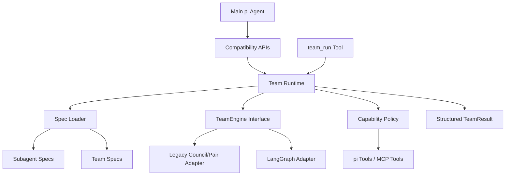

# Teams Platform Migration Research

Date: 2026-05-02
Status: research / planning, no implementation

## Purpose

Plan a migration from bespoke council/pair orchestration toward a generic teams platform for pi.

Current snowflakes:

- `extensions/pi-llm-council`: `council_form`, `council_update`, `council_list`, `council_dissolve`, `ask_council`, `pair_list`, `pair_consult`, automated `PAIR` mode.
- `extensions/pi-panopticon`: `spawn_agent`, `rpc_send`, messaging, registry, status monitoring.
- `lib/task-brief.ts`: structured task dispatch with classification and topology hints.

Target direction:

- Subagent descriptors define role identity, model/tool preferences, constraints, execution rules, and handback format.
- Team specs define topology, protocol, phases, routing, budgets, checkpointing, and synthesis/handoff.
- Existing council and pair features become compatibility wrappers over predefined team specs.

## Research findings

### Existing pi extension ecosystem

NPM search shows pi has a growing package/extension ecosystem, but no obvious generic teams-platform package.

Relevant examples found:

| Package | Notes |
| --- | --- |
| `@mariozechner/pi-coding-agent` | Official pi coding agent package. |
| `@mariozechner/pi-agent-core` | General-purpose agent core package. |
| `@plannotator/pi-extension` | Plan review / annotation extension. |
| `@agentuity/coder-tui` | Coder Hub pi extension. |
| `pi-acp` | Agent Client Protocol adapter for pi. |
| `whatsapp-pi` | WhatsApp integration extension. |
| `@ollama/pi-web-search` | Web search/fetch tools for pi. |
| `@a5c-ai/babysitter-pi` | Orchestration-oriented pi package. |
| `@juicesharp/rpiv-pi` | Skill-based development workflow. |
| `pi-interactive-shell` | Runs subagents/coding agents in pi TUI overlays. |

Conclusion: we should build on pi extension conventions and possibly inspect orchestration-adjacent packages later, but there is no clear off-the-shelf pi teams substrate.

### CrewAI / TypeScript

NPM results:

| Package | Version | Assessment |
| --- | ---: | --- |
| `crewai` | `1.0.1` | JavaScript implementation, not the canonical Python CrewAI. Requires deeper audit before trust. |
| `crewai-js` | `0.0.1` | Unofficial and immature. Avoid. |
| `@crewai/crewai` | not found | No official scoped TS package found. |

Conclusion: do **not** use CrewAI as the platform dependency for this TypeScript ESM repo.

### Candidate libraries / standards

| Candidate | NPM result | Fit |
| --- | --- | --- |
| `@langchain/langgraph` | `1.2.9` | Strong candidate for graph/state-machine orchestration, but keep behind an internal `TeamEngine` adapter. |
| `@modelcontextprotocol/sdk` | `1.29.0` | Good standard for tool/resource interoperability at boundaries. |
| `@a2a-js/sdk` | `0.3.13` | Useful to track for distributed agent-to-agent interoperability; avoid dependency until needed. |
| `@openai/agents` | `0.8.5` | Good optional/provider-specific adapter; avoid as generic core to prevent vendor lock-in. |

De facto descriptor standards to align with:

- Markdown + YAML frontmatter for agent/subagent definitions.
- `AGENTS.md`-style repo guidance for ambient project instructions.
- MCP-style capability/tool/resource separation.
- A2A-shaped message envelopes for future distributed handoff, without adopting the SDK yet.
- Strict output schemas for handback protocols.

## Proposed target model

### Subagent descriptor

Subagent descriptors are Markdown files with strict YAML frontmatter plus LLM-facing body.

```md
---
specVersion: 1
id: securityReviewer
name: Security Reviewer
description: Reviews changes for security-sensitive defects.
model:
  preference: anthropic/claude-sonnet
parameters:
  temperature: 0.1
  maxTokens: 2000
capabilities:
  requested:
    - filesystem.read
    - code.search
handback:
  schema: summaryOutputStatusV1
  maxTurns: 1
---

# Identity

You are a Security Reviewer. Your purpose is to find concrete vulnerabilities and unsafe operational behavior.

# Constraints

- Stay within the assigned scope.
- Do not mutate files.
- Report uncertainty explicitly.

# Task Execution

1. Inspect the provided task and context.
2. Identify concrete risks.
3. Return actionable findings.

# Handback Protocol

Return:

1. SUMMARY
2. OUTPUT
3. STATUS: COMPLETED | FAILED | REQUIRES_CLARIFICATION
```

Important rule: frontmatter is machine-readable config; Markdown body is prompt text only.

### Team spec

Team specs define topology and protocol.

```yaml
specVersion: 1
id: engineeringReviewTeam
name: Engineering Review Team
description: Parallel engineering review followed by chair synthesis.
topology: council
agents:
  - ./subagents/architecture-reviewer.md
  - ./subagents/security-reviewer.md
  - ./subagents/test-reviewer.md
chair: ./subagents/chair.md
protocol:
  phases:
    - generate
    - critique
    - synthesize
  handbackSchema: teamResultV1
limits:
  timeoutMs: 120000
  maxTurns: 1
  maxAgents: 4
capabilities:
  policy: denyByDefault
```

### Architecture



## Migration plan

### Phase 0 — compatibility spike

Goal: answer dependency/runtime risk before committing.

Tasks:

- Import `@langchain/langgraph` inside the pi extension runtime.
- Run one trivial graph from a throwaway command/tool.
- Import `@modelcontextprotocol/sdk` and validate basic client/server or schema usage.
- Confirm strict ESM behavior, Node API compatibility, bundle/runtime cost, and test behavior.

Exit criteria:

- Clear yes/no on LangGraph as an internal adapter.
- Clear yes/no on MCP SDK usage at boundaries.
- No public API changes.

### Phase 1 — specs and validation only

Goal: introduce the declarative model without changing execution.

Tasks:

- Add `AgentSpec` and `TeamSpec` schemas.
- Add parser for Markdown + YAML frontmatter.
- Add schema versioning and validation errors.
- Add fixtures for council, pair consult, and research team.
- Add golden tests proving generated specs map to current behavior.

Dependency options:

- Prefer minimal native parsing if feasible.
- If adding packages, consider `yaml` plus a tiny frontmatter parser; avoid dependency bloat.
- Use TypeBox if consistent with existing extension schemas; otherwise consider `zod` only if stronger runtime ergonomics justify it.

### Phase 2 — internal `TeamEngine` interface

Goal: route current behavior through one internal abstraction.

```ts
interface TeamEngine {
  runTeam(spec: TeamSpec, input: TeamInput): Promise<TeamResult>;
}
```

Tasks:

- Implement `LegacyCouncilTeamEngine` using existing `deliberate()` and `runPairCoding()` paths.
- Convert `ask_council(DEBATE)` into a generated council `TeamSpec`.
- Convert `pair_consult` into a generated pair-review `TeamSpec` or thin wrapper around one.
- Keep existing tools and commands stable.

Exit criteria:

- No user-visible regression.
- Council and pair can be described as specs in logs/results.
- Existing snowflake code starts shrinking, but remains available.

### Phase 3 — first-class teams extension surface

Goal: expose the platform while retaining compatibility.

Tools/commands:

- `team_list`
- `team_describe`
- `team_run`
- `/team list`
- `/team run <team> <task>`

Resource locations:

- `.pi/teams/**/*.md` or `.pi/teams/**/*.yaml`
- `.pi/subagents/**/*.md`
- package-provided teams via pi resource discovery

Exit criteria:

- A user can define a custom team without editing TypeScript.
- `council` and `pair` appear as built-in/predefined teams.

### Phase 4 — optional LangGraph adapter

Goal: support richer topologies after the legacy adapter is stable.

Tasks:

- Add `LangGraphTeamEngine` behind the `TeamEngine` interface if the spike passes.
- Start with simple topologies: `pairReview`, `debateSynthesize`, `pipeline`, `reviewLoop`.
- Keep LangGraph types out of public extension APIs.
- Add checkpointing abstraction before supporting long-running/multi-turn graphs.

Exit criteria:

- New topologies can use graph orchestration.
- Existing council/pair remain stable.
- LangGraph can be removed or swapped without rewriting specs.

### Phase 5 — capability policy and MCP boundary

Goal: make tool access explicit and safe.

Tasks:

- Add a deny-by-default `CapabilityPolicy`.
- Treat subagent-declared tools as requests, not grants.
- Map capabilities to pi tools, panopticon RPC operations, and optional MCP tools.
- Add path/network/shell restrictions where applicable.

Exit criteria:

- Specs cannot grant themselves dangerous access.
- Sensitive tools require host policy.
- External tools/resources can be integrated through MCP when useful.

### Phase 6 — deprecate snowflakes

Goal: simplify after compatibility is proven.

Tasks:

- Mark `ask_council`, `council_*`, `pair_*` as compatibility APIs.
- Internally route all of them through `team_run` / `TeamEngine`.
- Remove duplicated prompt/config paths once no longer needed.
- Preserve `pair_consult` ergonomics until `team_run` is equally simple.

## Dependency recommendation

Adopt now or soon:

- No CrewAI dependency.
- No A2A dependency yet.
- No OpenAI Agents dependency as core.

Spike only:

- `@langchain/langgraph@1.2.9`
- `@modelcontextprotocol/sdk@1.29.0`

Possible parser dependency choices:

- `yaml` for YAML parsing.
- A tiny local frontmatter parser if the format remains simple.
- Reuse TypeBox for schemas where possible because this repo already uses it.

## Key risks

| Risk | Mitigation |
| --- | --- |
| Dependency bloat | Spike before adopting; hide libraries behind adapters. |
| Spec files become authority for tool access | Deny-by-default capability policy. |
| Breaking existing `pair_consult` ergonomics | Keep compatibility wrapper until replacement is better. |
| Rewriting too much at once | Strangler migration: specs first, then engine, then new surface. |
| LangGraph runtime mismatch | Keep `TeamEngine`; fall back to in-house state-machine runner. |
| Prompt/config sprawl continues | Make existing council/pair prompts generated or grouped by team spec over time. |

## Recommended next step

Create a small spike branch/task that does only:

1. dependency/runtime checks for LangGraph and MCP;
2. draft `AgentSpec` / `TeamSpec` TypeScript interfaces and schemas;
3. fixtures for `defaultCouncil`, `pairConsult`, and `engineeringReviewTeam`;
4. no behavior changes.
