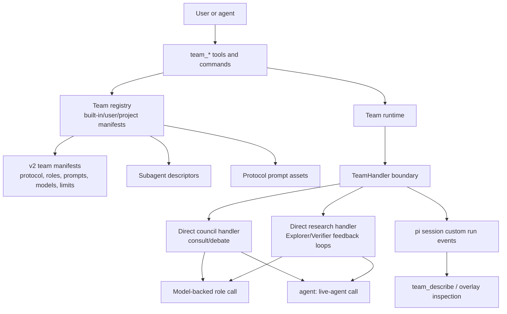

# Teams Platform

Living summary for `extensions/pi-teams`.

## Current architecture



## Standing decisions

- Keep execution config (`tools`, provider parameters, models) separate from
  runtime data rendered into protocol templates.
- Resolve prompts by protocol-local slots with deterministic precedence:
  protocol default < subagent prompt < team prompt override < binding
  override < binding literal.
- Persist team run state in the Pi session tree as protocol-neutral custom events with stable `schemaVersion: 1` event envelopes and `version: 1` reduced records.
- Accept only strict v2 authored team manifests; do not add v1 or legacy
  compatibility aliases.
- Keep direct topology functions per protocol; do not reintroduce a generic DAG
  executor unless a concrete user-visible workflow cannot be implemented as a
  small direct handler. The `research` protocol is implemented as a bounded
  direct handler, not a generic graph runtime.
- Keep bundled protocol labels (`debate`, `consult`, `research`) as
  configuration vocabulary, not TypeScript architecture boundaries.
- Represent live peers explicitly as `agent:<registered-name>` role bindings.

## Research protocol

`deep-research` uses protocol `research`, a bounded direct loop:

```text
Explorer -> Verifier/EAM + Gap Detector -> targeted Explorer follow-up -> Synthesis
```

- `limits.maxLoops` controls Explorer/Verifier feedback loops. Default is 2;
  runtime overrides are capped at 5.
- Verifier output containing `VERIFIED_COMPLETE` stops loop iteration early.
- Run progress is persisted through existing session custom events and surfaced
  via `team_runs`.
- Node records remain the compact execution ledger; structured `details[]` carry
  EDA-friendly trace, handoff, fallback, artifact, and error records without
  changing protocol handlers into a graph runtime.
- `team_stop` records a `stop_requested` event and shows the run as `stopping`
  until the protocol reaches a safe boundary and records terminal `stopped`.
- The `research` handler checks stop state before each Explorer, Verifier,
  follow-up loop, and Synthesis call. A stop request prevents any new phase or
  model call after the current boundary.
- One-shot model-backed team nodes run through a child `pi --print` subprocess;
  `team_stop` aborts that subprocess with SIGTERM through the node AbortSignal.
  Live-agent bindings still rely on the live-agent transport/runtime honoring
  the same AbortSignal and may only stop at normal cancellation boundaries.

## Public run state contract

`pi-teams` writes session custom events with `customType: "pi-teams:run"`.
The current event envelope is `schemaVersion: 1`; reduced `TeamRunRecord`
objects returned by `team_runs` use `version: 1`.

Stable record fields:

- `id`, `team`, `protocol`, `prompt`, `status`, `startedAt`, `completedAt`,
  `orchestratorPid`.
- `phases[]`: ordered phase ids observed in the run.
- `nodes[]`: compact node completions with `phaseId`, `nodeId`, `role`,
  `model`, `ok`, `durationMs`, bounded `output`, and optional `error`.
- `details[]`: structured operational details with `kind` (`trace`, `handoff`,
  `fallback`, `artifact`, `error`), optional `phaseId`/`nodeId`, `message`,
  optional `data`, optional `artifactUri`, optional `error`, and `timestamp`.

Claim-check/artifact pointers should use `details[].artifactUri`; large node
outputs continue to be bounded and hash-addressed in node completion events.

## Evidence-gated future work

Only consider new teams-platform work when one of these is true:

1. A user-facing workflow cannot be represented with current v2 manifests, role
   bindings, prompt refs, limits, and direct protocol handlers.
2. A fitness function or validation test exposes a recurring architecture smell.
3. Operational needs require richer live-agent lifecycle control or durable state
   that cannot fit the current session event model.

## Completed work

| Item | Status | Ref |
|------|--------|-----|
| Direct council handler (`consult`/`debate`) | ✅ Done | `team-handlers.ts` |
| Delete DAG executor (`team-graph.ts`) | ✅ Done | arch tests |
| Delete lowering layer (`team-lowering.ts`) | ✅ Done | arch tests |
| Delete protocol contracts (`protocol-contracts.ts`) | ✅ Done | — |
| Simplify `team-types.ts` (remove graph schema) | ✅ Done | registry tests |
| Migrate prompt contracts into handlers | ✅ Done | prompt-chain tests |
| Extract `team-node-runner.ts` shared helpers | ✅ Done | unit tests |
| Remove pair-coding topology | ✅ Done | `11436c9` |
| Rename default-debate → llm-council | ✅ Done | `11436c9` |
| Rename consult → navigator | ✅ Done | `f5a8ad3` |
| Supersede graph-affordances docs | ✅ Done | archive |

Historical planning records are in git history:
`git log --all --oneline -- docs/archive/teams-simplification.md`