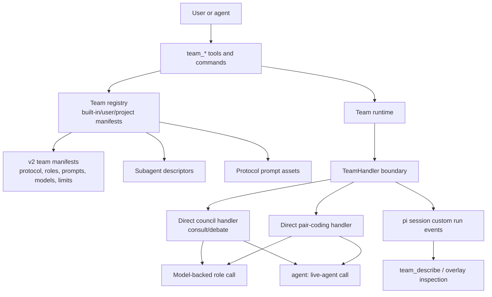

# Teams Platform

Living summary for `extensions/pi-teams`.

## Current architecture

## Standing decisions

- Keep execution config (`tools`, provider parameters, models) separate from
  runtime data rendered into protocol templates.
- Resolve prompts by protocol-local slots with deterministic precedence:
  protocol default < subagent prompt < team prompt override < binding
  override < binding literal.
- Persist team run state in the Pi session tree as protocol-neutral custom events.
- Accept only strict v2 authored team manifests; do not add v1 or legacy
  compatibility aliases.
- Keep direct topology functions per protocol; do not reintroduce a generic DAG
  executor unless a concrete user-visible workflow cannot be implemented as a
  small direct handler.
- Keep bundled protocol labels (`debate`, `consult`, `pair-coding`) as
  configuration vocabulary, not TypeScript architecture boundaries.
- Represent live peers explicitly as `agent:<registered-name>` role bindings.
- Do not add an external graph/workflow framework unless a future spike proves
  it deletes meaningful code without hiding Pi-specific behavior.

## Evidence-gated future work

Only consider new teams-platform work when one of these is true:

1. A user-facing workflow cannot be represented with current v2 manifests, role
   bindings, prompt refs, limits, and direct protocol handlers.
2. A fitness function or validation test exposes a recurring architecture smell.
3. A proposed dependency or abstraction demonstrably removes more code and risk
   than it adds.
4. Operational needs require richer live-agent lifecycle control or durable state
   that cannot fit the current session event model.

## Completed work

| Item | Status | Ref |
|------|--------|-----|
| Direct council handler (`consult`/`debate`) | ✅ Done | `team-handlers.ts` |
| Direct pair-coding handler | ✅ Done | `team-handlers.ts` |
| Delete DAG executor (`team-graph.ts`) | ✅ Done | arch tests |
| Delete lowering layer (`team-lowering.ts`) | ✅ Done | arch tests |
| Delete protocol contracts (`protocol-contracts.ts`) | ✅ Done | — |
| Simplify `team-types.ts` (remove graph schema) | ✅ Done | registry tests |
| Migrate prompt contracts into handlers | ✅ Done | prompt-chain tests |
| Extract `team-node-runner.ts` shared helpers | ✅ Done | unit tests |
| Supersede graph-affordances docs | ✅ Done | archive |

Historical planning records are in git history:
`git log --all --oneline -- docs/archive/teams-simplification.md`
