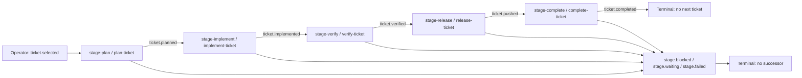

# Single-Ticket Delivery Event Loop — Operator Runbook (T-895)

**Evaluation only — not installed or activated.** The live GM progress driver remains the
five-minute CoAS schedule. A later event-loop pilot requires demonstrated added value and separate
approval (ADR-058); the following operating instructions describe that possible future pilot.

This directory holds the tracked pi-event-loop configuration for one manually selected ticket per
bounded run. Plan and status authority: Kanban ticket T-895; specification:
[`docs/plans/t-895-ticket-delivery-event-loop.md`](../../docs/plans/t-895-ticket-delivery-event-loop.md).

- **Config:** [`ticket-delivery.json`](./ticket-delivery.json) — validated by the production parser
  (`parseEventLoopConfig`) in `tests/pi-event-loop-ticket-delivery.test.ts`.
- **Model:** operator seeds one ticket + one unique run key → five bounded command turns
  (plan → implement → verify → release → complete) → terminal completion, or a terminal
  blocked/waiting/failed outcome that opens no successor.
- **Not included:** timers, automatic backlog selection, automatic repair loops, automatic
  next-ticket continuation, and any cross-agent discovery. Kanban stays authoritative; session
  events record observations only and do not themselves verify commits, tests, reviews, or
  ticket completion.

## Stage flow



Every stage's success event closes that stage's row and opens the next one; every stage also
accepts `stage.blocked`, `stage.waiting`, or `stage.failed`, which close the row and open
nothing. An operator decides any bounded retry after remediation; a new run always uses a new
run id.

## Enforced runtime invariants vs prompt guidance

The runtime guarantees only what the parser, projector and automator mechanically enforce. The
`message` text of each command is **prompt guidance**: the agent is instructed to revalidate
ownership, authorization, artifact identity, and same-ticket semantics, but JSON validation does
not enforce their meaning.

| Enforced by the runtime | Prompt guidance only (not runtime-enforced) |
| --- | --- |
| Strict config validation; inert without `.pi/event-loop.json`; no timers | That the agent actually read the canonical ticket or ran the checks before emitting an outcome |
| `ticket.selected` is agent-emission-blocked; only the operator can seed | That the canonical ticket is actually re-read and reconciled at every stage, or that a replayed implement command really avoids duplicate spawns |
| Compound run correlation: an outcome's `/correlation` must equal the active work item's key (the seed's compound `correlation`), otherwise emission is rejected | That `correlation` really equals `<ticketId>:<runId>`, or that the three fields are semantically correct — the runtime checks presence and key match only |
| Required payload keys per event — `ticketId` + `runId` + `correlation` everywhere, `reason` on terminal outcomes, and one evidence ref on success outcomes (`planRef` / `artifactRef` / `evidenceRef` / `commit`) — presence checks only, never their meaning | That recorded evidence is truthful, that a review genuinely passed, or that board notes really preserve the artifact/worker/evidence references |
| Command contract: agent events are accepted only during an active command turn and only for that command's `expectedEvents` | That commit/push/completion actually happened before `ticket.pushed` / `ticket.completed` was emitted |
| Limits: 1 pending command, 1 open row per stage view, 8 consecutive automated turns, chain depth 12, 16 KiB payloads | Replayed-command reconciliation (board status, worker/artifact state, commit and remote state) |
| Loop visibility: worker delegation (spawned agents, Jules) appends no loop event and carries no causation — worker calls are not extension causal events, and worker completion is not subscribed; chain depth counts stage outcome hops only | That a worker actually finished, or that its output is safe — bounded waits and board notes are the operator's duties |
| Missing-outcome settlement stalls the item and pauses delivery with a visible reason | Bounded-wait behavior while a worker or reviewer is pending |
| Deterministic event/work-item/command ids, so replay rebuilds the same projection | That outcome events "perform" anything: the push and `kanban_complete` are the completion's tool actions; `ticket.completed` only records that they succeeded |

## Future installation and enablement (approval required)

Do not perform these steps as part of the current evaluation.

1. Copy the tracked config into the project: `cp examples/event-loop/ticket-delivery.json .pi/event-loop.json`
   (`.pi/` is git-ignored, hence this tracked copy).
2. Enable the extension for this project only: in `.pi/settings.json`, add
   `"extensions/pi-event-loop/**"` to the existing `packages[0].extensions` filter, preserving
   every other entry and setting. Do not write global settings.
3. Load it in the current session with pi's core `/reload` operator command (a restart is not
   required; new sessions also pick it up). Verify activation: `/event-loop status` must report
   the `single-ticket` profile and the `event_loop_emit` tool must be registered. In a pristine
   session with no seed, there are no commands or automated turns. An existing session can replay
   prior commands on reload; inspect its history and reconcile domain effects before enabling.
4. Config content changes later: edit `.pi/event-loop.json` then run `/event-loop reload` — that
   subcommand only reloads configuration for an already-loaded runtime (it fails with
   "no configuration" once the file is removed); it never enables/disables the extension itself.
   Switching profiles is available via `/event-loop use <profile>` (this config ships exactly one
   profile).

## Operating procedure

- **Status/inspection:** `/event-loop status`, `/event-loop views [viewId]`,
  `/event-loop history [count]`, `/event-loop inspect` (TUI overlay).
- **Seed exactly one run (operator-only):**
  ```sh
  /event-loop emit ticket.selected {"ticketId":"T-886","runId":"t886-2026-09-05-01","correlation":"T-886:t886-2026-09-05-01"}
  ```
  - One ticket, one run id. Never reuse a run id across runs; stable run correlation is what
    prevents cross-run accidental closure.
  - Seed dedupe is semantic, not textual: the event id derives from the event type plus a
    canonical form of the payload (sorted keys), so re-emitting the same payload — even with
    different formatting or key order — is a no-op. A changed semantic payload (different keys or
    values) with the same `runId` opens a **second** row and is an operator error (with
    `maxOpenItemsPerView: 1` a second simultaneous seed also trips the open-item guard and pauses
    delivery until reconciled). The `/event-loop emit` command form derives the dedupe key for
    you; the `event_loop_emit` tool requires `dedupeKey` explicitly and reuses it on retries.
  - Row identity uses the compound `correlation` (`"<ticketId>:<runId>"`): correctly formed keys for two tickets sharing a
    `runId` differ, as do keys for the same ticket with a different `runId`. This does not enforce
    the convention itself or provide a cross-session mutex.
- **Stage turns:** the automator delivers each stage command as a self-describing turn (payloads
  are untrusted data). Each stage re-reads the canonical ticket and reconciles the previous
  stage's recorded completion and artifact/worker evidence before acting. The agent emits its
  outcome with the event_loop_emit tool, always carrying the same three fields (`ticketId`,
  `runId`, `correlation`) plus the stage's evidence ref and a stable `dedupeKey` (required tool
  input):
  `{"event":"ticket.planned","dedupeKey":"T-886:t886-2026-09-05-01:plan:planned","payload":{"ticketId":"T-886","runId":"t886-2026-09-05-01","correlation":"T-886:t886-2026-09-05-01","planRef":"ticket-note-anchor"}}`.
  Terminal outcomes carry `reason`:
  `{"event":"stage.waiting","dedupeKey":"T-886:t886-2026-09-05-01:implement:waiting","payload":{"ticketId":"T-886","runId":"t886-2026-09-05-01","correlation":"T-886:t886-2026-09-05-01","reason":"worker still running at bound"}}`.
  A mismatched `correlation`, a non-expected event, or a missing `reason`/evidence ref is
  rejected by the runtime. The runtime checks the three fields for presence and key match only —
  it cannot verify that `correlation` equals `<ticketId>:<runId>` or that the ids are correct.
- **Artifact handoff is a board duty:** the next stage receives only the outcome payload, and
  payload fields are presence-checked only. Durable artifact, worker and evidence references
  must therefore be preserved in the canonical ticket's board notes before emitting any outcome;
  the payload refs are pointers, not the record.
- **Completion is a tool call, not an event:** `kanban_complete` (like the push) performs the
  action; `ticket.completed` is emitted only after the tool succeeds and merely records it.
- **Pause/resume:** `/event-loop pause <reason>` stops automated delivery (facts stay in the
  log); `/event-loop resume` clears the pause and restarts the pump. Genuine interactive input
  resets the consecutive-turn counter; extension-delivered turns do not.

## Runtime pauses vs domain terminal outcomes

These are different things — do not conflate them:

- **Domain terminal outcomes** (`stage.blocked` / `stage.waiting` / `stage.failed`) close the
  stage row and open no successor. The runtime paused bit is **not** set; nothing more happens
  because nothing is queued. Record the state in Kanban (e.g. awaiting-worker note) — Kanban
  remains the task authority.
- **Runtime pauses** set the paused bit with an operator-visible reason: `missing-outcome` (a
  command turn settled without an expected event), `turn-limit` (8 consecutive automated turns),
  `command queue is full`, `open-item-limit`, `chain-depth`, or `delivery failed`.
- **Recovery from a runtime pause:** fix the cause, then `/event-loop resume`; for a stalled item
  use `/event-loop retry <workItemId>` to reopen it for automation. `retry` works **only for
  stalled items** (missing-outcome pauses) — it cannot revive a terminal outcome. If the agent
  fabricated or omitted an outcome, reconcile the real board/artifact/commit state in Kanban
  first — do not emit success events to make the loop quiet.
- **After a terminal outcome, resuming work requires a NEW run:** terminal rows are closed and
  nothing revives them. Seed `ticket.selected` again with a **new unique `runId`** (and its
  matching `correlation`); the old run's facts remain in history and on the board.

## Waiting-worker recovery

1. Inside a stage, bound the wait on any worker/subagent. If the work is unfinished when the
   bound expires, emit `stage.waiting` with the run's `ticketId`/`runId`/`correlation` and
   `reason` (or let the operator emit it) and record `awaiting-worker` in the Kanban ticket.
   Never fabricate success to keep the loop running.
2. Remediate outside the loop (worker, reviewer, decision). Worker calls are not loop events:
   the loop never observes worker completion directly — the board note and the next run's seed
   carry the state forward.
3. Resume with a **new run**: seed `ticket.selected` again with a new unique `runId` and its
   matching `correlation`. The old run's terminal facts remain in history; the new run's rows and
   commands are independent.

## Rollback and abort

- **Abort a seeded run before/during a stage:** `/event-loop pause`, wait for any active turn to
  settle, then emit the terminal close as operator:
  `/event-loop emit stage.blocked {"ticketId":"T-886","runId":"t886-2026-09-05-01","correlation":"T-886:t886-2026-09-05-01","reason":"operator abort"}` —
  every stage view closes on this event, so ALL open stage rows for that run close: this is the
  intended full-run stop, not a single-row undo. Queued-but-undelivered commands are cancelled
  automatically. It does not stop or undo any running worker — worker cleanup is a separate
  operator duty (workers may outlive the loop). The event log is append-only; there is no event
  undo. Then `/event-loop resume` if the loop stays enabled.
- **Full disable:** `/event-loop pause` first, then remove `extensions/pi-event-loop/**` from the
  `.pi/settings.json` extension filter and load it with pi's core `/reload`. Do not rely on
  deleting `.pi/event-loop.json` plus `/event-loop reload` to stop an old runtime: that
  subcommand is only a configuration reload for an already-loaded runtime and can fail without
  stopping it. Session history is immutable, so disablement does not rewrite past runs.
- **Do not** roll back by emitting fake success events; that records false facts.

## Restart semantics

A restart is **at-least-once, never exactly-once**: the event log and snapshot restore the
projection and pending commands, but a command that was delivered and not yet settled when a
session ended can be delivered again. Therefore every stage command must reconcile board status,
worker/artifact state, and commit/remote state before mutating, and must never blindly spawn,
commit, or push a second time. Restarting to "replay" a push or completion is not safe.

### Same-session resume vs new-session re-seed

The event log is **session-local**: a new Pi session starts with an empty event log and does not
share history with the previous session. There is no cross-session restore of loop facts.

- **Same-session resume:** the session history replays into the projection, so the run's rows,
  commands and pause state are visible; recover pauses via `/event-loop resume` / `retry` as
  above. After a terminal outcome, start a new run with a new `runId` (see terminal paths).
- **New-session re-seed:** the old session's events are gone from the loop's view. First
  reconcile the canonical ticket on the board (recorded stage completions, artifacts, evidence,
  commit state), then seed a fresh run with a new `runId`/`correlation`. Never assume loop state
  carried over; the board is the durable record between sessions.

## Pilot note (T-886)

T-886 was the initial pilot candidate, not an executed run. Keep this fixture uninstalled and
unactivated for now. The five-minute CoAS schedule is simpler for checking workers, recording ticket
checklists, validating tests/docs and progressing the approved queue. This profile adds replayable
stage contracts but still needs semantic evidence checks and manual re-seeding after waiting; no
net operational benefit has yet been demonstrated. Future Kaggle evaluation is separately scoped.