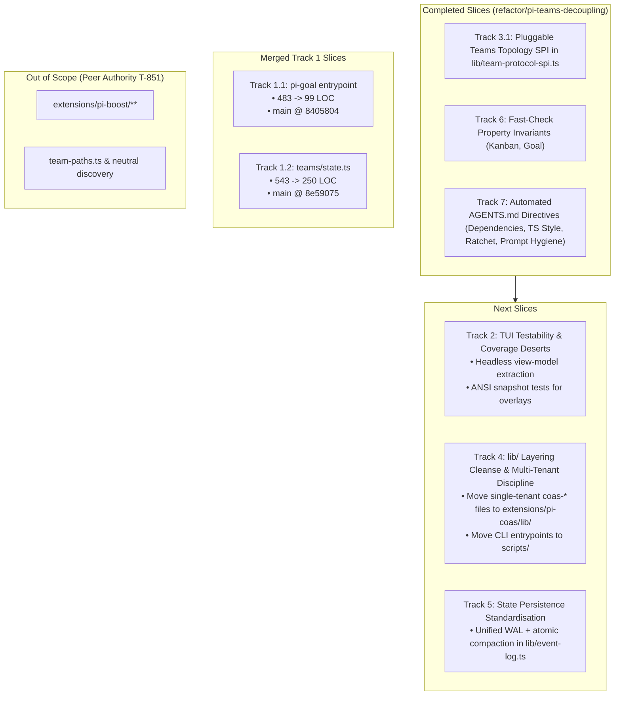

# Architecture Refactoring Queue & Execution Plan

**Status:** Active  
**Document:** `planning/ARCHITECTURE-REFACTOR-QUEUE.md`  
**Scope:** Monorepo-wide architectural improvements.  
**Boundary Isolation:** `extensions/pi-boost/*`, `team-paths.ts`, and neutral config discovery in `lib/` remain strictly **OUT OF SCOPE** (owned by peer on T-851).

---

## Executive Overview

This plan organizes architectural improvements into sequential tracks with explicit acceptance criteria, quality gates, property-based invariants, and validation commands.



---

## Progress & Completed Tasks

### Track 3 (SPI Slice): Pluggable Team Topology Contracts
- [x] **3.1 Topology SPI Contract (`lib/team-protocol-spi.ts`)**:
  - Implemented `TeamProtocolHandler`, `TeamModelSlot`, `TeamRunModels`, `TeamRunInput`, `TeamProtocolRunArgs`, and `TeamTopologyRegistry`.
- [x] **3.2 Protocol Handlers Registration**:
  - Refactored `consult`, `debate`, `fusion-analysis`, `hierarchical-swarm`, and `research` to register into `TeamTopologyRegistry`.
  - Validated zero regression across all 38 existing team tests.

### Track 6: Fast-Check Property Invariants
- [x] **6.1 Kanban Event Log Properties (`tests/kanban/pi-kanban-property.test.ts`)**:
  - Task ID formatting validation, log escaping, and agent sanitization property tests.
- [x] **6.2 Goal State Parser Properties (`tests/goal/pi-goal-property.test.ts`)**:
  - Valid state field preservation and invalid state error boundary resilience.

### Track 7: Automated AGENTS.md Directives
- [x] **7.1 Fitness Exception Ratchet (`tests/architecture/hotspots.ts`)**:
  - Monotonic ceilings: `LINE_BUDGET_EXCEPTIONS` ($\le 16$) and `COUPLING_BUDGETS` ($\le 12$).
  - Target-date expiry enforcement (fails if `targetDate < today`).
- [x] **7.2 Google TS Syntax Restrictions (`tests/architecture/ts-style-guard.ts`)**:
  - AST/token bans for `eval`, `Function`, `with`, `debugger`, `const enum`, `#private`, `I`-interfaces, and `@ts-ignore`.
- [x] **7.3 Dependency Bloat Allowlist (`tests/architecture/dependencies.ts`)**:
  - Strict ceiling: $\le 2$ production runtime dependencies (`@sinclair/typebox`, `matrix-js-sdk`).
- [x] **7.4 Desert Mode & Persona Noise Linter (`tests/architecture/prompt-hygiene.ts`)**:
  - Scans registered tool descriptions and prompt templates for conversational persona fluff.

---

## Active Refactor Queue

### Coordination Blockers

- [/] **Coordination Blockers** — none: ADR-047 pi-boost is complete and pushed to origin/main (`1e8cb50`). Hotspots 1.1–1.4 and Track 2.1–2.2 merged and green on main (`4ef4587`). All remaining refactoring tracks active via Luna workers.

### Track 1: High-Scoring Hotspot Decomposition

- [x] **1.1 Decompose `pi-goal/goal-extension.ts` (Score 2,113; 483 LOC; 84 branch points)** — **merged**:
  - Extracted slash command handlers and execution loop into `extensions/pi-goal/goal-commands.ts`.
  - Extracted runtime/UI/continuation helpers into `extensions/pi-goal/goal-runtime.ts`.
  - Entry point reduced to 99 LOC.
  - Merged to main: `8405804` (source `refactor/goal-hotspot` @ `961c05f`).
- [x] **1.2 Decompose `extensions/pi-panopticon/teams/state.ts` (Score 662; 543 LOC; 136 branch points)** — **merged**:
  - Extracted event contracts, JSON/JSONL codecs, and output bounds into `team-state-codecs.ts`.
  - Extracted event replay/reduction into `team-state-reducer.ts`.
  - State manager reduced to 250 LOC.
  - Merged to main: `8e59075` (source `refactor/teams-state-hotspot` @ `bec4987`).
  - Integration evidence: `git diff --check`, `npm test` (1,317 passed), and `npm run check` (99.23% type coverage) pass.
- [x] **1.3 Decompose `pi-coas/schedules.ts` & `scheduler.ts`** — **merged**:
  - Extracted schedule evaluation into `scheduler-evaluation.ts`.
  - Extracted dispatch handling into `scheduler-dispatch.ts`.
  - Merged to main: `a0a1d5e` (source `refactor/coas-scheduler-hotspot` @ `5c0d03f`).
  - Integration evidence: `git diff --check`, `npm test` (1,317 passed), and `npm run check` (99.23% type coverage) pass.
- [x] **1.4 Refactor `pi-kanban/snapshot.ts`** — **merged**:
  - Extracted snapshot and overlay view models (`snapshot-model.ts`, `overlay-model.ts`).
  - Merged to main: `4ef4587`.
  - Validation: `npm run check` (99.24% type coverage), `npm test` (1368 passed).
- **Validation Gate:** `npx vitest run tests/architecture/hotspots.ts && npm test`

---

### Track 2: TUI Testability & Coverage Desert Elimination

- [x] **2.1 Decouple TUI Renderers into Pure View-Models** — **merged**:
  - Goal overlay: `goal-render.ts` + `goal-overlay-render.test.ts`.
  - Panopticon UI: `agent-detail-model.ts`, `status-view-model.ts` + `ui-view-model.test.ts`.
  - Kanban overlay: `overlay-model.ts` + `pi-kanban-snapshot-render.test.ts`.
- [x] **2.2 Implement Deterministic TUI Snapshot Tests** — **merged**:
  - Snapshot tests in `tests/goal/goal-overlay-render.test.ts`, `tests/panopticon/ui-view-model.test.ts`, `tests/kanban/pi-kanban-snapshot-render.test.ts`.
- [/] **2.3 Command Unit-Test Harness** — active in `/tmp/pi-refactor-track-23`:
  - Add headless mock command context fixtures to test command parsing and error responses in `pi-coas/commands.ts` and `pi-panopticon/ui/*-command.ts`.
- **Validation Gate:** Raise statement coverage in UI/CLI modules to $>75\%$; run `npm run test:coverage`.

---

### Track 4: `lib/` Layering Cleanse & Multi-Tenant Discipline

- [/] **4.1 Relocate Single-Tenant Utilities** — active in `/tmp/pi-refactor-track-4`:
  - Move `lib/coas-*` files into `extensions/pi-coas/lib/` or internal module paths.
  - Move `lib/spawn-*` files into `extensions/pi-panopticon/spawner/` (unless shared).
  - Move CLI entrypoints (`session-spool-*-cli.ts`) into `scripts/` or `bin/`.
- [/] **4.2 Enforce Multi-Tenant Rule in Fitness Tests**:
  - Update `tests/architecture/lib-layering.ts`: every file in `lib/` must be imported by $\ge 2$ distinct extensions or test suites.
- [/] **4.3 Define Clean Core Primitives in `lib/`**:
  - `lib/` contains only true shared primitives: `file-lock.ts`, `file-persistence.ts`, `tool-result.ts`, `agent-registry.ts`, `runtime-control-plane.ts`, `gate-command.ts`, `team-protocol-spi.ts`.
- **Validation Gate:** `npx vitest run tests/architecture/lib-layering.ts && npm run check`

---

### Track 5: State Persistence & Write-Ahead Log (WAL) Consolidation

- [/] **5.1 Unified Event-Sourced Storage Primitive (`lib/event-log.ts`)** — active in `/tmp/pi-refactor-track-5`:
  - Shared append-only WAL with atomic append, fsync, and replay iterators.
  - Atomic snapshot/compaction with lockfile acquisition (`.lock` + rename).
- [/] **5.2 Migrate Extensions to Shared Storage Primitive**:
  - Migrate `pi-kanban` log appending and compaction to `lib/event-log.ts`.
  - Migrate `pi-teams` run-state event streams to `lib/event-log.ts`.
- **Validation Gate:** `npx vitest run tests/kanban/ tests/teams/ tests/shared/`

---

## Validation & Quality Gates

```bash
# 1. Full static analysis suite
npm run check

# 2. Complete unit, integration, and architecture fitness suite
npm test

# 3. Architecture fitness functions specifically
npx vitest run tests/architecture

# 4. Test coverage verification
npm run test:coverage
```

### Quantitative Success Criteria

| Metric | Baseline | Target |
|---|---|---|
| **Top Hotspot Score (`pi-goal`)** | 2,113 | $\le 600$ |
| **Largest File in Monorepo** | 544 LOC (`teams/state.ts`) | $\le 300$ LOC (0 budget exceptions) |
| **Line Budget Exceptions** | 16 exceptions | 0 exceptions (ratchet reduced) |
| **Coupling Budget Exceptions** | 12 exceptions | $\le 4$ exceptions |
| **Single-Tenant Files in `lib/`** | 15 files | 0 files |
| **TUI / Command Statement Coverage** | $< 10\%$ | $\ge 75\%$ |
| **Total Test Suite Time** | 3.85s | $\le 4.50s$ |
| **Type Coverage** | 99.22% | $\ge 99.2\%$ |
