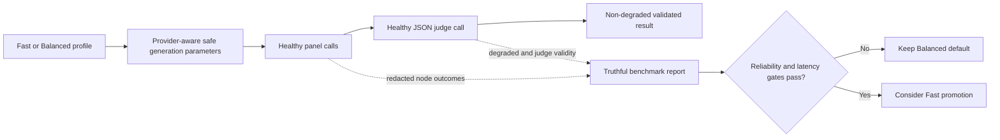

# Fusion Live Reliability Recovery

## Status

Active. Live benchmark on 2026-07-12 proved that Fast is degraded and must not become the default.

## Goal

Make Fusion Fast produce non-degraded, judge-validated results and meet the documented latency gates against a healthy Balanced baseline.

## Evidence

- Balanced: median 37.954s, P95 62.547s, final fallback schema 10/10.
- Fast: median 25.831s, P95 27.246s, final fallback schema 10/10.
- Fast median is 68.1% of Balanced and fails the ≤50% gate; P95 is 43.6% and passes the ≤60% gate.
- Fast `openai-codex/gpt-5.5` panel and judge failed 10/10; diagnostic error: `Unsupported parameter: max_output_tokens`.
- Fast `google/gemini-3.1-pro-preview` panel passed 10/10.
- Balanced `google/gemini-2.5-pro` panel passed 3/10; its failure reason still needs capture.
- The live harness counts structured degraded fallback JSON as valid and omits node error/degradation summaries.

## Target Shape

## Work Plan

1. [x] Reproduce the live failure and capture its redacted node error.
2. [ ] Fix provider parameter mapping so the Codex transport is not sent unsupported `max_output_tokens`, without weakening supported OpenAI Responses/chat and Google mappings.
3. [ ] Add provider-payload regression tests for the failing Codex-shaped request and supported provider shapes.
4. [ ] Make live benchmark reports distinguish process success, schema validity, judge validity, degradation, and per-role/model node success; retain bounded redacted error categories rather than raw sensitive output.
5. [ ] Add deterministic benchmark-report tests and update evaluation documentation.
6. [ ] Capture and diagnose the Balanced Gemini 2.5 failure using the truthful harness; apply only the smallest evidence-backed fix.
7. [ ] Run focused tests, `npm run check`, `npm test`, and `npm run test:evals`.
8. [ ] Obtain Navigator review and council review for the final provider/benchmark contract.
9. [ ] Rerun live Balanced and Fast benchmarks and evaluate only non-degraded results.
10. [ ] Keep Balanced as default unless every promotion gate passes.

## Acceptance Criteria

- Codex panel and judge no longer fail because of unsupported generation parameters.
- Benchmark output reports degraded runs separately and cannot label fallback JSON as a valid judge result.
- Benchmark records bounded redacted node failure categories without prompts, model output, tokens, or credentials.
- Balanced baseline is healthy enough for comparison: ≥80% non-degraded runs, ≥80% per-model success, and no model above 20% failure.
- Fast non-degraded validity is at least Balanced validity.
- Fast median is ≤50% and P95 ≤60% of healthy Balanced timings.
- Judge output validity is ≥99% on the promotion sample.
- Full repository validation passes.

## Constraints

- No default-profile change before gates pass.
- No fitness-test exemptions.
- No provider/model substitution without measured evidence.
- No raw prompts, model output, credentials, or sensitive headers in benchmark artifacts.
- ADR 035 is required if the persisted team event/public result contract changes. A harness-only reporting correction does not by itself require a runtime event-schema change.
