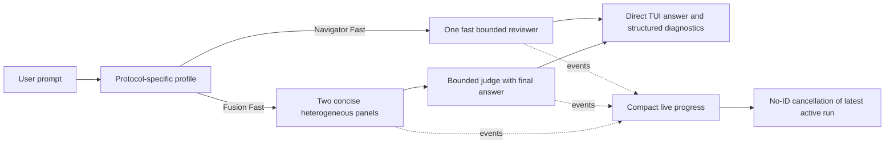

# TUI and Team Latency Improvement Plan

## Status

Core implementation was validated locally on 2026-07-12. The first live provider benchmark exposed degraded Fusion runs and activated the recovery plan in [`planning/FUSION_RECOVERY.md`](FUSION_RECOVERY.md). Balanced remains the default until the repaired, truthful benchmark passes every promotion gate.

## Goal

Make Fusion and Navigator materially faster while improving team-run discoverability, progress feedback, and cancellation in the TUI.

## Success Criteria

- Fusion Fast median end-to-end latency is at most 50% of the current Fusion baseline; P95 is at most 60% of baseline.
- Navigator Fast median latency is at most 60% of the current Navigator baseline; P95 completes within 30 seconds.
- Fusion judge output is valid against its response contract in at least 99% of benchmark runs.
- Fast profiles preserve useful review quality on the representative evaluation set; any material regression blocks making Fast the default.
- Every parallel Fusion node becomes visible in the TUI within 250 ms of a node transition.
- Cancellation reaches active child processes within 500 ms.
- Team overlay render closures perform no filesystem or registry reads.
- `npm run check` and `npm test` pass.

Relative latency targets will be finalized after the baseline is collected; do not claim improvement from call-count reduction alone because Fusion panels already run concurrently.

## Scope

### Included

- Protocol-specific Fast, Balanced, and Thorough profiles exposed through one consistent team-run and TUI surface.
- Fusion panel/judge prompt and output bounding.
- Fusion judge final-answer delivery.
- Navigator model, prompt, context, and output optimization.
- Compact event-driven team progress UI.
- Low-friction cancellation.
- Cached team-browser render data and direct Run/Profile actions.
- Latency and quality benchmarks for profile selection.

### Excluded

- Persistent RPC agents or warm worker pools.
- Speculative/streaming judge execution before panels finish.
- Multi-judge merging.
- One-model “Fusion”.
- Automatic summarizer calls inserted before the judge.
- External routing or Fusion dependencies.
- General-purpose workflow/DAG infrastructure.

## Target Flow



## Decisions

1. Add `profile: "fast" | "balanced" | "thorough"` as the common user-facing concept; map it to protocol-specific behavior.
2. Keep explicit runtime model overrides authoritative. Profiles supply defaults and limits, not silent substitutions.
3. Stop using `limits.maxLoops` as Fusion’s public panel-count control. Preserve legacy behavior temporarily, document precedence, and migrate callers to the profile/panel-count surface.
4. Keep stateless `pi --print --no-session` children unless measurements show startup time is material.
5. Select Fast model defaults from measured latency and quality results rather than assumptions about provider/model names.
6. A Fusion judge should return a user-facing `answer` plus structured analysis. Deterministic team mode renders `answer` directly; tool-mediated auto mode may still require the outer model to complete its current turn.

## Work Plan

### Phase 0 — Baseline and acceptance fixture

- [x] Create bounded representative deterministic fixtures for Fusion and Navigator routing, bounds, validity, and direct-result behavior.
- [x] Add an opt-in harness that captures redacted end-to-end, team, and per-node durations, validity, and failures.
- [!] Record live Fusion and Navigator medians/P95. Not run here: provider benchmarks are opt-in, cost-bearing, and environment-dependent.
- [x] Keep deterministic evaluation in CI and live measurement behind `PI_TEAM_LIVE_BENCHMARK=1`.
- [x] Define protocol-specific comparison and promotion gates before changing defaults.

Deliverable: baseline report with measured profile candidates and recommended model bindings.

### Phase 1 — Shared profile contract

- [x] Add the profile field to team-run input/schema and session-mode state.
- [x] Define precedence: explicit runtime models/limits → profile defaults → Balanced compatibility default, followed by safety caps.
- [x] Map profiles separately for Fusion and Navigator.
- [x] Expose selected profile and call shape in command/status UI.
- [x] Retain backward compatibility for Fusion `limits.maxLoops` callers.
- [x] Add pure tests for parsing, precedence, approval gates, and protocol mappings.

Initial mapping, subject to Phase 0 results:

| Protocol | Fast | Balanced | Thorough |
|---|---|---|---|
| Fusion | 2 provider-diverse configured panels, strict caps | 3 configured panels, moderate caps | 3 configured panels, larger bounded output/context |
| Navigator | configured model, minimal context, 600 output tokens, zero retries | configured model, bounded recent context | configured model, larger bounded context/output |

### Phase 2 — Fusion critical-path optimization

- [x] Request concise, structured panel responses.
- [x] Apply provider-tested output-token limits for Google, OpenAI Responses, and OpenAI-compatible chat payloads.
- [!] Do not add generic reasoning-effort limits: providers require incompatible scalar/nested shapes; widening the generation contract without live tests is unsafe.
- [x] Truncate panel output at semantic boundaries before constructing the judge prompt.
- [x] Enforce a total judge-input budget with explicit truncation markers.
- [x] Extend the judge contract with `answer` and all structured diagnostics.
- [x] Validate the complete judge schema.
- [x] Display deterministic answers without another LLM turn.
- [x] Preserve partial-panel degradation and invalid-judge fallback behavior.
- [x] Select provider-diverse Fast panels when candidates allow it.

### Phase 3 — Navigator critical-path optimization

- [x] Add a compact verdict, at-most-three-findings, and next-action contract.
- [x] Apply the Fast output-token limit; reasoning effort is covered by the blocker above.
- [x] Use zero retries and a bounded Fast timeout.
- [x] In Fast mode, send the focused prompt without automatic history.
- [x] Retain bounded context for Balanced/Thorough modes.
- [x] Display deterministic Navigator output without another LLM turn.
- [!] Do not cache immutable prompt/team metadata until live profiling shows setup cost is material.

### Phase 4 — TUI UX and cancellation

- [x] Replace the polling widget with a compact all-node summary, phase/status, event-updated elapsed values, and cancellation hint.
- [x] Trigger progress renders from state transitions with no polling timer.
- [x] Permit `/teams stop` without a run ID using deterministic newest-active selection.
- [x] Add native `SelectList` profile selection for one-shot browser/command runs; retain the existing native model picker.
- [x] Add Run/Profile actions to the team browser.
- [x] Load registry/detail data when opening or reloading, never inside `render()`.
- [!] Do not add another render cache after removing filesystem work; the remaining pure render is small and avoids stale-theme cache complexity.
- [x] Preserve width tests and IME focus propagation for input-bearing components.

Proposed compact progress:

```text
fusion fast · 8s · panel 1/2
✓ model-a 5s  ● model-b 8s  · next: judge  · /team stop
```

```text
navigator fast · model-a · 4s
reviewing focused prompt · /team stop
```

### Phase 5 — Validation, documentation, and rollout

- [x] Run deterministic unit, render-width, cancellation, failure, evaluation, and architecture fitness tests.
- [!] Live Fast/Balanced benchmarks and median/P95 comparison were not run; the opt-in harness and methodology are complete.
- [x] Keep Balanced as default until reviewed live results meet protocol-specific gates.
- [x] Update README/help, architecture Mermaid, evaluation docs, and ADR 034.
- [x] Run `npm run check` and `npm test` successfully on the integrated tree.
- [x] Focused Navigator review returned REVISE, its two blockers were fixed, and re-review returned PASS. Final council review returned PASS; its degraded-answer/doc follow-ups were applied.

## Likely Affected Files

### Runtime and protocols

- `extensions/pi-panopticon/teams/team-runtime.ts`
- `extensions/pi-panopticon/teams/team-session-mode.ts`
- `extensions/pi-panopticon/teams/team-handler-fusion-analysis.ts`
- `extensions/pi-panopticon/teams/team-handler-consult.ts`
- `extensions/pi-panopticon/teams/team-handler-shared.ts`
- `extensions/pi-panopticon/teams/team-node-runner.ts`
- `extensions/pi-panopticon/teams/runner.ts`
- `extensions/pi-panopticon/teams/provider-payload.ts`
- `extensions/pi-panopticon/teams/team-types.ts`

### Configuration and prompts

- `extensions/pi-panopticon/teams/config/teams/fusion-analysis.md`
- `extensions/pi-panopticon/teams/config/teams/navigator.md`
- `extensions/pi-panopticon/teams/config/agents/fusion-panel.md`
- `extensions/pi-panopticon/teams/config/agents/fusion-judge.md`
- `extensions/pi-panopticon/teams/config/agents/consult-navigator.md`
- `extensions/pi-panopticon/teams/config/prompts/fusion-judge-system.md`

### TUI

- `extensions/pi-panopticon/teams/team-overlay.ts`
- `extensions/pi-panopticon/teams/team-models.ts`
- `extensions/pi-panopticon/teams/team-commands.ts`

### Tests and docs

- `tests/teams/team-fusion-handler.test.ts`
- `tests/teams/team-session-mode.test.ts`
- `tests/teams/team-tools.test.ts`
- `tests/teams/pi-teams-overlay-render.test.ts`
- New opt-in latency/quality benchmark fixtures under `tests/evals/`
- `extensions/pi-panopticon/teams/README.md`
- `docs/architecture.md`
- New ADR if required by the final public contract

## Test Plan

### Deterministic tests

- Profile parsing, defaults, precedence, and legacy compatibility.
- Fusion panel selection, provider diversity, caps, prompt truncation, schema validation, and degradation.
- Navigator context selection and compact response formatting.
- Direct-answer behavior in deterministic session mode.
- Event-driven progress showing all concurrent nodes.
- No-ID cancellation with zero, one, and multiple active runs.
- Team browser render-width tests at narrow and wide terminal sizes.
- Fitness test preventing registry/filesystem reads inside render closures.
- Provider payload tests for output and reasoning limits.

### Model-dependent benchmark

- Current versus Fast/Balanced latency distributions.
- Fusion answer/analysis validity and qualitative comparison.
- Navigator finding precision, false-positive rate, and actionability.
- Provider failure, timeout, partial success, and invalid-output cases.

### Required gates

```bash
npm run check
npm test
```

## Risks and Mitigations

- **Fast models reduce quality:** benchmark before changing defaults; retain Balanced/Thorough.
- **Output caps truncate critical reasoning:** use semantic-boundary truncation, record diagnostics, compare quality fixtures.
- **Provider parameter incompatibility:** normalize and test payloads per supported provider shape; fail loudly rather than silently ignoring caps.
- **Direct answer changes public behavior:** retain structured diagnostics and document the response contract; use an ADR if exposed publicly.
- **Profile complexity leaks into every protocol:** keep one shared enum with small protocol-local mapping functions.
- **UI work expands into a dashboard:** restrict the first release to compact progress, settings, run, and cancel actions.

## Review Checkpoints

1. Approve baseline methodology and profile contract before implementation.
2. Review Fusion and Navigator protocol changes after deterministic tests pass.
3. Review TUI behavior using captured renders at supported widths.
4. Compare benchmark results before promoting Fast to default.
5. Council review for the public contract and model-selection decision.
