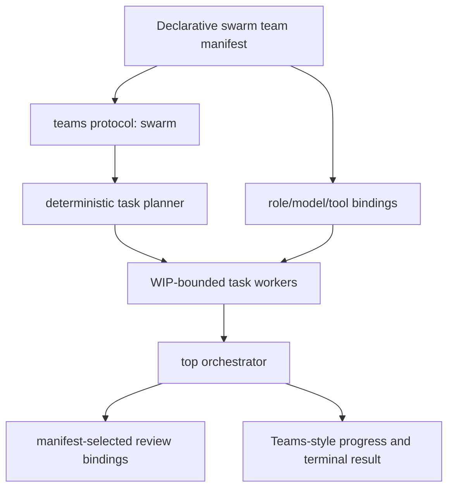

# Swarm as a declarative team protocol — redesign brief

## User decision

Reframe `/swarm` as a declarative Teams protocol rather than a sibling Panopticon orchestration primitive.

## Why

A manifest supplies the missing explicit control plane for:

- worker role bindings and allowed tools;
- local-model selection/fallback per worker role;
- review/gate roles and profiles;
- WIP, TTL, repair, and write-isolation policy;
- a discoverable, reusable definition comparable to Navigator/Council teams.

## Target shape

## Proposed manifest semantics

- New protocol: `swarm` under `extensions/pi-panopticon/teams/`.
- Manifest contains worker role templates, local-model bindings, tool allowlists, review bindings, WIP/TTL/repair/write-isolation limits, and profile defaults.
- Invocation supplies a goal; deterministic planner creates tasks and maps each task category to a manifest role template.
- The top orchestrator retains exclusive lifecycle/kanban/provenance authority; workers remain task-scoped and do not communicate peer-to-peer.
- `team_run id=<swarm-manifest>` becomes the canonical invocation; `/swarm` and `swarm_run` become compatibility aliases or are retired only after explicit migration decision.

## Decisions for council

1. Is `swarm` a first-class protocol in the existing TeamSpec schema, or a typed extension field for an existing protocol?
2. How do manifest model bindings interact with ADR-035 governance routing? Proposed precedence: private/local safety routing constrains the eligible set; manifest selects among eligible local models; absent binding uses advisory routing.
3. Are `/swarm` and `swarm_run` retained as aliases, deprecated, or removed?
4. Where does session-persisted swarm runtime state live relative to existing team run state?
5. What migration preserves active code and avoids a dual divergent orchestration path?

## Non-negotiable bounds

- WIP ≤3, deterministic one-time decomposition, max three repair cycles, TTL, artifact gates, parallel-write isolation, no worker peer-to-peer communication.
- No root model/residency/cadence change without authority.
- No implementation until council/ADR amendment and manifest UX contract are accepted.
