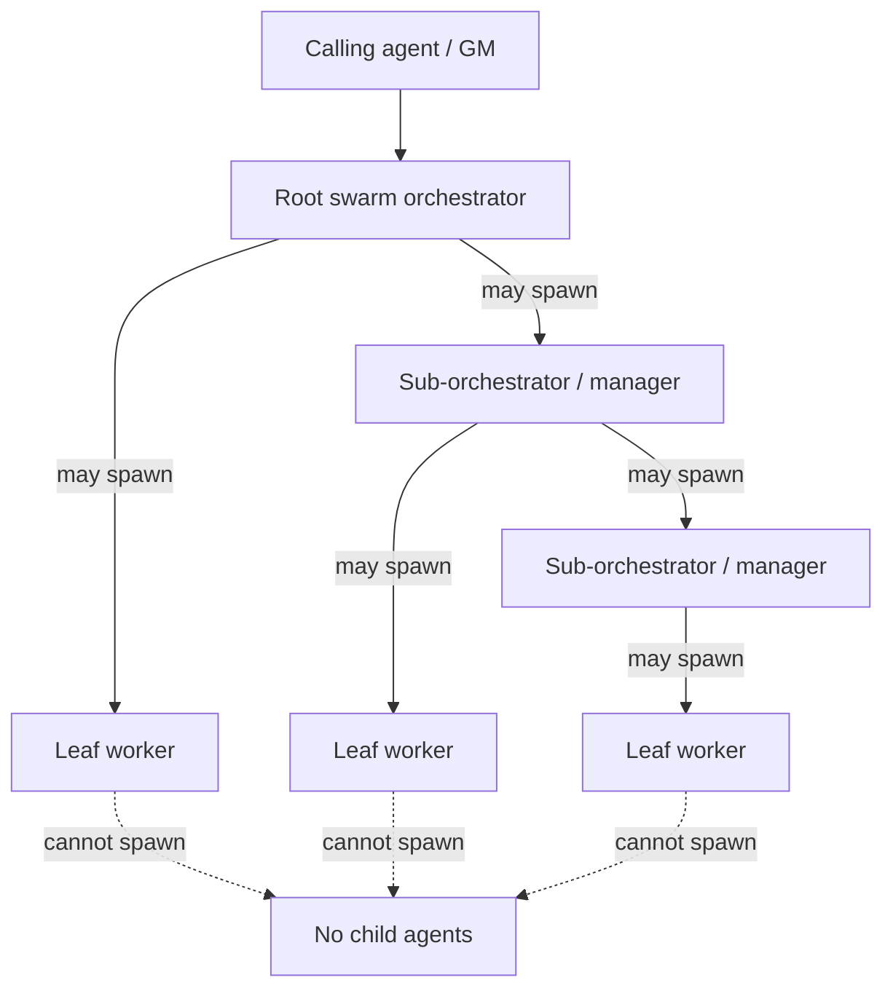

# Hierarchical swarm orchestration redesign brief

## User-directed topology

Replace the fixed declarative-pool interpretation with bounded hierarchical orchestration:

## Authority model

| Role | May spawn | May mutate swarm plan | May report upward |
| --- | --- | --- | --- |
| Root orchestrator | managers and leaf workers | root plan within global bounds | caller / GM |
| Sub-orchestrator | managers and leaf workers | assigned subtree within inherited bounds | parent orchestrator |
| Leaf worker | nobody | no | direct parent only |

## Required invariants

- Every child has a parent run/node id and inherited swarm id, scope, TTL, budget, model-safety policy, and depth.
- Only orchestrators receive spawn authority. Leaf worker tools exclude all spawn/team/swarm management surfaces.
- Root remains the only caller-facing lifecycle owner: terminal aggregation, teardown, final result, and follow-up.
- Managers are bounded by inherited WIP, remaining TTL, depth limit, task budget, and write-isolation policy. They cannot mint capacity.
- ADR-035 private/local eligibility applies at every spawn boundary.
- No worker peer-to-peer messaging; all communication follows parent/child edges.
- Parent cancellation propagates downward; child completion summarizes upward.

## Questions for council

1. Is hierarchy a new `protocol: "swarm"` Teams protocol, a distinct orchestration primitive, or a protocol backed by runtime child entities?
2. What fixed limits prevent manager-tree explosion (max depth, manager count, total child count, inherited WIP accounting)?
3. How should manager subteams map to declarative manifests and model/tool bindings?
4. Does a manager create nested TeamStateManager runs or child nodes within one root run?
5. How do review gates apply at leaf, manager subtree, and root aggregate levels?
6. Does this supersede ADR-036 and ADR-039, or does it become ADR-040 with explicit migration?

## Non-goals until decided

- No schema, model-routing, runner, or compatibility implementation.
- No unbounded recursive spawning, autonomous goal redefinition, or peer-to-peer worker mesh.
