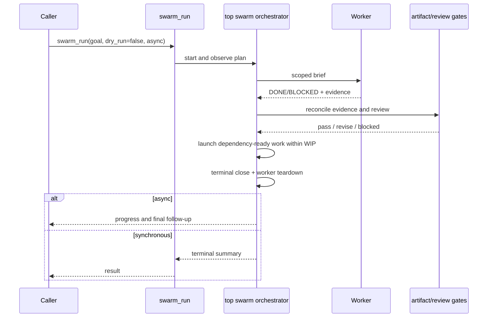

# Swarm top-orchestrator completion plan

## Goal

Make the GM/top orchestrator own the complete swarm lifecycle: observe worker completion, reconcile evidence/gates/dependencies, close the swarm automatically, tear down workers, and deliver progress/final updates to the invoking agent.

## Problem

Current `SwarmRunner.start()` launches workers and records them as `in_progress`, but it has no completion observer or terminal lifecycle. Therefore a swarm can remain session-resident after workers finish, and `swarm_run` cannot deliver a final summary to the caller.

## ADR-036 alignment

This implements existing ADR-036 requirements rather than changing policy:

- workers do not coordinate peer-to-peer;
- top orchestrator reconciles DONE/BLOCKED and gates;
- dependency-ready tasks launch within WIP ≤3;
- terminal swarm closes itself and reports progress/final outcome;
- `async:true` returns immediately and delivers follow-ups;
- `async:false` waits for the terminal summary.

## Design

### Contracts

1. Extend the worker adapter/handle with a completion observation mechanism derived from the existing RPC child event stream. It must provide final worker text/events without exposing child process internals to swarm callers.
2. A `SwarmCoordinator` (or equivalent runner-owned lifecycle) is the sole state mutator: reconcile one worker result, update task state, launch ready tasks, and determine terminal state.
3. Completion parsing requires the existing DONE/BLOCKED protocol plus artifact evidence. Missing/invalid completion blocks the task; it never silently succeeds.
4. When all tasks are done, mark swarm `completed`; when no runnable task remains and any task is blocked, mark swarm `blocked`; set `finishedAt`, stop/release handles, and clear active swarm.
5. `async:true`: tool returns start acknowledgement, sends bounded task-state progress and final summary through `pi.sendUserMessage(..., {deliverAs:"followUp"})`.
6. `async:false`: await terminal lifecycle and return the same final summary directly. No infinite wait: ADR-036 profile TTL is enforced.
7. `swarm_status`/`swarm_list` remain read-only views of this same record.

## Council clarification — 2026-07-28

Council confirmed an ADR-036 amendment, not a new ADR. Before implementation:

- verify `pi.sendUserMessage(..., { deliverAs: "followUp" })` from the swarm tool context with a deterministic fake API test;
- retain explicit stall detection (`agent_status`/`agent_peek`) or record a conscious TTL-only v1 decision;
- serialize completion, cancellation, TTL, and gate-result mutation through a per-swarm queue/mutex;
- make terminal state first-writer-wins and ignore late worker/gate results;
- block a silent worker exit without a valid DONE/BLOCKED signal;
- enforce parallel-write isolation in `claimAvailable`, not only through planner dependencies;
- clean worker handles/listeners/timers and `activeSwarmId` on every terminal path.

## Bounds and safety

- WIP hard cap remains 3; no dynamic decomposition.
- Max repair cycles remains 3.
- Progress messages contain only compact state/evidence summaries, never raw worker briefs, prompts, or artifacts.
- Cancellation and session shutdown win over pending completion events and produce one terminal `aborted` state.
- One completion observer per worker; listener/timer cleanup is mandatory.
- Async final follow-ups are lost on session shutdown by design; v1 has no resume.

## Test matrix

- single successful worker → terminal completed record, worker release, synchronous final summary;
- dependent tasks → next task starts only after accepted predecessor;
- invalid/no completion → task/swarm blocked;
- revise gate → bounded repair relaunch; fourth revise blocks;
- WIP never exceeds 3;
- async run sends non-empty progress plus exactly one final follow-up;
- cancellation/TTL produces one terminal aborted/blocked summary and no later launches;
- status/list reflect terminal records after automatic close.

## Acceptance criteria

- A non-dry swarm never hangs after workers finish.
- Calling agent receives a compact final outcome automatically.
- All terminal paths release active swarm ownership and worker handles.
- ADR-036 bounds and structured details remain intact.
- `npm run check`, `npm test`, and `npm run security:semgrep` pass with no exemptions.
