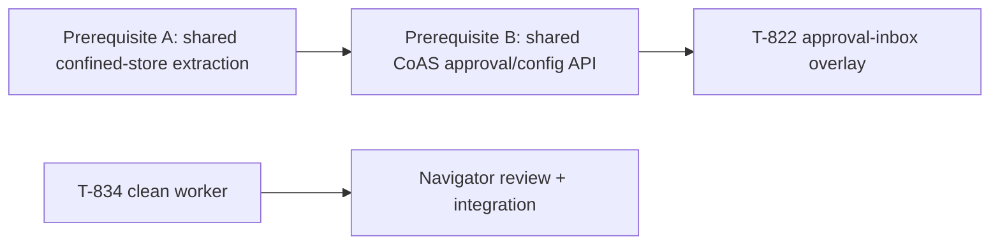

# T-822 / T-834 Recovery Plan

## Goal

Land T-822 only after its shared CoAS prerequisite is reviewable and validated; replace the lost T-834 work with an isolated, test-first implementation.

## Constraints

- Preserve the current dirty tree; do not bundle unrelated scheduler/refactor work.
- No test bypasses or architecture-test exceptions.
- T-822 remains blocked until its prerequisite lands.
- T-834 worker may modify only its isolated worktree.

## T-822 sequence

1. **Prerequisite A — confined I/O extraction.** Review and isolate `lib/confined-store.ts`, `lib/path-inside.ts`, `lib/coas-paths.ts` with their adapter changes in `extensions/pi-coas/store.ts` and `store-paths.ts`, plus `tests/architecture/lib-layering.ts`.
   - Gate: scoped CoAS confinement/architecture tests, `npm run typecheck`, `git diff --check`.
2. **Prerequisite B — shared CoAS contracts.** Review and isolate `lib/coas-{types,config,run-state,schedule-target,approval-inbox}.ts` and corresponding CoAS adapters (`config.ts`, `scheduler-run-state.ts`, `types.ts`).
   - Gate: approval-inbox/scheduler focused tests, `npm run typecheck`, `git diff --check`.
3. **T-822 restoration.** Rebase/restore only the panopticon overlay paths and `tests/panopticon/approval-inbox-overlay.test.ts` after both prerequisites land.
   - Gate: `npm test -- tests/panopticon/approval-inbox-overlay.test.ts`, `npm run typecheck`, `git diff --check`, then isolated commit/push.

## T-834 replacement

- **Worker artifact:** `/tmp/pi-tools-T-834-recovery` on `ticket/T-834-recovery`.
- **Scope:** `extensions/pi-doctor/`, optional new scanner module within that extension, and `tests/pi-doctor-doctor.test.ts`; no CoAS, Panopticon, scheduler, or shared-refactor edits.
- **Acceptance tests:** clean AGENTS fixture passes; fixtures for ignore-instructions, suspicious hidden HTML, secret-read, curl-exfiltration, zero-width/BiDi controls each report a bounded warning/block signal.
- **First validation:** run the focused Pi Doctor test before any implementation change to establish the baseline, then rerun it after each scanner slice.
- **Review:** GM reviews worker diff and focused tests; Navigator reviews the security-facing diagnostics before integration.

## Status

- T-822: blocked on uncommitted, unreviewed shared CoAS extraction.
- T-834: replacement worktree and worker pending creation.
