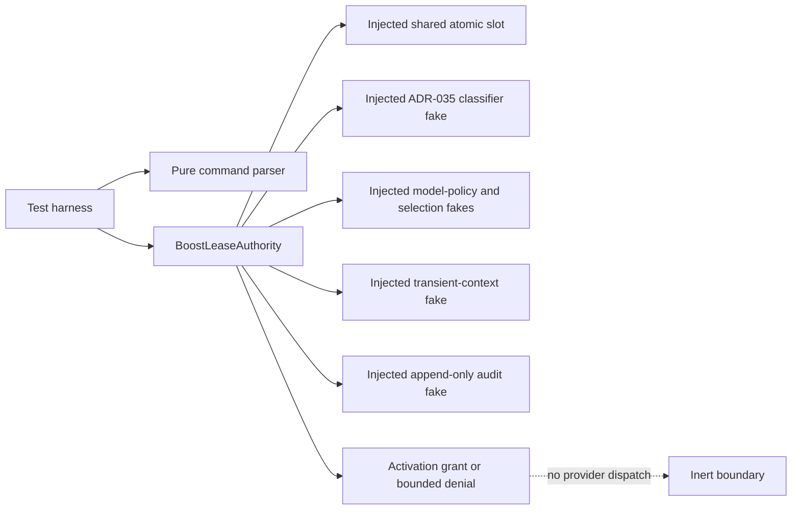

# T-839 clean reimplementation plan

## Goal

Implement ADR-045 as an inert, dependency-injected Panopticon domain. The result is testable policy and lifecycle code only: it does not register `/boost`, dispatch a model, call a provider or network, mutate configuration/defaults/schedulers, or create a live lease.

## Target shape

Production files stay under `extensions/pi-panopticon/boost/` and are not imported by the Panopticon runtime entrypoint.

## Test-first slices

1. Parser: terminal `status`/`reset`, `--` disambiguation, option validation, UTF-8 framing-plus-prompt cap.
2. Authority: Principal-only reservation/reactivation, strict policy mapping, one injected global slot, fail-closed combined-input governance.
3. Lifecycle: exact visible-yield accounting, reversion after every active turn, expiry/restart/transfer cleanup, `RevertFailed` subject blocking, Principal reset.
4. Isolation and audit: captured workspace/issuer binding, empty clean/fresh contexts, activation-time revalidation, no merge, redacted bounded records, audit failure behavior.
5. Regression boundary: no runtime registration/import, provider/network adapter, dependency, configuration/default/scheduler mutation, or transcript persistence.

## Acceptance checks

- Focused boost tests pass.
- New and modified scoped TypeScript files are Biome-clean.
- `npm run typecheck`, `npm run check`, and the full test suite pass.
- `git diff --check` passes and the diff contains only scoped files.
- No commit or push.
