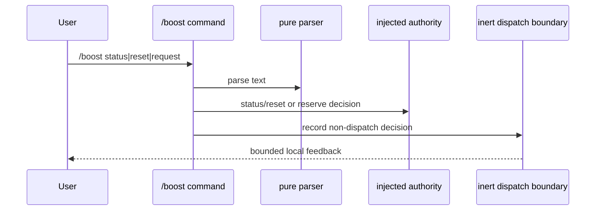

# T-839 Phase 2: Inert `/boost` Command Wiring Plan

## Purpose

Wire the already-reviewed ADR-045 parser and lease authority into the Panopticon extension without enabling a provider call, model selection, configuration/default mutation, scheduler behavior, or live lease.

## Exact hook

Add `extensions/pi-panopticon/boost/command.ts` exporting:

```ts
registerBoostCommand(pi: ExtensionAPI, deps: BoostCommandDeps): void
```

Call it from `extensions/pi-panopticon/index.ts` during extension registration, beside existing command registration. Do not place it in `setupUI`: `/boost` is a lease-control command, not a rendering concern. `setupUI` remains responsible only for UI overlays/widgets.

`BoostCommandDeps` is explicit and injected:

- `parse(input)` — `parseBoostCommand` from the inert domain.
- `authority` — `BoostLeaseAuthority` interface.
- `identity(ctx)` — supplied Principal/session/subject/workspace identity.
- `notify(ctx, message, level)` — bounded local feedback.
- `dispatch` — an inert test boundary that always records/returns a decision; it has no provider/model-selector/config/scheduler capability.

The runtime entrypoint owns construction of these dependencies. Phase 2 uses an `InertBoostDispatch` implementation that never invokes `authority.activate()` or a model adapter. Its only observable behavior is command parse/authorization routing and bounded status feedback.



## Command routing

- `status`: call only the injected authority status method; redact to state, remaining yields, expiry, and opaque id.
- `reset`: require Principal identity; call only authority reset; no replay, provider, or selector operation.
- `request`: parse options/prompt, require Principal identity, reserve through authority, then send the resulting `Reserved` decision to `InertBoostDispatch`. Do not activate a lease in this phase.
- Parse, authorization, policy, budget, and audit denials return bounded messages with no prompt/model/provider details.

## Test plan

Add command tests with injected fakes for:

1. Registration and parser routing for request/status/reset.
2. Non-Principal rejection before dispatch.
3. `--clean`, `--fresh`, `-n`, `--` parsing and malformed-command feedback.
4. Request produces only a reserved inert decision; no activation, selector, provider, config/default, scheduler, or network call.
5. Status/reset identity and redaction behavior.
6. Runtime construction contains no real model adapter and no mutation surface.

## Explicit exclusions

- No `model_select`, provider adapter, or live Sol/GLM call.
- No `.pi` settings/model registry/default/residency change.
- No scheduler, schedule, Matrix, child-agent, or tool-call activation.
- No automatic reactivation on `agent_start`/`agent_end`.
- No merge to `main` without phase-2 implementation approval, tests, and independent review.

## Approval requested

Approve only the inert command-registration slice above. A later phase must separately approve a real model-selector/governance integration, live dispatch semantics, and any configuration values.
