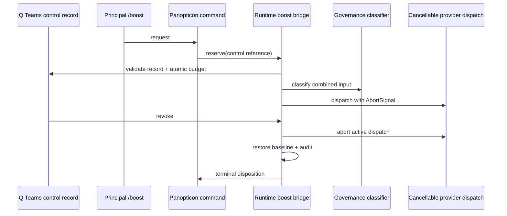

# T-843 Proposal: Live Boost Runtime Bridge

**Status:** design proposal only. It authorizes no implementation, Q configuration, provider dispatch, or live `/boost` enablement.

## Problem

Phase-4 review found that an extension-local `ExtensionAPI` command cannot safely own a live provider lease: normal extension loading supplies no deployable injected control object, provider dispatch has no lease lifecycle bridge, positive budget validation is not consumption, and Q revocation cannot cancel/revalidate an active dispatch. T-843 supplies the smallest runtime bridge consistent with T-826's daemon-backed/persistent-session direction without introducing a new scheduler, global default mutation, or bespoke configuration store.

## Decision shape

A host-owned runtime bridge provides a narrow, persisted-in-session capability to the Panopticon boost adapter. Panopticon remains a consumer; Q remains the owner of Teams descriptor/control records. The bridge is injected at extension start and is unavailable unless the host supports every required method.

## Runtime bridge contract

The host supplies an injected `LiveBoostRuntimeBridge` with these capability families:

1. **Control resolution** — read-only resolve of a normal schema-v2 `protocol: boost` Teams descriptor and its descriptor-adjacent Q enablement record. It verifies expiry, signature/ownership, residency evidence, logical key consistency, and rollback version.
2. **Atomic budget** — compare-and-reserve/consume/release by `(enablementId, subjectId, leaseId)` in one durable transaction; it enforces one global active lease, Q ceiling, and the three-yield maximum. The durable substrate is the host daemon's private session-control store: append-only WAL plus a process-wide transactional mutex keyed by `enablementId`. It is not a Teams mapping, root config, or scheduler store.
3. **Provider dispatch** — `dispatch(request, AbortSignal)` is the only provider seam. An *activation generation* is the monotonically increasing opaque number issued on each successful lease activation; terminal callbacks must echo it and stale callbacks are rejected. The bridge emits one terminal event bearing lease id, generation, outcome, and human-visible status. It accepts no raw Q record, credential, or configuration path.
4. **Revocation and restore** — the host subscribes to Q control-record revision events from its read-only control resolver. On revision/revoke it serializes abort before any subsequent provider request: mark the lease revoking in the transaction, abort its controller, await one terminal/cancellation acknowledgement, restore baseline, then append audit/release budget. Poll fallback detects expiry before each request; an unavailable event stream fails closed.
5. **Session persistence** — writes only bounded lease lifecycle state and redacted audit records to the host/session runtime state. It never writes root model defaults, Teams mappings, schedules, or prompts/transcripts.

## Caller and ownership boundary

The host, not Panopticon, owns the bridge capability. Every reserve, activate, reset, and dispatch request carries an authenticated caller identity; only the Principal session identity is accepted. Scheduler, tool, Matrix, child, background, and automatic-reactivation identities are rejected at the bridge boundary before control resolution or budget mutation.

T-826 is an external daemon-backed/persistent-session tracker reference, not a repository-local ADR. T-843 aligns only to its host-owned session/control direction; a T-826 artifact URL or tracker reference must be attached to the implementation review record before code begins.

## Lifecycle invariants

- Every provider request checks current Q control, atomic budget, and governance eligibility immediately before dispatch.
- Q revoke/expiry/rollback cancels the active request, blocks further **dispatch for the affected subject only**, and restores baseline. This matches ADR-045; it is not a global dispatch block.
- A terminal human-visible response consumes exactly one yield; cancelled, failed, tool-only, and suppressed work consume none.
- Restore/audit/cleanup failure enters durable `RevertFailed`; every dispatch for the affected subject is blocked until Principal reset after Q control revalidation.
- Session shutdown calls bridge revocation/restore synchronously or writes a durable recovery marker. On restart, the marker blocks the affected subject until Principal reset and Q revalidation; no lease, selector, or activation survives restart.
- No child, schedule, background loop, or automatic reactivation can acquire the bridge.

## Teams/Q integration

Q control remains a normal Teams descriptor and descriptor-adjacent record, not a Panopticon/global config. The bridge receives logical control references only:

- `teamId: "q-boost"`
- logical keys `principalBoostBaseline` and `principalBoostLease`
- enablement id, mapping version, rollback version

The Q control-plan artifact must reproduce the bridge's control-resolution, revocation, dispatch, and rollback contracts verbatim or identify council-approved deltas.

## Failure/rollback matrix

| Failure | Bridge action | Subject state |
|---|---|---|
| Control invalid/revoked/expired | deny before dispatch | normal baseline |
| Budget reservation failure | deny atomically | normal baseline |
| Governance private/local-only | deny before dispatch | normal baseline |
| Provider failure/cancellation | cancel + restore + audit | Reserved or Idle |
| Q revoke during dispatch | abort + restore + audit | Idle |
| Restore/audit/cleanup failure | durable `RevertFailed` | affected subject dispatch blocked |
| Host bridge unavailable | inert command denial | no mutation |

## Tests required before implementation

### Deterministic/mock

- Atomic race tests across two sessions/subjects and budget rollback on every failed step.
- Q revoke at pre-dispatch, active dispatch, terminal-yield, and reactivation boundaries.
- `AbortSignal` propagation, revoke ordering, and one terminal outcome only.
- RevertFailed persistence, per-subject blocking, reset/revalidation, and shutdown recovery marker restart behavior.
- Control/key/residency/signature/version mismatch fail-closed tests.
- Principal identity rejection for child/schedule/background/tool callers.
- No writes to root defaults, Teams mapping, schedules, prompts, or transcripts.

### Controlled real validation (only after Q plan approval)

- Q dry-run resolver with no provider selection.
- One Principal-approved, non-sensitive fixture within a two-hour Q record, one global lease, and at most three yields.
- Q-triggered revoke/rollback during a controlled dispatch proves abort, restore, audit, and inert fallback.

## Explicit exclusions

- No implementation in this proposal.
- No direct extension-level provider dispatch or `ExtensionAPI` workaround.
- No new scheduler, background service, child activation, root default mutation, or bespoke global control file.
- No credentials/tokens/Q records committed to this repository.

## Approval gate

Council review is required because this adds a runtime/provider control surface and persistent lifecycle state. Q must supply a bridge-compatible control plan and dry-run/rollback runbook. Principal/Gravitas must separately approve implementation after those artifacts pass review.
