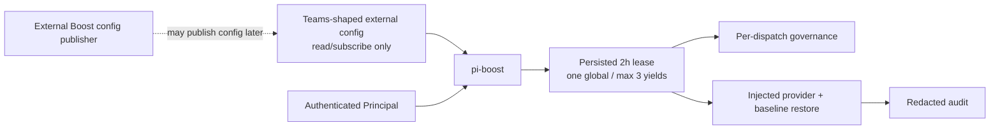

# T-849 Final Boost Contract

## Goal

Make `pi-boost` the complete production owner while keeping external configuration read-only and implementation-neutral.

## Required behavior

- Principal-only `/boost`.
- One process-global active lease.
- At most three human-visible yields.
- Persisted lease expiry capped at two hours from reservation.
- Governance and external-config validation before each dispatch; fail closed.
- Revocation, expiry, shutdown, and terminal outcomes restore baseline and append redacted audit before release.
- No default-model mutation, background activation, scheduler coupling, credential discovery, or external config writes.

## Target shape

## Scope

1. Rename publisher-owned contract/adapter/host terminology to neutral external Boost config terminology.
2. Add a single exported two-hour duration constant and persisted `expiresAt` lease field.
3. Enforce expiry at reserve/status/dispatch boundaries without an activation timer.
4. Update tests, ADR/C4 documentation, and package registration evidence.

## Validation

- Focused config/store/runtime/production-host tests.
- Property tests retain max-yield and reversion coverage.
- `npm run check`, `npm test`, `git diff --check`.
- Independent read-only review must return PASS before integration.
